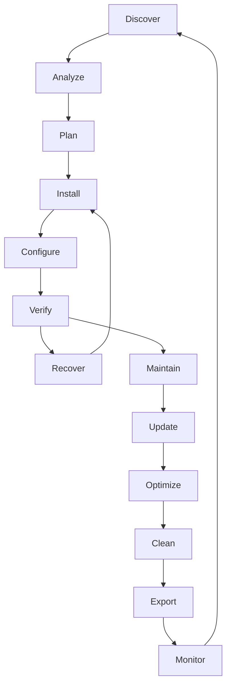
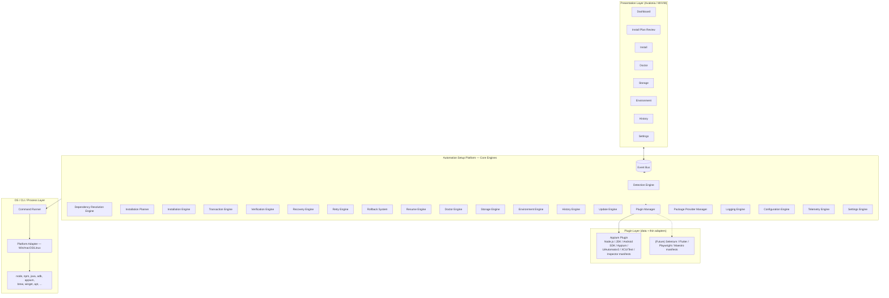
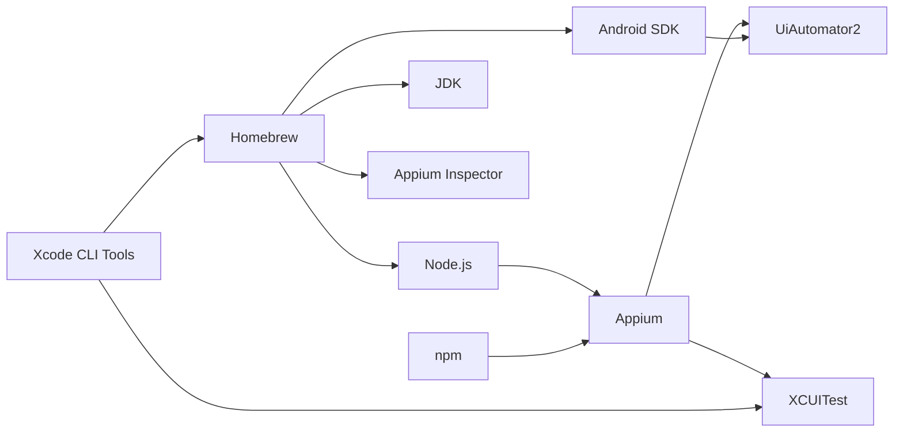
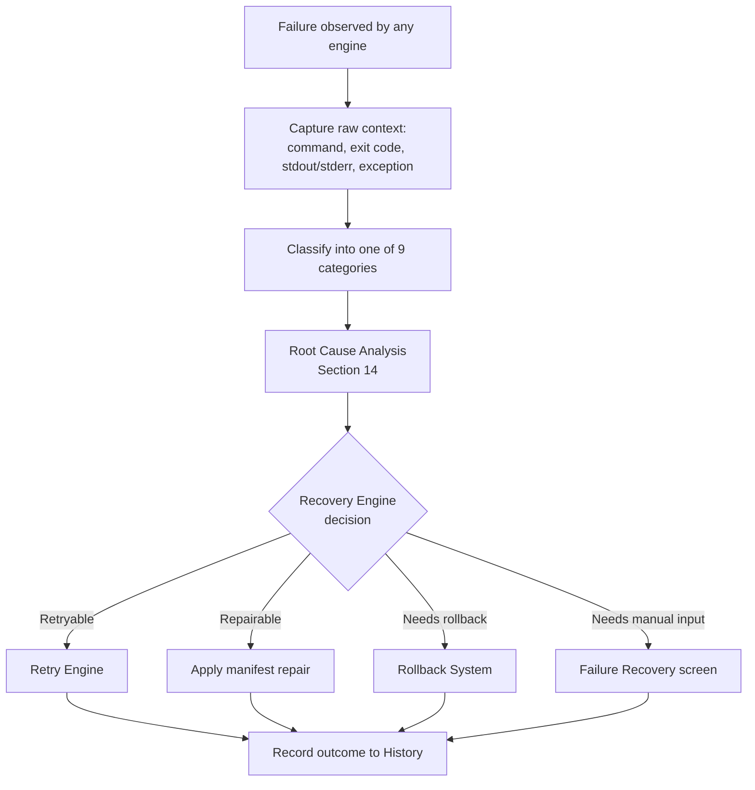

# Appium Setup Manager — Product & Engineering Specification

*Enterprise-grade specification for a plugin-based automation environment setup platform*

**Version 2.0 · Status: Approved for Architecture Implementation**
**Internal Codename: Automation Setup Platform (ASP) — Appium Plugin (V1 shipping scope)**
**Author: Ray · Document Owner: Product & Architecture**

---

## How to Read This Document

This specification supersedes PRD v1.0. It is written so that a developer, QA architect, DevOps
engineer, or technical writer can implement any feature described here without needing to ask
clarifying questions. Every feature chapter follows the same structure: **Why it exists → What
problem it solves → How it works → User workflow → Functional requirements → Edge cases → Error
handling → Recovery → Acceptance criteria → Future scalability.**

The product name presented to users remains **Appium Setup Manager**. Internally, the codebase and
architecture are designed as the **Automation Setup Platform** — a plugin-hosting runtime of which
"Appium" is the first and, for Version 1, only installed plugin. No UI, marketing, or user-facing
text mentions "Automation Setup Platform"; it exists purely as an internal architectural boundary
so that Selenium, Flutter, Playwright, Maestro, or other automation ecosystems can be added in a
future version **as new plugins, without modifying the core engines**. Version 1 ships the Appium
plugin only. This document does not specify Flutter, Selenium, Maestro, or Playwright features —
it specifies the platform contract that makes adding them later a plugin-authoring exercise, not a
re-architecture.

---

## Table of Contents

**Part 0 — Philosophy & Foundations**
0. Product Philosophy
1. Executive Overview
2. User Personas
3. User Stories

**Part 1 — Platform Architecture**
4. Automation Setup Platform Architecture
5. Manifest-Driven Architecture
6. Engine Catalog (18 Engines)

**Part 2 — Core Engine Deep Dives**
7. Detection Engine
8. Dependency Resolution Engine
9. Installation Planner
10. Installation Engine
11. Transaction Engine
12. Snapshot System

**Part 3 — Failure, Recovery & Resilience**
13. Failure Management Engine
14. Root Cause Analysis
15. Recovery Engine
16. Retry Engine
17. Rollback System
18. Resume Engine

**Part 4 — Verification & Health**
19. Verification Engine
20. Doctor Engine

**Part 5 — Environment & Lifecycle Management**
21. Environment Engine
22. Update Engine
23. Storage Engine
24. History Engine

**Part 6 — Extensibility & Distribution**
25. Plugin Manager
26. Package Provider Manager
27. Offline Installation
28. Environment Profiles
29. Import / Export

**Part 7 — Platform Services**
30. Event System
31. Error Catalog
32. Logging Engine
33. Diagnostics
34. Configuration Engine
35. Telemetry Engine
36. Settings Engine
37. Security
38. Accessibility

**Part 8 — Experience Design**
39. UX Design System — Screen-by-Screen
40. Failure UX

**Part 9 — Requirements & Quality**
41. Functional Requirements (FR-001 through FR-220+)
42. Non-Functional Requirements
43. Testing Strategy
44. Performance Targets
45. Success Metrics
46. Risk Register
47. Open Questions Tracker
48. Appendices

---

# PART 0 — PHILOSOPHY & FOUNDATIONS

## 0. Product Philosophy

### 0.1 Vision

> **One click from a clean machine to a production-ready Appium automation environment.**

A QA engineer should be able to hand this application to a brand-new laptop — no Node.js, no JDK,
no Android SDK, nothing — and arrive at a fully working, verified, health-checked Appium
environment without opening a terminal, reading a wiki, or copy-pasting a single command.

### 0.2 Mission

> **Reduce Appium environment setup from hours to minutes through automation.**

Every architectural decision in this document is evaluated against this mission. If a feature adds
friction, manual steps, or ambiguity to setup time, it does not belong in Version 1 regardless of
how technically interesting it is.

### 0.3 Core Principles

These principles are non-negotiable design constraints. Every engine chapter in this document must
show how it upholds each relevant principle.

| # | Principle | What it means in practice |
|---|---|---|
| 1 | **Never leave users stuck** | Every failure state has at least one actionable next step (retry, repair, rollback, manual instructions, or diagnostics export). A dead-end screen with no action is a defect. |
| 2 | **Every operation is transparent** | Every command the application runs is visible in the Command Log before, during, and after execution — with its exact arguments, exit code, and output. Nothing happens silently. |
| 3 | **Every modification is reversible** | Any change to PATH, environment variables, shell configuration, or installed components is preceded by a Snapshot that can be restored. |
| 4 | **Verify every installation** | A component is never marked "Installed" because a command returned exit code 0. It is marked "Installed" only after the Verification Engine independently confirms the executable, version, and environment wiring. |
| 5 | **Recover automatically whenever possible** | The Recovery Engine attempts automatic remediation (retry, alternative mirror, alternative package provider) before ever asking the user to intervene manually. |
| 6 | **Explain every failure** | "Installation Failed" is a banned UI string. Every failure surfaces a root cause, a dependency chain (if applicable), and a human-readable explanation. |
| 7 | **Safe by default** | Destructive actions (deletion, rollback, overwrite) always require explicit confirmation and always show a preview of exactly what will change. |
| 8 | **Plugin-first architecture** | No engine contains hardcoded knowledge of "Appium" specifically. All tool-specific behavior lives in manifests and plugin packages, never in core engine code. |
| 9 | **Data-driven configuration** | Tool definitions, install commands, verification rules, and dependency graphs are JSON manifests, not compiled logic. Adding or updating a tool must never require a code change to a core engine. |
| 10 | **Enterprise ready** | Offline installation, proxy support, audit history, import/export of environments, and centrally distributed configuration profiles are first-class citizens, not bolted on later. |

### 0.4 The Environment Lifecycle

Every feature in this platform exists to support one or more stages of a single, repeating
lifecycle. This lifecycle is the organizing model for the entire architecture — engines map to
stages, and stages map to UI screens.



| Stage | Purpose | Primary Engine(s) | User-Visible Surface |
|---|---|---|---|
| **Discover** | Find out what already exists on the machine | Detection Engine | Dashboard |
| **Analyze** | Interpret detection results against manifest requirements; classify Found/Outdated/Missing | Detection Engine, Dependency Resolution Engine | Dashboard, Doctor |
| **Plan** | Build a dependency-ordered, time/size-estimated execution plan | Dependency Resolution Engine, Installation Planner | Install Plan Review screen |
| **Install** | Execute the plan as a transaction | Installation Engine, Transaction Engine, Package Provider Manager | Install screen |
| **Configure** | Wire environment variables, PATH, shell profiles | Environment Engine | Install screen, Environment screen |
| **Verify** | Independently confirm every installed component actually works | Verification Engine | Install screen, Doctor |
| **Recover** | Diagnose and remediate anything that failed verification or installation | Recovery Engine, Retry Engine, Rollback System, Resume Engine, Root Cause Analysis | Failure Recovery screen |
| **Maintain** | Ongoing health monitoring after initial setup | Doctor Engine | Doctor |
| **Update** | Detect and apply new component versions safely | Update Engine | Updates screen |
| **Optimize** | Identify unused/oversized artifacts before they become a problem | Storage Engine | Storage |
| **Clean** | Reclaim disk space safely | Storage Engine, Snapshot System | Storage |
| **Export** | Package the current environment definition for reuse elsewhere | Import/Export | Settings → Export |
| **Monitor** | Long-running visibility into environment drift and history | History Engine, Telemetry Engine | History, Dashboard |

Every functional requirement in Part 9 is tagged with the lifecycle stage it belongs to. Every
engine chapter opens by stating which stage(s) it serves.

---

## 1. Executive Overview

Appium Setup Manager is a desktop application that eliminates the manual, error-prone process of
configuring an Appium test automation environment. Setting up Appium today requires engineers to
manually install Node.js, the JDK, Android SDK/ADB, Xcode command-line tools, Homebrew (on macOS),
the Appium server, drivers (UiAutomator2, XCUITest), Appium Inspector, and to correctly wire
environment variables (`ANDROID_HOME`, `JAVA_HOME`, `PATH`). Each of these has version- and
OS-specific pitfalls, and a single misconfigured environment variable can cost a new hire an entire
day of onboarding.

Internally, the application is built as the **Automation Setup Platform**: a plugin-hosting runtime
composed of 18 independent engines (detection, dependency resolution, installation planning,
transactional installation, verification, recovery, health diagnostics, storage, environment
management, and more) that operate against **data-driven manifests** rather than hardcoded,
per-tool logic. Version 1 installs exactly one plugin — **Appium** — but the platform itself has no
compiled knowledge of what "Appium" is. Every install command, dependency, verification rule, and
repair strategy for Node.js, the JDK, Android SDK, Appium server, and its drivers is described in a
JSON manifest that the platform interprets at runtime. This is the architectural investment that
allows a second plugin (Selenium, Flutter, Playwright, Maestro, or others) to be added in a future
release by authoring new manifests and, if needed, a thin plugin package — never by modifying a
core engine.

### 1.1 Problem Statement

- Appium setup is slow, inconsistent across machines, and the single most common source of
  onboarding friction reported by QA teams.
- Dependencies and environment variables are easy to misconfigure and hard to debug — the
  "works on my machine" problem is endemic to mobile test automation because there is no
  standard, verifiable definition of "a correctly configured machine."
- When installation fails, generic tools report only "Installation Failed," leaving the user to
  manually copy an error into a search engine. There is no structured root-cause analysis, no
  automatic recovery, and no guided repair path.
- There is no reversible model for environment changes. If an install partially completes or
  writes a bad `PATH` entry, undoing it requires manual shell-profile surgery.
- Android SDKs, emulators, iOS simulators, and package caches silently consume tens of gigabytes
  with no easy way to audit, attribute, or safely reclaim that space.
- Every existing tool in this space (`appium-doctor`, manual shell scripts, ad-hoc onboarding
  wikis) is single-purpose, non-transactional, and provides no historical record of what changed,
  when, or why.

### 1.2 Goals

- One-click install of a complete, working Appium environment on Windows, macOS, and Linux.
- Accurate detection of existing installs and their versions before taking any action — never
  install over something that already works.
- A plugin/manifest architecture that makes the Appium tool graph (Node.js → JDK → Android SDK →
  Appium → drivers → Inspector) fully data-driven, so the same engines can host other automation
  ecosystems later without modification.
- Environment health diagnostics that go beyond pass/fail — every issue is scored, explained, and
  either auto-repairable or given a clear manual path.
- Every environment-mutating operation is transactional, snapshotted, and reversible.
- Every failure is categorized, root-caused, and paired with a recovery strategy — "Installation
  Failed" as a terminal, unexplained state is treated as a product defect.
- Transparent storage view and safe cleanup of caches, emulators/simulators, and orphaned SDK
  components.
- Every operation executed via CLI under the hood, with a live, readable, exportable command log.
- Enterprise readiness from Version 1: offline installation bundles, environment profiles,
  import/export, and full operation history — not deferred to a "v2 enterprise edition."

### 1.3 Non-Goals (Version 1)

- Writing or executing user test scripts — this is a setup/maintenance tool, not a test runner.
- Reimplementing Appium Inspector's inspection UI — the tool installs and launches it, not
  replaces it.
- Managing CI/CD pipeline setup (a plausible future plugin, not Version 1 scope).
- Shipping any plugin other than Appium. The architecture must support Selenium, Flutter,
  Playwright, and Maestro as *future* plugins; none of their tool graphs, manifests, or UI are
  built in Version 1.
- Multi-user / centrally managed fleet administration UI (the underlying data — History Engine
  records, Import/Export bundles — is designed to make this possible later, but no fleet console
  ships in V1).

### 1.4 Recommended Technology Stack

**Chosen: Avalonia (.NET / C#).** This application is roughly 80% process orchestration and 20%
UI — its core job is spawning CLI processes, parsing their output, and managing long-running,
resumable state machines (transactions). .NET's `System.Diagnostics.Process` gives mature, async
stdout/stderr streaming, and C# covers the entire platform — engines, plugin contracts, manifest
parsing, transaction/snapshot persistence — in a single language with no frontend/backend split.

| Criteria | Avalonia (chosen) | Tauri (Rust + web) | Electron |
|---|---|---|---|
| Core job: run CLI commands | Excellent — `Process` async streaming, one language end-to-end | Good — Rust backend, split across JS/IPC boundary | Good — Node `child_process` |
| Single-language codebase | Yes (C# throughout) | No (Rust + JS/TS) | No (Node + JS/TS) |
| Cross-platform installers | Win/mac/Linux; mac signing needs manual setup | Native `.msi`/`.dmg`/`.deb`/AppImage | Yes (larger bundles) |
| Bundle size | ~40–80 MB (trimmed / NativeAOT) | ~3–10 MB | ~85–120 MB |
| Fit for a transactional, state-machine-heavy tool | Very strong — first-class async/await, structured concurrency | Strong | Moderate |

**Decision:** Avalonia is retained as the implementation platform for Version 1 and for the
Automation Setup Platform runtime itself. The engine/plugin architecture described in this document
is deliberately UI-framework-agnostic at the contract level (engines communicate via plain C#
interfaces and an event bus — see Part 7), so a future UI rewrite would not require re-architecting
the platform.

---

## 2. User Personas

Every engine, screen, and requirement in this document must serve at least one of these five
personas. Where a feature exists primarily for one persona, that is called out explicitly in the
feature's "Why it exists" section.

### 2.1 Persona: Junior QA (Priya)

| Attribute | Detail |
|---|---|
| **Role** | QA Analyst, 6 months into first automation role |
| **Technical skill level** | Low-to-moderate. Comfortable with a GUI; uncomfortable with a terminal. Has never manually edited `PATH` or a shell profile and does not want to start now. |
| **Goals** | Get a working Appium environment without needing to understand what `JAVA_HOME` is. Avoid looking incompetent in front of senior teammates by asking basic setup questions. |
| **Pain points** | Copy-pasted terminal commands from a wiki that are subtly wrong for her OS version. No idea how to tell if a failure is her fault or the instructions' fault. Terrified of "breaking" her laptop. |
| **Daily workflow** | Follows a checklist from a senior teammate or wiki page step by step. Asks for help in Slack when a command fails. Re-images her laptop rather than debug a broken environment. |
| **Problems this application solves for her** | Removes the terminal entirely from initial setup. Every failure she encounters comes with a plain-language explanation and a one-click fix, so she is never stuck waiting for someone else. Snapshots mean she can experiment without fear of permanently breaking her machine. |

### 2.2 Persona: Automation Engineer (Diego)

| Attribute | Detail |
|---|---|
| **Role** | Mid-level SDET, writes and maintains Appium test suites daily |
| **Technical skill level** | High. Comfortable with CLI, git, and CI configuration. Wants control, not hand-holding. |
| **Goals** | Fast, reproducible environment setup across his primary laptop and several VMs used for debugging platform-specific failures. Fine-grained control over exact tool versions to match CI. |
| **Pain points** | "Latest" installs breaking a suite that was pinned to a specific Appium/driver version. No visibility into *why* an install picked the version it did. Doctor tools that say "fail" without telling him which specific dependency chain broke. |
| **Daily workflow** | Spins up or resets test environments frequently. Diagnoses "works in CI, fails locally" discrepancies by comparing exact tool versions. Occasionally needs to pin an older driver version to reproduce a bug. |
| **Problems this application solves for him** | Advanced install mode with explicit version pinning. Root Cause Analysis that shows the full dependency chain behind a failure. Environment Engine's snapshot/compare feature to diff his machine against a known-good baseline or CI image. |

### 2.3 Persona: Senior QA (Amara)

| Attribute | Detail |
|---|---|
| **Role** | Senior QA Engineer, owns automation strategy for a product line |
| **Technical skill level** | High, but time-constrained — wants tools that respect her time rather than tools she has to learn deeply. |
| **Goals** | Confidence that her whole team's environments are consistent. Ability to quickly audit and reclaim disk space across her own machine and help others do the same. Wants a clean audit trail when something changes. |
| **Pain points** | Team members silently accumulate gigabytes of stale AVDs and Gradle caches, then blame "the laptop" for being slow. No record of who changed what environment variable when an issue was "fixed" by someone poking at a teammate's machine. |
| **Daily workflow** | Periodically reviews team environment health. Onboards new team members. Investigates "it broke after an update" reports by looking at history. |
| **Problems this application solves for her** | Storage Engine's categorized, safe cleanup. History Engine's full timeline of every install, update, repair, and environment change — with the ability to export it for a teammate's investigation. Environment Profiles let her define a standard "Android QA" setup once and have new hires apply it. |

### 2.4 Persona: Team Lead (Marcus)

| Attribute | Detail |
|---|---|
| **Role** | QA Team Lead / Engineering Manager, manages 6–15 QA engineers |
| **Technical skill level** | Moderate-to-high, but operates at a process level rather than a command-line level day to day. |
| **Goals** | Reduce onboarding time for new hires from days to under an hour. Standardize environments across the team to eliminate "works on my machine" bug triage cycles. Quantify how much engineering time setup issues cost the team. |
| **Pain points** | No metrics on setup time or failure rate across the team. Every new hire's setup issue becomes an ad-hoc Slack thread that consumes senior engineers' time. No way to know if the team's environments have drifted from what CI expects. |
| **Daily workflow** | Reviews onboarding checklists. Occasionally gets pulled into "why won't this install" escalations. Reports team velocity and blockers upward. |
| **Problems this application solves for him** | Environment Profiles ("Beginner", "Android QA", "Android+iOS", "Enterprise", "Custom") standardize what a correct environment looks like for each role. Export/Import lets a known-good environment definition be handed to every new hire. History and Diagnostics exports give him hard data instead of anecdotes when escalating recurring failures. |

### 2.5 Persona: Enterprise Administrator (Sam)

| Attribute | Detail |
|---|---|
| **Role** | IT/DevOps administrator responsible for provisioning developer and QA machines across an organization, often in a regulated or network-restricted environment |
| **Technical skill level** | Very high. Manages package mirrors, proxies, certificate trust stores, and endpoint security policy. |
| **Goals** | Provision compliant, auditable environments at scale, often with no direct internet access. Ensure every installed binary is checksum-verified and, where required, code-signed. Centrally define what "approved" environments look like. |
| **Pain points** | Most developer tools assume unrestricted internet access and administrator privileges — neither of which is true in his environment. No audit trail suitable for a compliance review. No way to pre-stage packages before an air-gapped deployment. |
| **Daily workflow** | Builds and maintains internal package mirrors. Approves or denies software installation requests. Responds to audits with historical evidence of what was installed, when, by whom, and from where. |
| **Problems this application solves for him** | Offline Installation (Part 6) with pre-cached bundles and internal mirror support. Checksum verification and code-signing checks are enforced, not optional. Least-privilege installs (user-scope where possible, explicit and explained elevation requests otherwise). The History Engine provides exactly the audit trail a compliance review requires, and Import/Export lets him distribute a single approved environment definition org-wide. |

---

## 3. User Stories

User stories are grouped by the module/engine they belong to. Each story maps to one or more
functional requirements in Part 9.

### 3.1 Detection & Dashboard

- As Priya (Junior QA), I want the application to automatically tell me what's already installed
  when I open it, so I don't have to guess or run version-check commands myself.
- As Diego (Automation Engineer), I want to see the exact installed version of every component, so
  I can compare it against what my CI pipeline uses.
- As Amara (Senior QA), I want a single glance at "environment health" as a percentage or score,
  so I can tell at a glance whether a teammate's machine needs attention.

### 3.2 Dependency Resolution & Installation Planning

- As Diego, I want to see the full dependency graph before an install starts, so I understand why
  installing Appium is also going to install Node.js.
- As Sam (Enterprise Administrator), I want to see estimated download size and whether internet
  access is required before approving an install plan, so I can decide whether it's safe to run on
  a restricted network.
- As Marcus (Team Lead), I want a dry-run mode that shows exactly what would happen without
  changing anything, so I can validate a new environment profile before rolling it out to the team.

### 3.3 Installation

- As Priya, I want to click one button and have a complete, working Appium environment installed
  for me, so I can start writing automation immediately without learning package managers.
- As Diego, I want an advanced mode where I can pin specific versions of Node.js, the JDK, and
  Appium, so my local environment matches CI exactly.
- As Amara, I want installation to be resumable if my laptop sleeps or loses network mid-install, so
  I don't have to start over from scratch.

### 3.4 Verification & Doctor

- As Priya, I want the application to tell me *why* a check failed in plain language, not just show
  a red X, so I know what to do next without asking for help.
- As Diego, I want one-click repair for fixable issues and a clear manual path for issues that can't
  be auto-fixed, so I'm never stuck without knowing why.
- As Amara, I want a health score and history of repairs, so I can tell whether a teammate's machine
  is chronically unstable or had a one-off issue.

### 3.5 Failure, Recovery & Rollback

- As Priya, I want any failed installation step to explain what actually went wrong and offer a
  retry, so a single network blip doesn't force me to restart the whole setup.
- As Diego, I want to see the full dependency chain behind a failure (e.g., "Appium driver install
  failed because Appium server install failed because npm registry timed out"), so I can diagnose
  the real root cause instead of the symptom.
- As Sam, I want every environment change to be snapshotted and reversible, so a bad install can
  never permanently damage a managed machine.

### 3.6 Storage & Cleanup

- As Amara, I want to see exactly how much disk space is consumed by Android emulators, iOS
  simulators, and caches, categorized and sized, so I can reclaim space without guessing.
- As Priya, I want to be warned before anything is deleted, with a clear preview of what will be
  removed and how much space it frees, so I never lose something I actually needed.

### 3.7 Environment Management

- As Diego, I want to compare my current environment variables against a known-good snapshot, so I
  can spot exactly what changed when something broke.
- As Sam, I want to export an entire environment definition (versions, variables, profile) as a
  file, so I can distribute an approved configuration across the organization.

### 3.8 Updates

- As Amara, I want to be notified when a new Appium version is available, with a clear explanation
  of breaking changes, before anything updates automatically.
- As Diego, I want to pin a component's version so it is excluded from automatic update checks,
  matching how his CI pipeline is pinned.

### 3.9 Offline & Enterprise

- As Sam, I want to install a complete Appium environment on a machine with no internet access, from
  a pre-downloaded bundle, so I can provision machines in an air-gapped network.
- As Marcus, I want to apply a single "Environment Profile" to a new hire's machine and have it
  install exactly the standardized toolset our team uses, so onboarding takes minutes, not days.

### 3.10 History & Diagnostics

- As Amara, I want a full timeline of every install, update, repair, and cleanup action taken on a
  machine, so I can answer "when did this change" without guessing.
- As Sam, I want to export a diagnostics bundle (logs, snapshots, environment state, redacted of
  secrets) with one click, so I can attach it to a support ticket or compliance record without
  manually collecting files.


---

# PART 1 — PLATFORM ARCHITECTURE

## 4. Automation Setup Platform Architecture

### 4.1 Why this redesign exists

The V1.0 PRD described three services — `DetectionService`, `InstallerService`, `DoctorService` —
each of which contained direct, hardcoded knowledge of Appium's specific tool graph (Node.js, JDK,
Android SDK, Appium, drivers). This is fast to build for one plugin, but every future plugin
(Selenium, Flutter, Playwright, Maestro) would require touching the same three files, and their
tool graphs would become increasingly entangled. The redesign in this document separates **what the
platform can do** (18 engines, fixed in Version 1) from **what any given plugin needs done**
(manifests, which are pure data and can be added indefinitely).

### 4.2 What problem it solves

- **Coupling risk**: without this separation, adding Selenium support would require editing
  `DetectionService` to understand Selenium Grid, `InstallerService` to understand WebDriver
  binaries, and `DoctorService` to understand browser/driver version matching — all inside the same
  files that also contain Appium logic. One plugin's bug fix risks breaking another's behavior.
- **Untestable tool logic**: hardcoded per-tool `if` branches are difficult to unit test in
  isolation and impossible for a non-developer (e.g., a DevOps engineer maintaining an internal
  mirror) to update without a code change and a full release cycle.
- **No place for enterprise concerns**: transactions, snapshots, rollback, and audit history don't
  fit naturally into a `DetectionService`/`InstallerService`/`DoctorService` split — they are
  cross-cutting concerns that belong in dedicated engines.

### 4.3 How it works



**Layering rules (enforced by architecture, not convention):**

1. Engines never reference each other's concrete types directly — only through interfaces
   registered in the Configuration Engine's dependency injection container. This keeps every
   engine independently testable and independently replaceable.
2. Engines never contain a literal tool name ("Appium", "Node.js", "JDK") in code. Any string that
   looks like a tool name in an engine is a defect. Tool identity flows through manifests only.
3. All cross-engine communication that isn't a direct method call (e.g., "installation progressed,"
   "verification failed") flows through the Event Bus (Part 7, Event System) so that the UI layer
   and other engines can subscribe without the emitting engine knowing who is listening.
4. The Plugin Manager is the only engine allowed to load manifest files from disk and hand
   structured `Manifest` objects to the rest of the platform. No other engine touches the
   filesystem to discover "what tools exist."

### 4.4 User workflow

The end user never sees "engines" or "plugins" — this is purely an internal architecture. The
user-visible workflow is the Environment Lifecycle (Section 0.4): open the app, see detection
results, review an install plan, install, verify, and maintain.

### 4.5 Functional requirements

See FR-001 through FR-015 (Part 9) for platform-level architectural requirements (plugin isolation,
manifest-only tool definitions, engine interface contracts).

### 4.6 Edge cases

- **Two plugins define the same tool** (e.g., a future Selenium plugin and the Appium plugin both
  depend on Node.js). The Dependency Resolution Engine treats "Node.js" as a single shared manifest
  node regardless of which plugin declared the dependency; it is installed once and both plugins'
  dependency edges point to the same resolved node. See Section 8.6.
- **A plugin manifest references an engine capability that doesn't exist yet** (e.g., a future
  plugin manifest declares a `containerized: true` install strategy before the platform supports
  container-based installs). The Plugin Manager rejects the manifest at load time with a clear
  "unsupported capability" diagnostic rather than allowing a partial, broken load.

### 4.7 Error handling

Plugin/manifest loading failures are isolated per plugin. A malformed manifest in a future
Selenium plugin must never prevent the Appium plugin from loading or functioning. See Section 5.7.

### 4.8 Recovery

If a plugin fails to load, the platform continues operating with whatever plugins loaded
successfully and surfaces a non-blocking diagnostic banner naming the failed plugin and the
manifest validation error.

### 4.9 Acceptance criteria

- AC-1: No source file under any `*.Engines.*` namespace contains the literal string `"Appium"`,
  `"Node.js"`, `"JDK"`, or any other tool name outside of unit test fixtures.
- AC-2: The Appium plugin can be fully disabled (all its manifests unloaded) and the application
  still launches, showing an empty-but-functional Dashboard with a "no plugins installed" state.
- AC-3: A second plugin can be added by dropping new manifest files and, if needed, a plugin
  assembly into the plugins directory, with zero changes to any engine's source code.

### 4.10 Future scalability

This architecture is the entire point of the redesign: Selenium, Flutter, Playwright, and Maestro
each become a manifest set (and, where their install/verify logic needs custom code beyond what
the manifest schema expresses, a small plugin assembly implementing `IPluginExtension` — see
Section 25.5). No engine listed in Section 6 is expected to change when those plugins are added.

---

## 5. Manifest-Driven Architecture

### 5.1 Why it exists

Hardcoded tool logic (`if os == "macos": run "brew install node"`) cannot be updated without a code
change, cannot be authored by a non-developer (e.g., an enterprise administrator maintaining an
internal mirror override), and cannot be validated independently of the engine that consumes it.
Manifests solve all three: they are versioned JSON files, validated against a published JSON
Schema, and interpretable by any engine without a rebuild.

### 5.2 What problem it solves

- Adding a new tool (even within the Appium plugin — e.g., a new driver) becomes a data change, not
  a code change, eliminating an entire class of release risk.
- Enterprise administrators can override a manifest's install command to point at an internal
  mirror without forking the application.
- Every engine that needs tool metadata (Detection, Dependency Resolution, Installation, Doctor,
  Update, Storage) reads the same manifest, guaranteeing consistency — there is exactly one place
  that defines "what version of Node.js does this plugin require," not three.

### 5.3 How it works

Every installable unit — a runtime (Node.js), an SDK (Android SDK), a server (Appium), a driver
(UiAutomator2), or a tool (Appium Inspector) — is described by one manifest file. The Plugin
Manager loads all manifests for enabled plugins at startup, validates each against the schema
below, and publishes them to an in-memory `ManifestRegistry` that every other engine queries.

**Manifest JSON Schema (illustrative; the authoritative schema lives at
`schemas/manifest.schema.json`):**

```json
{
  "id": "appium-server",
  "displayName": "Appium Server",
  "pluginId": "appium",
  "category": "automation-framework",
  "description": "The Appium 2.x automation server.",
  "version": {
    "latest": "2.11.0",
    "minimum": "2.0.0",
    "pinned": null
  },
  "dependencies": [
    { "id": "nodejs", "versionRange": ">=18.0.0", "optional": false, "reason": "Appium server runs on Node.js" },
    { "id": "npm", "versionRange": ">=9.0.0", "optional": false, "reason": "Installed via npm" }
  ],
  "platforms": ["windows", "macos", "linux"],
  "requiredPrivileges": "user",
  "estimatedDownloadSizeMb": 45,
  "estimatedInstallSeconds": 60,
  "install": {
    "windows": { "provider": "npm", "command": "npm install -g appium@{{version}}" },
    "macos":   { "provider": "npm", "command": "npm install -g appium@{{version}}" },
    "linux":   { "provider": "npm", "command": "npm install -g appium@{{version}}" }
  },
  "verify": {
    "command": "appium --version",
    "successPattern": "^{{version}}",
    "timeoutSeconds": 10
  },
  "healthChecks": [
    { "id": "appium-executable-on-path", "command": "appium --version", "expectedExitCode": 0 }
  ],
  "repair": {
    "strategy": "reinstall",
    "command": "npm install -g appium@{{version}} --force"
  },
  "rollback": {
    "strategy": "uninstall",
    "command": "npm uninstall -g appium"
  },
  "cleanup": {
    "paths": ["~/.appium/logs"],
    "command": null
  },
  "failurePolicy": {
    "retryCount": 3,
    "retryBackoffSeconds": [2, 5, 15],
    "abortOnFailure": false,
    "retryableExitCodes": [1, 254],
    "nonRetryableExitCodes": [126, 127]
  },
  "updatePolicy": {
    "channel": "stable",
    "autoCheck": true,
    "autoInstall": false,
    "breakingChangeMajorVersionBump": true
  },
  "checksums": {
    "algorithm": "sha256",
    "value": null,
    "verifiedBy": "npm-registry-integrity"
  },
  "packageProviders": ["npm"],
  "environmentVariables": []
}
```

**Field-by-field responsibilities:**

| Field | Consuming Engine(s) | Purpose |
|---|---|---|
| `dependencies` | Dependency Resolution Engine | Builds the directed dependency graph |
| `install` | Installation Engine, Package Provider Manager | Per-platform, per-provider install command template |
| `verify` / `healthChecks` | Verification Engine, Doctor Engine | Confirms the install actually works |
| `repair` | Recovery Engine | One-click repair command |
| `rollback` | Rollback System | Undo command if installation must be reversed |
| `cleanup` | Storage Engine | Known cache/log paths this tool creates |
| `failurePolicy` | Retry Engine | Backoff schedule and retryable vs. terminal exit codes |
| `updatePolicy` | Update Engine | Whether/how this component checks for and applies updates |
| `checksums` | Security | Integrity verification before executing any downloaded artifact |
| `estimatedDownloadSizeMb` / `estimatedInstallSeconds` | Installation Planner | Populates the plan review screen |
| `requiredPrivileges` | Installation Planner, Security | Whether elevation will be requested, and why |

### 5.4 User workflow

Manifests are invisible to end users in the default experience. Enterprise Administrators (Sam)
interact with them directly when overriding an install command to point at an internal mirror
(Section 26) or when authoring a custom Environment Profile (Section 28).

### 5.5 Functional requirements

FR-001 through FR-010.

### 5.6 Edge cases

- **Manifest declares a dependency on a tool ID that has no manifest** (typo, or a plugin shipped
  incompletely). The Plugin Manager flags this as a load-time validation error and excludes the
  manifest (and everything that depends on it) rather than crashing the platform.
- **Two manifests declare the same `id`** (a plugin conflict, or a user override manifest
  intentionally shadowing a bundled one). The Plugin Manager applies a precedence order: user
  override manifests (Section 26.4) > plugin-bundled manifests > built-in defaults. A conflict
  between two plugin-bundled manifests with no override is a hard load error for both.
- **A manifest's `install.{platform}` is absent for the current OS.** The tool is marked
  "Not Available on this Platform" rather than "Not Found" — this is the mechanism by which
  XCUITest/Xcode-only tools are cleanly hidden on Windows/Linux without any platform-conditional
  code in an engine.

### 5.7 Error handling

Manifest validation failures produce a structured diagnostic (`ASM-9xxx` range, Section 31)
containing the manifest file path, the JSON Schema validation error, and the specific field that
failed. Validation happens entirely before any engine touches the manifest, so a bad manifest can
never cause a partially-initialized engine state.

### 5.8 Recovery

If a previously-valid manifest becomes invalid after an update (e.g., a plugin update introduces a
schema violation), the platform falls back to the last-known-good cached manifest version and
surfaces a non-blocking warning, rather than removing the tool from the UI entirely.

### 5.9 Acceptance criteria

- AC-1: A new driver can be added to the Appium plugin by adding one manifest file, with zero
  changes to any `.cs` file.
- AC-2: An invalid manifest (schema violation) is rejected with a specific, actionable error
  identifying the exact field and expected type — never a generic parse exception.
- AC-3: Manifest loading completes in under 200ms for the full Version 1 manifest set (9 manifests)
  on a typical machine.

### 5.10 Future scalability

The manifest schema's `category`, `packageProviders`, and `platforms` fields are deliberately
open-ended (new enum values do not require a schema version bump). This is what allows a future
Playwright manifest to introduce `"category": "browser-automation"` and
`"packageProviders": ["npx"]` without touching the schema definition used by the Appium plugin.


---

## 6. Engine Catalog (18 Engines)

This section is the quick-reference contract for every engine in the platform. Engines marked
**[Deep Dive →]** receive full narrative treatment (Why / How / Workflow / Edge Cases / Recovery /
Acceptance Criteria) in their own chapter later in this document; this section defines their
formal contract so that the deep-dive chapters can focus on behavior rather than interface shape.

### 6.1 Detection Engine **[Deep Dive → Section 7]**

- **Responsibilities**: Probe the host machine for every manifest-declared tool; classify each as
  `Found`, `Outdated`, `NotFound`, or `NotApplicable`.
- **Inputs**: `ManifestRegistry` (from Plugin Manager), `IPlatformAdapter`, `ICommandRunner`.
- **Outputs**: `IReadOnlyList<ComponentStatus>` published to the Event Bus as `DetectionCompleted`.
- **Interfaces**: `IDetectionEngine.ScanAllAsync(CancellationToken)`.
- **State management**: Stateless per scan; the last scan result is cached by the Configuration
  Engine for display continuity across screen navigation, not by the Detection Engine itself.
- **Dependencies**: Plugin Manager (manifests), Command Runner, Platform Adapter.
- **Error handling**: A single probe failure (missing executable) must never fail the whole scan —
  see Section 13 for the historical incident that made this an explicit, tested contract.
- **Acceptance criteria**: A scan with zero manifests loaded returns an empty result set in
  under 50ms rather than erroring.
- **Future extension points**: New probe strategies (registry lookup on Windows, `.plist`
  inspection on macOS) can be added as manifest `verify.strategy` values without changing the
  engine's public interface.

### 6.2 Dependency Resolution Engine **[Deep Dive → Section 8]**

- **Responsibilities**: Build a directed dependency graph from all loaded manifests; detect cycles;
  topologically sort into a valid install order; resolve version constraints and conflicts.
- **Inputs**: `ManifestRegistry`, current `DetectionResult` (to know what's already satisfied).
- **Outputs**: `DependencyGraph`, `ResolutionResult` (ordered install list + conflicts + blocked
  nodes).
- **Interfaces**: `IDependencyResolutionEngine.Resolve(IEnumerable<string> requestedIds)`.
- **State management**: Stateless; graphs are rebuilt per resolution request (cheap — Version 1's
  full graph has 9 nodes).
- **Dependencies**: Plugin Manager, Detection Engine.
- **Error handling**: Cycle detection is a hard failure with a clear "circular dependency" diagnostic
  naming every node in the cycle; the engine never silently drops a node to break a cycle.
- **Acceptance criteria**: Resolving the full Appium plugin graph (9 nodes, 8 edges) completes in
  under 10ms.
- **Future extension points**: Multi-plugin graphs (shared Node.js node between Appium and a future
  Selenium plugin) are resolved by the same algorithm with no special-casing.

### 6.3 Installation Planner **[Deep Dive → Section 9]**

- **Responsibilities**: Convert a `ResolutionResult` into a user-reviewable execution plan with
  time/size estimates, permission requirements, and warnings.
- **Inputs**: `ResolutionResult`, manifest metadata (`estimatedDownloadSizeMb`, etc.), current disk
  free space, network reachability.
- **Outputs**: `InstallationPlan` (ordered steps, parallel groups, aggregate estimates, warnings).
- **Interfaces**: `IInstallationPlanner.BuildPlan(ResolutionResult)`.
- **State management**: A generated `InstallationPlan` is immutable once presented to the user;
  re-running detection invalidates it and requires a new plan.
- **Dependencies**: Dependency Resolution Engine, Detection Engine, Storage Engine (free space
  check).
- **Error handling**: If disk space is insufficient for the plan, the plan is still generated but
  flagged with a blocking warning; the user cannot proceed past the review screen until resolved.
- **Acceptance criteria**: Every plan shown to a user includes download size, estimated time,
  privilege requirements, and internet requirement — no plan may omit any of these fields.
- **Future extension points**: Plan generation supports pluggable "plan annotators" so a future
  compliance plugin could add a "requires security approval" annotation without changing the
  planner's core logic.

### 6.4 Installation Engine **[Deep Dive → Section 10]**

- **Responsibilities**: Execute an `InstallationPlan` step by step (or in parallel groups),
  delegating actual command execution to the Package Provider Manager and Command Runner.
- **Inputs**: `InstallationPlan`.
- **Outputs**: Stream of `InstallStep` state transitions (`Pending → Running → Done/Failed/Skipped`)
  published via the Event Bus.
- **Interfaces**: `IInstallationEngine.ExecuteAsync(InstallationPlan, CancellationToken)`.
- **State management**: Delegates all durable state to the Transaction Engine; the Installation
  Engine itself holds no state that survives a crash.
- **Dependencies**: Transaction Engine, Package Provider Manager, Environment Engine (post-install
  variable wiring), Verification Engine.
- **Error handling**: Every step failure is handed to the Failure Management Engine for
  categorization before the Installation Engine decides whether to continue, retry, or abort.
- **Acceptance criteria**: A component already satisfied by detection is never re-executed
  (idempotency), and this is enforced by consulting the Dependency Resolution Engine's skip-set,
  not by ad-hoc string matching in the Installation Engine.
- **Future extension points**: Parallel installation groups are already part of the plan shape,
  so increasing parallelism for independent branches of a larger future multi-plugin graph requires
  no engine change.

### 6.5 Transaction Engine **[Deep Dive → Section 11]**

- **Responsibilities**: Treat an installation run as an atomic, checkpointed, resumable transaction.
- **Inputs**: `InstallationPlan`, step-level completion events from the Installation Engine.
- **Outputs**: Persisted `TransactionLog` (on disk), `TransactionState` (Active/Committed/
  RolledBack/Aborted).
- **Interfaces**: `ITransactionEngine.Begin`, `.Checkpoint`, `.Commit`, `.Rollback`, `.Resume`,
  `.Abort`.
- **State management**: Durable — every checkpoint is fsync'd to disk before the next step begins,
  so an application crash or power loss loses at most one in-flight step.
- **Dependencies**: Snapshot System, History Engine (every transaction becomes a history record).
- **Error handling**: A checkpoint write failure is treated as fatal to the current step (not the
  whole transaction) and triggers the Retry Engine.
- **Acceptance criteria**: Killing the application process mid-installation and relaunching it
  always offers Resume, Restart, or Discard — never silent data loss and never a corrupted
  half-applied state.
- **Future extension points**: The checkpoint format is versioned so future engine versions can add
  fields to a checkpoint without breaking resume compatibility with transactions started by an
  older application version.

### 6.6 Verification Engine **[Deep Dive → Section 19]**

- **Responsibilities**: Independently confirm that an installed component actually works —
  executable resolves, version matches, environment variables point somewhere valid.
- **Inputs**: Manifest `verify`/`healthChecks` blocks, post-install environment state.
- **Outputs**: `VerificationResult` (Pass/Fail per check) feeding both the Installation Engine
  (to decide `Done` vs `Failed`) and the Doctor Engine (ongoing health checks).
- **Interfaces**: `IVerificationEngine.VerifyAsync(string manifestId)`.
- **State management**: Stateless; every call is a fresh, independent check.
- **Dependencies**: Command Runner, Environment Engine.
- **Error handling**: A verification failure immediately after a reported-successful install is
  treated as a distinct failure category (`Verification`, Section 13) — never silently accepted.
- **Acceptance criteria**: No component is ever displayed as "Installed" in any UI without having
  passed Verification Engine checks in the current session.
- **Future extension points**: Health check strategies are manifest-declared, so a future plugin
  can define an HTTP-based health check (e.g., "Selenium Grid node reachable at
  `http://localhost:4444/status`") using the same engine.

### 6.7 Recovery Engine **[Deep Dive → Section 15]**

- **Responsibilities**: Orchestrate the response to a categorized failure — decide between retry,
  repair, rollback, alternative source, manual instructions, or skip.
- **Inputs**: `CategorizedFailure` from the Failure Management Engine, manifest `repair`/
  `failurePolicy` blocks.
- **Outputs**: `RecoveryAction` taken + `RecoveryOutcome` recorded to History.
- **Interfaces**: `IRecoveryEngine.RecoverAsync(CategorizedFailure)`.
- **State management**: Recovery attempts are tracked per transaction step so the engine never
  retries the same failure indefinitely without escalating (bounded by `failurePolicy.retryCount`).
- **Dependencies**: Retry Engine, Rollback System, Resume Engine, Root Cause Analysis.
- **Error handling**: If every automatic recovery strategy is exhausted, the Recovery Engine
  always terminates in an actionable manual-recovery UI state, never a silent stop.
- **Acceptance criteria**: Every recovery attempt (automatic or manual) is logged to the History
  Engine with its outcome.
- **Future extension points**: New recovery strategies are added as manifest `repair.strategy`
  enum values; the engine's dispatch logic is a lookup table, not a hardcoded switch on tool name.

### 6.8 Doctor Engine **[Deep Dive → Section 20]**

- **Responsibilities**: Run comprehensive, ongoing health checks; compute an overall health score;
  classify issues by severity; offer one-click and batch repair.
- **Inputs**: Detection Engine results, Verification Engine checks, manifest health-check
  definitions.
- **Outputs**: `DoctorReport` (score, per-check results, repair history).
- **Interfaces**: `IDoctorEngine.RunChecksAsync()`, `.FixAndRecheckAsync(checkId)`.
- **State management**: Each run's report is appended to the History Engine; the Doctor Engine
  itself is stateless between runs.
- **Dependencies**: Detection Engine, Verification Engine, Recovery Engine, History Engine.
- **Error handling**: A single check's probe failure never aborts the remaining checks — checks run
  independently and concurrently.
- **Acceptance criteria**: Every failed check has either `canAutoFix = true` with a working repair
  path, or an explicit, specific manual instruction — "contact support" is not an acceptable manual
  instruction.
- **Future extension points**: Health score weighting is configuration-driven (Configuration
  Engine) so different Environment Profiles (Section 28) can weight checks differently (e.g., an
  Enterprise profile might weight checksum-verification checks more heavily).

### 6.9 Storage Engine **[Deep Dive → Section 23]**

- **Responsibilities**: Discover, categorize, size, and safely clean disk artifacts (caches,
  emulators, simulators, SDK junk, logs).
- **Inputs**: Manifest `cleanup` blocks, platform-specific known cache paths, live filesystem scan.
- **Outputs**: `StorageReport` (categorized items with size and safety classification).
- **Interfaces**: `IStorageEngine.ScanAsync()`, `.PreviewCleanup(IEnumerable<string> itemIds)`,
  `.CleanAsync(IEnumerable<string> itemIds)`.
- **State management**: Scans are cached for the session; a manual re-scan is always available.
- **Dependencies**: Snapshot System (a snapshot is taken before any deletion), Plugin Manager
  (manifest cleanup paths).
- **Error handling**: A single inaccessible directory (permissions) is reported as a partial-scan
  warning for that item, not a scan-wide failure.
- **Acceptance criteria**: Nothing is ever deleted without a prior preview showing exact paths and
  total size, and without an explicit user confirmation.
- **Future extension points**: New cleanup categories are added via manifest `cleanup.paths`
  entries; a future Playwright plugin's browser binary cache is discovered the same way Appium's
  npm cache is today.

### 6.10 Environment Engine **[Deep Dive → Section 21]**

- **Responsibilities**: Read, write, snapshot, restore, validate, and compare environment variables,
  PATH entries, and shell configuration across Windows/macOS/Linux.
- **Inputs**: Manifest `environmentVariables` blocks, current OS environment state.
- **Outputs**: `EnvironmentSnapshot`, `EnvironmentDiff`, applied variable changes (both to the
  current process and to persisted shell/registry state).
- **Interfaces**: `IEnvironmentEngine.SetVariable`, `.AppendToPath`, `.Snapshot`, `.Restore`,
  `.Compare`.
- **State management**: Every mutating call takes a snapshot first (Section 12); snapshots are
  persisted and listed in the Environment screen's history.
- **Dependencies**: Snapshot System, Platform Adapter.
- **Error handling**: A persisted write failure (e.g., read-only shell rc file) does not prevent
  the current-process live update, so the running application session still benefits from the
  change even if persistence must be retried.
- **Acceptance criteria**: Setting a variable and immediately re-querying it in the same process
  reflects the new value — this was a real defect (Section 13.7) and is now a permanent regression
  test.
- **Future extension points**: Additional shell dialects (fish, PowerShell profiles) are added as
  new `IShellProfileWriter` implementations without changing the public `IEnvironmentEngine`
  contract.

### 6.11 History Engine **[Deep Dive → Section 24]**

- **Responsibilities**: Record every install, update, repair, cleanup, environment change, rollback,
  and failure as an immutable, timestamped, queryable history record.
- **Inputs**: Events from every other engine via the Event Bus.
- **Outputs**: `HistoryTimeline` (queryable, filterable, exportable).
- **Interfaces**: `IHistoryEngine.Record(HistoryEntry)`, `.Query(HistoryFilter)`, `.Export()`.
- **State management**: Append-only persisted log; entries are never mutated or deleted (only the
  Storage Engine's own log-rotation policy, itself a history-visible action, prunes old entries).
- **Dependencies**: Event Bus, Logging Engine.
- **Error handling**: A history write failure is escalated as a platform-level warning (loss of
  audit trail is treated seriously) but never blocks the operation being recorded.
- **Acceptance criteria**: Every action described in Section 0.4's lifecycle produces at least one
  History record.
- **Future extension points**: History records include a `pluginId` field from Version 1 onward,
  so multi-plugin history filtering ("show me only Selenium-related history") works the moment a
  second plugin exists.

### 6.12 Update Engine **[Deep Dive → Section 22]**

- **Responsibilities**: Detect available updates, check compatibility, respect pinned versions,
  surface breaking changes, and apply updates (individually or batched).
- **Inputs**: Manifest `updatePolicy` and `version` blocks, remote version feeds (via Package
  Provider Manager).
- **Outputs**: `UpdateAvailability` per component, `UpdateResult` after an update runs.
- **Interfaces**: `IUpdateEngine.CheckForUpdatesAsync()`, `.ApplyUpdateAsync(string manifestId)`.
- **State management**: Update checks are cached with a configurable TTL (Configuration Engine) to
  avoid excessive network calls.
- **Dependencies**: Package Provider Manager, Dependency Resolution Engine (an update must
  re-validate the dependency graph), Rollback System (updates are rollback-capable).
- **Error handling**: A failed update always leaves the previous working version intact —
  updates are applied as install-new-then-switch, never destructive in-place upgrades.
- **Acceptance criteria**: A pinned component (`updatePolicy` override) never appears in the
  "updates available" list, even if a newer version exists upstream.
- **Future extension points**: Update channels (`stable`, `beta`, `nightly`) are already part of
  the manifest schema so future plugins can offer pre-release channels without schema changes.

### 6.13 Plugin Manager **[Deep Dive → Section 25]**

- **Responsibilities**: Discover, load, validate, enable/disable, and version-check plugins;
  publish their manifests to the `ManifestRegistry`.
- **Inputs**: Plugin directory contents (manifest files + optional plugin assemblies).
- **Outputs**: `ManifestRegistry`, `PluginLoadReport` (per-plugin success/failure).
- **Interfaces**: `IPluginManager.LoadAllAsync()`, `.GetManifest(string id)`,
  `.ListPlugins()`.
- **State management**: Plugin load state is session-scoped; re-loading requires an application
  restart in Version 1 (hot-reload is a documented future extension, Section 25.6).
- **Dependencies**: Configuration Engine (plugin directory path), Security (manifest/plugin
  signature verification for enterprise deployments).
- **Error handling**: See Section 5.6 — one bad manifest never blocks other plugins from loading.
- **Acceptance criteria**: The Appium plugin loads successfully with zero configuration on a clean
  install.
- **Future extension points**: This is, by design, the primary extension point of the entire
  platform — see Section 25 for the full plugin contract.

### 6.14 Package Provider Manager **[Deep Dive → Section 26]**

- **Responsibilities**: Abstract "how a package is actually fetched and installed" (Homebrew,
  winget, apt, dnf, pacman, npm, GitHub Releases, direct ZIP/MSI/PKG) behind a single interface.
- **Inputs**: Manifest `install.{platform}.provider` + `command`.
- **Outputs**: `CommandResult` (delegated to Command Runner for actual execution).
- **Interfaces**: `IPackageProvider.IsAvailable()`, `.Install(string command)`,
  `.Uninstall(string command)`.
- **State management**: Stateless; provider availability is probed once per session and cached.
- **Dependencies**: Command Runner, Platform Adapter.
- **Error handling**: If a manifest's declared provider is unavailable (e.g., Homebrew not
  installed), the Recovery Engine is notified with a `PackageManager` category failure
  (Section 13.3) rather than the raw "command not found" OS error.
- **Acceptance criteria**: Every supported provider implements the same three-method interface;
  the Installation Engine never branches on provider type.
- **Future extension points**: New providers (e.g., `scoop` on Windows, `mise`/`asdf` version
  managers) are added as new `IPackageProvider` implementations with no change to any engine that
  consumes them.

### 6.15 Logging Engine **[Deep Dive → Section 32]**

- **Responsibilities**: Structured, queryable logging of every command execution and application
  event.
- **Inputs**: Log events from every engine.
- **Outputs**: Persisted structured log files (Serilog-based), live Command Log UI stream.
- **Interfaces**: `ILoggingEngine.LogCommand`, `.LogOutput`, `.LogError`.
- **State management**: Append-only, rolling files by day; in-memory ring buffer feeds the live UI.
- **Dependencies**: None (foundational — every other engine depends on this one, not vice versa).
- **Error handling**: A logging failure (disk full) degrades to in-memory-only logging with a
  visible warning; it never crashes the operation being logged.
- **Acceptance criteria**: Every command executed by the platform produces exactly one structured
  log entry containing command, arguments, exit code, stdout, stderr, and duration.
- **Future extension points**: Additional sinks (remote log aggregation for enterprise fleets) are
  added as new Serilog sinks with zero call-site changes.

### 6.16 Configuration Engine **[Deep Dive → referenced throughout]**

- **Responsibilities**: Central, typed access to application configuration (paths, timeouts, TTLs,
  feature flags) and the dependency-injection composition root that wires engines together.
- **Inputs**: `appsettings.json`, environment overrides, enterprise-distributed config profiles
  (Section 28).
- **Outputs**: Typed configuration objects injected into every engine.
- **Interfaces**: `IConfigurationEngine.Get<T>(string key)`.
- **State management**: Loaded once at startup; hot-reload of specific keys (e.g., update-check TTL)
  is supported without restart.
- **Dependencies**: None (foundational, loaded before any other engine).
- **Error handling**: A missing required configuration key fails application startup with a clear
  diagnostic rather than allowing an engine to run with an undefined default silently.
- **Acceptance criteria**: Every configurable value referenced anywhere in this document (timeouts,
  retry counts, TTLs) has a documented default in `appsettings.json`.
- **Future extension points**: Enterprise Environment Profiles are, mechanically, Configuration
  Engine overrides distributed as a signed file (Section 28).

### 6.17 Telemetry Engine **[Deep Dive → referenced in NFRs]**

- **Responsibilities**: Opt-in, anonymized usage and reliability metrics (install success rate,
  time-to-ready, common failure categories) to inform product decisions.
- **Inputs**: Anonymized events from the Event Bus.
- **Outputs**: Batched telemetry payloads (never sent without explicit opt-in).
- **Interfaces**: `ITelemetryEngine.Track(TelemetryEvent)`.
- **State management**: Local batching with periodic flush; fully disabled and zero-cost when
  opted out.
- **Dependencies**: Event Bus, Settings Engine (opt-in state).
- **Error handling**: Telemetry send failures are silent and never retried aggressively — this is
  explicitly the lowest-priority network traffic the application generates.
- **Acceptance criteria**: With telemetry disabled, zero network calls related to telemetry occur;
  this is independently verifiable via network capture in QA.
- **Future extension points**: Enterprise deployments can redirect telemetry to an internal
  collector endpoint via Configuration Engine override, supporting fleet-wide reliability
  dashboards without sending data externally.

### 6.18 Settings Engine **[Deep Dive → referenced throughout]**

- **Responsibilities**: User-facing preferences (theme, telemetry opt-in, default install mode,
  notification preferences) as distinct from Configuration Engine's system-level configuration.
- **Inputs**: User interaction on the Settings screen.
- **Outputs**: Persisted `UserSettings` object.
- **Interfaces**: `ISettingsEngine.Get<T>`, `.Set<T>`, `.SettingsChanged` event.
- **State management**: Persisted to a per-user local settings file; changes take effect
  immediately without restart.
- **Dependencies**: Configuration Engine (defaults), Event Bus (settings-changed notifications).
- **Error handling**: A corrupted settings file falls back to defaults with a one-time notification,
  rather than failing to launch.
- **Acceptance criteria**: Every user-adjustable preference described in the UX chapters (Part 8)
  has a corresponding, persisted Settings Engine key.
- **Future extension points**: Settings schema is versioned so future preference additions migrate
  cleanly from older persisted settings files.


---

# PART 2 — CORE ENGINE DEEP DIVES

## 7. Detection Engine

**Lifecycle stage:** Discover, Analyze.

### 7.1 Why it exists

Before the platform changes anything on a machine, it must know — accurately and quickly — what is
already there. Installing over an already-correct component wastes time and risks breaking a
working setup; failing to detect an already-correct component causes redundant, confusing
re-installs. The Detection Engine is the platform's single source of truth for "what exists right
now."

### 7.2 What problem it solves

Manual setup guides ask users to run `node -v`, `java -version`, `adb version`, and half a dozen
other commands themselves, interpret the output, and decide what's missing. Most users don't know
what a "correct" version looks like, and version-string formats are inconsistent across tools
(compare `openjdk version "21.0.3"` on stderr to `v20.11.0` on stdout for Node.js). The Detection
Engine standardizes this into one consistent model — `ComponentStatus` — regardless of how
inconsistent the underlying tool's own version-reporting is.

### 7.3 How it works

For every manifest in the `ManifestRegistry`, the engine runs the manifest's declared `verify`
probe concurrently (bounded parallelism to avoid overwhelming the OS with simultaneous process
spawns). Each probe result is parsed against the manifest's version-extraction pattern and
classified:

- **Found** — installed and meets the manifest's minimum version.
- **Outdated** — installed but below the minimum version.
- **NotFound** — the probe command failed to execute, or executed but reported no usable version.
- **NotApplicable** — the manifest declares no install strategy for the current OS (e.g., an
  iOS-only tool on Windows).

A single probe throwing an unexpected exception (most commonly: the executable does not exist at
all, which on some platforms raises a process-start error rather than a non-zero exit code) is
caught **at the Command Runner level**, not the Detection Engine level, and converted into a
well-formed failed `CommandResult`. This distinction matters: it means every engine that calls the
Command Runner — not just Detection — is automatically protected from this failure mode.

### 7.4 User workflow

1. User opens the application (or clicks "Scan System" / "Re-scan").
2. Detection Engine runs all probes concurrently.
3. Results populate the Dashboard as a list of components with status pills (VERIFIED / OUTDATED /
   MISSING) and, where available, installed version and resolved install path.
4. Results feed directly into the Dependency Resolution Engine to determine what an install plan
   would actually need to do.

### 7.5 Functional requirements

FR-016 through FR-035 (Part 9).

### 7.6 Edge cases

- **The probe executable exists but is a broken symlink or wrapper** (e.g., macOS's
  `/usr/bin/java` stub when no JDK is registered). The probe still executes and fails cleanly with
  a non-zero exit and diagnostic stderr; this is classified `NotFound`, not treated as a crash.
- **A version string appears more than once in a single command's output** — this is a real,
  previously-shipped defect. `adb version` prints both a frozen protocol version
  ("Android Debug Bridge version 1.0.41") and the actual platform-tools build version
  ("Version 37.0.0-14910828") in the same output. The manifest's version-extraction pattern must be
  anchored specifically to the meaningful line (in this case, the line beginning with a capital
  "Version"), not the first numeric match found. Every manifest's extraction pattern is unit-tested
  against real, captured CLI output — not synthetic strings — specifically to catch this class of
  bug before it reaches users.
- **Two tools resolve to the same underlying binary** (e.g., a system-provided dispatcher versus
  the actual installed runtime). Detection reports the dispatcher's resolved target path
  (`InstallPath`), not just "found," so the Doctor Engine and Environment Engine can reason about
  where the real installation lives.
- **Probe takes longer than expected** (slow disk, network-backed home directory). Every probe has
  a manifest-declared timeout (default 5 seconds); a timeout is classified `NotFound` with a
  distinct diagnostic noting "timed out" rather than "not found," so the user isn't told to install
  something that is, in fact, present but slow to respond.

### 7.7 Error handling

All probe failures are non-fatal to the overall scan. The scan's result set always contains exactly
one `ComponentStatus` per loaded manifest, regardless of how many individual probes failed. This is
enforced by a regression test that runs the Detection Engine with a real (non-mocked) Command
Runner against a manifest set including at least one guaranteed-missing tool.

### 7.8 Recovery

Detection has no failure state that requires "recovery" in the transactional sense — a failed probe
simply becomes a `NotFound`/`Outdated` result, which is exactly the input the rest of the platform
needs to plan an installation. The relevant "recovery" is procedural: the Dashboard always offers a
manual "Re-scan," and every install/repair action triggers an automatic re-scan on completion.

### 7.9 Acceptance criteria

- AC-1: A full scan of the Version 1 manifest set (9 core manifests + discovered drivers) completes
  in under 10 seconds on a typical developer machine (NFR-linked).
- AC-2: A missing tool never causes the scan to return fewer results than the number of loaded
  manifests.
- AC-3: Version extraction is correct for at least the real, captured CLI output formats of every
  Version 1 Appium-plugin tool, verified by fixture-based unit tests (not live system tests).

### 7.10 Future scalability

Because probes are manifest-declared, a future plugin's detection logic (e.g., checking whether a
Selenium Grid node responds on a port, or whether a Flutter SDK's `flutter doctor` reports clean)
requires only a new manifest `verify` block and, if the check type is genuinely novel, a new
verification *strategy* registered once — never a change to the Detection Engine's scanning loop.

---

## 8. Dependency Resolution Engine

**Lifecycle stage:** Analyze, Plan.

### 8.1 Why it exists

Appium's tool graph is not a flat list — Appium depends on Node.js and npm; UiAutomator2 and
XCUITest depend on Appium; the Android SDK's usefulness depends on `ANDROID_HOME` being wired
correctly, which depends on the SDK actually being installed first. Installing components in the
wrong order wastes time (installing a driver before its server exists) or fails outright. A
dedicated engine that reasons about this graph — rather than a hardcoded, linear install list —
is what allows new tools (and eventually new plugins) to be added without hand-maintaining install
order.

### 8.2 What problem it solves

The V1.0 architecture maintained install order as a literal ordered array in
`InstallCatalog.All`. This works for nine hand-placed entries but does not scale, does not detect
misordering introduced by a careless edit, and provides no way to reason about *why* an order was
chosen. A graph-based resolver makes correctness structural rather than manually maintained: order
falls out of the graph, and a cycle or missing dependency is a detected error rather than a
silent, wrong install sequence discovered by a user in production.

### 8.3 How it works

1. **Graph construction**: every loaded manifest becomes a node; every `dependencies[]` entry
   becomes a directed edge from dependent to dependency.
2. **Cycle detection**: a depth-first traversal with a recursion-stack set detects back-edges. Any
   cycle is a hard resolution failure — the engine returns every node in the cycle so the
   diagnostic can name the entire loop, not just the first pair found.
3. **Topological sort**: Kahn's algorithm (in-degree tracking) produces a valid linear install
   order. Where multiple nodes have no remaining unresolved dependencies at the same step, they are
   grouped into a **parallel installation group** — this is how, for example, Xcode CLI Tools and
   Homebrew's own prerequisite check can be considered for concurrent evaluation while still
   respecting that Homebrew's *installation* must wait for Xcode CLI Tools to complete.
4. **Version resolution**: for each node, the resolver compares the manifest's `version.pinned`
   (if set), `version.minimum`, and the current Detection Engine result. A node already `Found` at
   or above the required version is marked **Satisfied** and excluded from the install list (but
   remains in the graph for visualization and dependency-chain purposes).
5. **Conditional and optional dependencies**: a dependency edge marked `optional: true` (e.g.,
   XCUITest Driver's platform-conditional relationship with Xcode) is only included in the resolved
   plan if the current platform/manifest conditions make it relevant; otherwise, it is resolved as
   `NotApplicable` and excluded without blocking anything that depends on the parent node.
6. **Conflict resolution**: if two requested nodes require incompatible version ranges of the same
   dependency (not possible within the Version 1 single-plugin graph, but structurally supported
   for future multi-plugin graphs), the resolver reports a `VersionConflict` failure naming both
   requesting nodes and their incompatible ranges rather than silently picking one.



### 8.4 User workflow

Dependency resolution is invisible in Quick Install (it simply produces the correct plan silently).
In Advanced mode, the user can open a **Dependency Visualization** panel showing the graph above
with Satisfied nodes dimmed and blocked/conflicted nodes highlighted in the failure color.

### 8.5 Functional requirements

FR-036 through FR-050.

### 8.6 Edge cases

- **A dependency is satisfied by a different plugin's manifest than the one that declared the
  edge** (future multi-plugin scenario: Appium and a hypothetical Selenium plugin both depend on
  `nodejs`). The resolver treats `nodejs` as a single shared node; installing it once satisfies
  both plugins' edges. This is validated today by a unit test using two synthetic manifests even
  though only one real plugin ships in Version 1.
- **A requested component's dependency is itself blocked** (e.g., user explicitly deselects Node.js
  in Advanced mode while keeping Appium selected). The resolver marks Appium **Blocked** with a
  reason chain pointing at the deselected dependency, rather than silently proceeding to a doomed
  install attempt.
- **Circular dependency introduced by a malformed manifest.** Reported as a load-time-adjacent
  resolution error naming every node in the cycle; the offending plugin's affected manifests are
  excluded from any plan (see Section 5.6).

### 8.7 Error handling

All resolution failures (cycles, conflicts, blocked nodes) are structured `ResolutionError` objects
with a machine-readable category and a human-readable explanation, consumed directly by the
Installation Planner's warning system (Section 9) — they are never raw exceptions surfaced to the
UI.

### 8.8 Recovery

A resolution failure blocks plan generation, not the whole application. The user can adjust their
selection (Advanced mode) or the Doctor Engine can suggest which blocking issue to resolve first,
then request resolution again.

### 8.9 Acceptance criteria

- AC-1: The Version 1 Appium plugin graph (Homebrew → {Node.js, JDK, Android SDK, Appium
  Inspector}; Xcode CLI Tools → Homebrew; {Node.js, npm} → Appium; Appium → {UiAutomator2,
  XCUITest}; Android SDK → UiAutomator2; Xcode CLI Tools → XCUITest) resolves to a valid order in
  every run, verified by a deterministic unit test asserting relative ordering constraints (not a
  single hardcoded expected array, since multiple valid topological orders exist).
- AC-2: A synthetic cycle (test-only manifests) is always detected and never causes an infinite
  loop or stack overflow, regardless of cycle length.
- AC-3: An already-fully-satisfied environment resolves to an empty install list in under 10ms.

### 8.10 Future scalability

This is the single most important engine for the "add Selenium/Flutter/Playwright/Maestro later"
goal: the algorithm has no knowledge of plugin boundaries. A second plugin's manifests simply add
more nodes and edges to the same graph, and shared dependencies (Node.js, JDK) are naturally
deduplicated without any special multi-plugin logic.

---

## 9. Installation Planner

**Lifecycle stage:** Plan.

### 9.1 Why it exists

Users — especially Sam (Enterprise Administrator) and Marcus (Team Lead) — need to know what an
install is going to do *before* it does it: how much will it download, how long will it take, will
it need elevated privileges, will it need internet access, will it require a restart. Jumping
straight from "click Install" to "things are happening" with no preview is unacceptable for a tool
that enterprise users will run on managed, sometimes-restricted machines.

### 9.2 What problem it solves

Without a planning phase, the only way to know an install would fail due to insufficient disk space
or a captive network portal is to watch it fail. The Installation Planner front-loads every
knowable risk into a single review screen, so failures that are *predictable* (not enough disk
space, no internet, needs admin rights) are caught before a single byte is downloaded.

### 9.3 How it works

Given a `ResolutionResult` from the Dependency Resolution Engine, the planner:

1. Sums `estimatedDownloadSizeMb` and `estimatedInstallSeconds` across every non-Satisfied node.
2. Checks available disk space (via Storage Engine) against the sum of estimated sizes plus a
   safety margin (default 20%); insufficient space becomes a **blocking warning**.
3. Checks network reachability to each required package provider's host; unreachable providers
   with no cached/offline alternative (Section 27) become a **blocking warning**.
4. Aggregates `requiredPrivileges` across all steps; if any step requires elevation, the plan
   surfaces exactly which components need it and why (never a blanket "this needs admin rights"
   with no explanation).
5. Flags components whose install strategy is known to require a restart (rare in the Appium
   plugin, relevant for future plugins) as **restart required**.
6. Produces the final ordered/parallel-grouped step list for display and for the Installation
   Engine to consume verbatim — the plan the user approves is the exact plan that executes, with no
   re-planning at execution time.

### 9.4 User workflow

1. User selects Quick Install or configures Advanced mode selections.
2. **Install Plan Review** screen appears: component list with size/time per item, aggregate
   totals, privilege/network/restart badges, and any blocking or non-blocking warnings.
3. User can toggle **Dry Run Mode** to simulate the plan without executing any command (every step
   reports what it *would* do; nothing is written to disk or the environment).
4. User clicks **Approve & Install** (blocking warnings must be resolved or explicitly
   acknowledged first) or **Cancel**.

### 9.5 Functional requirements

FR-051 through FR-065.

### 9.6 Edge cases

- **Estimated size/time in the manifest is wrong or absent** (new tool, never measured). The
  planner shows "Estimate unavailable" rather than a fabricated number, and the aggregate total is
  marked as a partial/minimum estimate.
- **Disk space is borderline** (plan fits, but leaves less than 1GB free afterward). This is a
  non-blocking warning distinct from the blocking "won't fit at all" case.
- **User approves a plan, then the underlying environment changes before execution starts**
  (e.g., another process installs Node.js in the few seconds between plan approval and execution
  start). The Installation Engine re-validates Satisfied/skip status per step at execution time
  regardless of what the plan said, so a stale plan degrades gracefully to "skip, already there"
  rather than a wasted reinstall.

### 9.7 Error handling

Plan generation itself can fail only if Dependency Resolution failed first; the Installation
Planner does not introduce new failure categories, only surfaces and aggregates warnings.

### 9.8 Recovery

Any blocking warning has an associated recovery hint — e.g., "Free up 2.1 GB and re-scan" for disk
space, "Connect to a network and retry, or use an Offline Bundle" for connectivity (linking directly
to Section 27).

### 9.9 Acceptance criteria

- AC-1: No install ever begins execution without the user having seen a plan review screen (Quick
  Install still shows the plan; it is not skipped, only pre-filled with sensible defaults).
- AC-2: Dry Run Mode produces a step-by-step report identical in structure to a real run's report,
  with every step marked `WouldExecute` instead of `Done`.
- AC-3: A blocking warning always prevents the "Approve & Install" action from being enabled.

### 9.10 Future scalability

The planner's warning system is a pluggable list of "plan annotators" (Section 6.3), so a future
enterprise compliance plugin could inject an additional blocking check (e.g., "this component is
not on the organization's approved software list") without modifying the planner's core estimation
logic.


---

## 10. Installation Engine

**Lifecycle stage:** Install, Configure.

### 10.1 Why it exists

Once a plan is approved, something has to actually execute it — spawning the right command for the
right platform and provider, in the right order, while respecting parallel groups, and handing off
to Verification before declaring success. This is the engine that turns a plan into real, observed
system state change.

### 10.2 What problem it solves

Naive install scripts run commands sequentially with no structured state, no ability to skip
already-satisfied steps safely, and no clean way to hand off to verification/environment
configuration afterward. The Installation Engine formalizes "run this plan" into a well-defined
state machine per step, which is what makes Transaction Engine checkpointing (Section 11) and
Resume (Section 18) possible at all.

### 10.3 How it works

For each step in the approved plan, in the order/grouping the plan specifies:

1. **Pending** → the step is queued and visible in the UI before it starts.
2. **Skip check** → re-validate against current Detection Engine state; if satisfied, transition
   directly to **Skipped** and continue.
3. **Running** → the Package Provider Manager resolves the manifest's `install.{platform}` block
   into a concrete command, which the Command Runner executes with streamed stdout/stderr.
4. On process exit: if exit code indicates success, proceed to **Configure** (Environment Engine
   applies any `environmentVariables` the manifest declares) then to **Verify** (Section 19).
5. **Done** only after Verification Engine independently confirms the result. **Failed** if the
   command's exit code indicates failure, or if verification fails despite a successful exit code
   (this distinction is preserved in the step's recorded failure category — see Section 13).
6. Every transition is checkpointed by the Transaction Engine before the next step begins.

### 10.4 User workflow

The Install screen shows every step with a live status icon, its resolved command (expandable),
and — for the currently running step — streamed output. Parallel groups are shown side-by-side
rather than forcing an artificial serial appearance for steps that are, in fact, running
concurrently.

### 10.5 Functional requirements

FR-066 through FR-085.

### 10.6 Edge cases

- **A step's package provider is itself missing** (e.g., a `brew install` command on a machine
  where Homebrew was never installed and the plan somehow proceeded — should be caught by the
  planner, but defense-in-depth applies here too). Classified as a `PackageManager` failure
  (Section 13.3), not a generic failure, and offers "Install Homebrew first" as a specific recovery
  action rather than a bare retry.
- **A step succeeds but its dependent step's prerequisite check still fails** (e.g., Appium
  reports successful install but the binary isn't actually resolvable on PATH yet due to shell
  caching). Verification catches this before the step is marked Done; see Section 19.6.
- **User cancels mid-installation.** In-flight step is allowed to reach its next safe checkpoint
  (never killed mid-write) before the Transaction Engine transitions to a clean, resumable
  cancelled state.

### 10.7 Error handling

Every step failure is hands off immediately to the Failure Management Engine for categorization
(Section 13) before the Installation Engine decides whether to halt the whole plan, skip only the
failed branch of the dependency tree, or continue with independent parallel branches.

### 10.8 Recovery

See Recovery Engine (Section 15) — the Installation Engine's role is limited to *invoking* recovery
and *resuming plan execution* based on the Recovery Engine's decision; it does not itself decide
retry/rollback policy.

### 10.9 Acceptance criteria

- AC-1: A component whose Detection status is already `Found` at the required version is always
  `Skipped`, never re-executed, in both Quick and Advanced modes.
- AC-2: A step failure in one dependency branch does not prevent independent, unrelated branches
  from completing (e.g., if Android SDK installation fails, Node.js/Appium installation for a
  hypothetical Node-only workflow still completes).
- AC-3: Every step, regardless of outcome, produces exactly one Command Log entry and one History
  Engine record.

### 10.10 Future scalability

The Installation Engine has no branch of logic conditioned on which plugin a step belongs to —
plugin identity is metadata carried alongside the step for display/history purposes only.

---

## 11. Transaction Engine

**Lifecycle stage:** Install (cross-cutting durability layer).

### 11.1 Why it exists

An installation that touches multiple interdependent components, environment variables, and shell
configuration files must not be allowed to leave a machine in a half-configured, unrecoverable
state if it's interrupted by a crash, a sleeping laptop, a lost network connection, or a user
cancellation. Treating an installation run as a database-style transaction — with checkpoints,
commit, and rollback — is what makes every other resilience guarantee in this document possible.

### 11.2 What problem it solves

Without transactional semantics, "the installer crashed halfway through" is an unrecoverable,
undebuggable state: the user doesn't know what happened, what's safe, or whether re-running from
scratch will make things worse. The Transaction Engine makes "what happened" always answerable and
"what to do next" always well-defined (Resume, Restart, or Discard — never "figure it out
yourself").

### 11.3 How it works

- **Begin**: opens a new `TransactionLog` on disk (append-only, fsync'd), recording the approved
  `InstallationPlan` verbatim.
- **Checkpoint**: after every step's state transition (Section 10.3), the current state of every
  step plus a reference to the Snapshot taken before that step (Section 12) is written and fsync'd
  before the next step begins. This is the durability boundary: at most one step's progress can be
  lost to a crash.
- **Commit**: once every step reaches a terminal state (`Done`, `Skipped`, or an accepted
  `Failed`-but-continuing state), the transaction is marked `Committed` and handed to the History
  Engine as a permanent record.
- **Rollback**: see Rollback System (Section 17) — the Transaction Engine invokes it and records
  the outcome.
- **Resume**: on application startup, if an `Active` (non-terminal) transaction log is found, the
  user is prompted with Resume / Restart / Discard (Section 18).
- **Abort**: a user- or policy-initiated hard stop; the in-flight step is allowed to reach a safe
  checkpoint, then the transaction is marked `Aborted` (distinct from `RolledBack` — abort does not
  automatically undo already-completed steps; the user is offered rollback as a separate, explicit
  choice).
- **Partial commit**: a transaction where some steps succeeded and some failed can still be
  `Committed` if the user explicitly accepts the partial result (e.g., "continue without the iOS
  driver") — this is recorded distinctly from a fully-successful commit so History and Doctor can
  reason about it.

### 11.4 User workflow

Transaction state is mostly invisible during a smooth install. It becomes visible in exactly two
situations: (1) the Resume prompt after an interrupted session, and (2) the Failure Recovery screen,
which shows "Checkpoint N of M reached" so the user understands how much progress is preserved.

### 11.5 Functional requirements

FR-086 through FR-095.

### 11.6 Edge cases

- **Power loss during a checkpoint write.** The write is designed to be atomic (write to a temp
  file, fsync, atomic rename over the previous checkpoint) so a partial write can never corrupt the
  log into an unreadable state — the worst case is losing the in-progress checkpoint and resuming
  from the previous one.
- **Disk fills up during checkpointing.** Checkpoint failure is treated as fatal to the *current
  step* (triggering Retry Engine), not silently ignored; a transaction is never allowed to proceed
  without a durable record of its own progress.
- **User resumes a transaction on a different machine** (e.g., synced profile folder) where the
  environment has changed. Resume always re-validates current Detection state before continuing
  rather than blindly trusting the checkpoint's recorded state.

### 11.7 Error handling

Every Transaction Engine failure mode (checkpoint write failure, log corruption on read) is a
distinct diagnostic in the `ASM-8xxx` range (Section 31), since these are platform-integrity
failures, not tool-installation failures.

### 11.8 Recovery

Crash recovery and power-failure recovery are the Transaction Engine's primary reason for existing;
see Resume Engine (Section 18) for the full user-facing workflow.

### 11.9 Acceptance criteria

- AC-1: Force-killing the application process at any point during an installation and relaunching
  it always results in a Resume/Restart/Discard prompt — never a silently-lost or silently-corrupt
  state.
- AC-2: A committed transaction's record is available in History immediately and permanently.
- AC-3: Checkpoint write latency does not add more than 50ms of overhead per step under normal
  disk conditions (NFR-linked).

### 11.10 Future scalability

The transaction log format includes a schema version field from Version 1, so future engine
versions can extend the checkpoint payload (e.g., adding container-image references for a future
containerized install strategy) while remaining able to read and resume transactions started by
older application versions during an in-place update.

---

## 12. Snapshot System

**Lifecycle stage:** cross-cutting, invoked by Installation, Environment, and Storage engines.

### 12.1 Why it exists

"Every modification is reversible" (Core Principle 3) is only achievable if there is always a
recorded "before" state to return to. The Snapshot System is the mechanism that makes rollback,
environment restore, and safe cleanup all possible using one consistent model instead of three
different ad-hoc undo mechanisms.

### 12.2 What problem it solves

Manually reversing a bad `PATH` edit or a mistaken cleanup requires either perfect memory of what
the "before" state was, or a manual OS-level backup the user probably didn't think to make. The
Snapshot System removes the need for the user to think about this at all — a snapshot is taken
automatically before any of the following: an environment variable write, a PATH modification, a
shell configuration file edit, a Windows registry environment write, or a Storage Engine deletion.

### 12.3 How it works

A snapshot captures, as a single versioned, timestamped, named unit:

- The full current value of every environment variable the platform is about to touch (not the
  entire environment — only what's relevant, to keep snapshots small and diff-able).
- The full contents of any shell configuration file (`.zshrc`, `.bashrc`, etc.) about to be
  modified, byte-for-byte, before the modification.
- On Windows, the relevant registry key values before modification.
- For Storage Engine cleanup snapshots: the list of files/directories about to be deleted, their
  sizes, and (where feasible within a configurable size budget) a temporary retained copy for a
  configurable grace period before permanent removal.
- A record of which installed components (per Detection Engine) existed at snapshot time.

**Snapshot format** (persisted as JSON, one file per snapshot, indexed in a manifest file for fast
listing):

```json
{
  "id": "snap-2026-07-16T08-42-11Z-9f3a",
  "createdAt": "2026-07-16T08:42:11Z",
  "reason": "Before setting JAVA_HOME (Detect & Set)",
  "triggeringEngine": "EnvironmentEngine",
  "environmentVariables": { "JAVA_HOME": null },
  "shellFiles": [
    { "path": "~/.zshrc", "contentHash": "sha256:...", "backupPath": "snapshots/snap-.../zshrc.bak" }
  ],
  "registryKeys": [],
  "componentsAtSnapshotTime": [ { "id": "jdk", "state": "Found", "version": "25.0.2" } ]
}
```

Restoring a snapshot re-applies every captured value (including re-writing shell files from their
backed-up content) and re-runs Detection Engine afterward to confirm the restore took effect.

### 12.4 User workflow

The Environment screen lists all snapshots chronologically with their human-readable `reason`. Any
snapshot can be previewed (diff against current state) or restored with one click, which itself
takes a new "before restore" snapshot first — restores are themselves reversible.

### 12.5 Functional requirements

FR-096 through FR-105.

### 12.6 Edge cases

- **Shell file has been manually edited by the user between snapshot and restore.** Restoring
  performs a content-hash check; if the current file no longer matches what was expected
  immediately after the snapshot was taken (i.e., someone else modified it since), the restore
  warns and asks for explicit confirmation before overwriting, rather than silently clobbering
  unrelated manual edits.
- **Snapshot storage grows unbounded over a long-lived installation.** A configurable retention
  policy (Settings Engine) prunes snapshots older than N days or beyond a total count, always
  keeping at least the most recent snapshot and never pruning a snapshot referenced by an
  un-committed transaction.
- **Deleted-file retention grace period expires while a restore is requested.** The Storage Engine
  clearly distinguishes "metadata snapshot only" (always available) from "full content retained"
  (time-limited); the restore UI reflects which is possible.

### 12.7 Error handling

A snapshot write failure **blocks** the mutating operation that requested it — the platform never
proceeds with an environment or file change it cannot guarantee is reversible. This is a
deliberate, conservative choice consistent with Core Principle 3.

### 12.8 Recovery

If a snapshot restore itself fails partway (e.g., one of several shell files fails to write), the
partially-applied restore's own automatic "before restore" snapshot allows recovering to the
pre-restore-attempt state.

### 12.9 Acceptance criteria

- AC-1: Every Environment Engine mutating call and every Storage Engine deletion has a
  corresponding snapshot created and successfully persisted before the mutation proceeds.
- AC-2: Restoring a snapshot and re-running Detection afterward always reflects the restored state.
- AC-3: A snapshot's shell-file backup is a byte-for-byte, independently-verifiable (content hash)
  copy of the original.

### 12.10 Future scalability

The snapshot's `triggeringEngine` and `reason` fields are free-form-extensible, so future engines
(e.g., a future containerized-install engine snapshotting a container registry configuration) can
participate in the same snapshot/restore UI without any change to the Snapshot System's core
persistence format.


---

# PART 3 — FAILURE, RECOVERY & RESILIENCE

## 13. Failure Management Engine

**Lifecycle stage:** Recover (and a cross-cutting concern touching every other stage).

This is the largest and most important chapter in this document. Every real defect uncovered
during Version 1 development — a missing-executable crash silently taking down an entire
detection scan, a version-string misparse that made a component permanently appear outdated, a
skip-logic name mismatch that caused endless redundant reinstalls, an environment variable write
that never became visible to the running process — was, in retrospect, a failure that the
application handled by doing *nothing informative at all*. The Failure Management Engine exists so
that class of defect becomes structurally impossible: every failure, no matter its source, is
required to pass through this engine and come out the other side categorized, explained, and paired
with a recovery path.

### 13.1 Why it exists

"Installation Failed" tells the user nothing about what went wrong, why, or what to do next. A
user's only recourse to an unexplained failure is to ask someone else for help — which does not
scale, is slow, and is exactly the onboarding friction this product exists to eliminate.

### 13.2 What problem it solves

- Generic error handling treats a network blip, a permissions problem, and a genuine dependency
  conflict identically — as "it broke." Each of these has a completely different correct response
  (retry, request elevation, resolve the conflict), and conflating them into one message forces the
  user to become a debugger.
- Without categorization, the Retry Engine cannot know whether retrying is even sensible (retrying
  a permissions error without fixing the permission will fail identically every time, wasting the
  user's time and eroding trust in the "automatic recovery" promise).
- Without a consistent taxonomy, two different engines might describe the same underlying failure
  differently, making History and Diagnostics exports inconsistent and hard to search.

### 13.3 Failure Categories

Every failure captured anywhere in the platform is classified into exactly one of the following
categories at the point of capture (by the engine that observed it), before being hands off to this
engine for further processing.

#### 13.3.1 Network

- **Root cause examples**: DNS resolution failure, connection timeout, TLS handshake failure,
  captive portal, corporate proxy blocking the request, package registry outage.
- **Severity**: Medium (usually transient).
- **Retry strategy**: Yes — exponential backoff via Retry Engine (Section 16); network failures are
  the canonical retryable category.
- **Recovery strategy**: Automatic retry first; if exhausted, offer mirror/provider switching
  (Section 16.3) or Offline Bundle installation (Section 27).
- **User message pattern**: "Couldn't reach {host} to download {component}. This is usually
  temporary — {retry countdown} — or check your network/proxy settings."
- **Automatic repair**: Retry with backoff; automatic package-provider fallback where the manifest
  declares more than one provider.
- **Manual repair**: Configure proxy settings (Settings Engine); switch to an Offline Bundle.
- **Rollback policy**: No rollback needed — nothing was modified before a network failure during
  download.
- **Diagnostic information captured**: target host, DNS resolution result, HTTP status if any,
  TLS error detail, proxy configuration in effect (redacted of credentials).

#### 13.3.2 Permission

- **Root cause examples**: Attempting a system-scope write without administrator/root privileges;
  a file owned by another user; a read-only mounted volume.
- **Severity**: Medium-High.
- **Retry strategy**: No — retrying without a privilege change will fail identically.
- **Recovery strategy**: Request elevation with a specific, upfront explanation of exactly which
  operation needs it and why (never a blanket "needs admin"); if the user declines, offer a
  user-scope install alternative where the manifest supports one.
- **User message pattern**: "{Component} needs to write to {path}, which requires administrator
  access. This is used only for {specific reason}."
- **Automatic repair**: None — privilege elevation always requires explicit user consent.
- **Manual repair**: Approve the elevation prompt; or manually adjust file/directory ownership.
- **Rollback policy**: Any partial write that occurred before the permission failure is rolled back
  via the pre-operation Snapshot.
- **Diagnostic information captured**: attempted path, required permission level, current process
  privilege level.

#### 13.3.3 Dependency

- **Root cause examples**: A required dependency failed to install; a version conflict between two
  requested components; a manifest cycle.
- **Severity**: High (blocks downstream installs).
- **Retry strategy**: Only after the underlying dependency failure is itself resolved — the Retry
  Engine will not blindly retry a dependent step whose prerequisite is still failing.
- **Recovery strategy**: Root Cause Analysis (Section 14) walks the chain to the originating
  failure; recovery is applied there, and the dependent step is automatically re-attempted once its
  prerequisite succeeds.
- **User message pattern**: "{Component} can't be installed because {dependency} isn't ready yet.
  See the root cause below."
- **Automatic repair**: Re-attempt the dependent step automatically once the root dependency
  succeeds (no user action needed for the dependent step itself).
- **Manual repair**: Resolve the root dependency issue (which will have its own category and
  message).
- **Rollback policy**: Dependent steps that never started have nothing to roll back.
- **Diagnostic information captured**: full dependency chain from the failing node to the original
  root cause.

#### 13.3.4 Environment

- **Root cause examples**: A required environment variable is set but points to a non-existent
  path; a shell configuration file is not writable; PATH contains a malformed entry.
- **Severity**: Medium.
- **Retry strategy**: No — this is a configuration state issue, not a transient one.
- **Recovery strategy**: Environment Engine's Detect & Set / repair flow (Section 21); snapshot
  taken before any corrective write.
- **User message pattern**: "{Variable} is set to {value}, but that location doesn't exist. Want to
  point it at {detected correct location} instead?"
- **Automatic repair**: Yes, where an alternative valid location can be detected (this is exactly
  the "Detect & Set" feature).
- **Manual repair**: User manually edits the variable via the Environment screen.
- **Rollback policy**: Snapshot-based restore of the previous variable value.
- **Diagnostic information captured**: variable name, current value, validation failure reason,
  any detected alternative candidates.

#### 13.3.5 Version Conflict

- **Root cause examples**: Two requested components require incompatible version ranges of a
  shared dependency; an installed version is newer than what a pinned configuration expects.
- **Severity**: Medium-High.
- **Retry strategy**: No.
- **Recovery strategy**: Present both conflicting requirements explicitly and let the user choose
  which to prioritize, or fall back to the less restrictive range if the manifest marks it safe to
  do so.
- **User message pattern**: "{Component A} needs {dependency} {range A}, but {Component B} needs
  {range B}. These can't both be satisfied automatically."
- **Automatic repair**: None by default (conflicts are inherently a judgment call); a manifest may
  optionally declare a resolution preference.
- **Manual repair**: User selects which requirement wins, or deselects one of the conflicting
  components.
- **Rollback policy**: N/A — conflicts are detected during planning, before any installation
  action.
- **Diagnostic information captured**: both requesting manifest IDs and their version ranges.

#### 13.3.6 Disk Space

- **Root cause examples**: Insufficient free space for a download or extraction; disk fills up
  mid-installation.
- **Severity**: High.
- **Retry strategy**: Only after space is freed (the Retry Engine does not blindly retry against
  unchanged disk conditions).
- **Recovery strategy**: Offer a direct link into the Storage Engine's cleanup flow, sized to show
  exactly how much space reclaiming specific categories would free relative to what's needed.
- **User message pattern**: "{Component} needs {size} but only {available} is free. Free up space
  and retry, or clean up now."
- **Automatic repair**: None (deletion always requires explicit confirmation per Core Principle 7).
- **Manual repair**: Run Storage Engine cleanup; free space manually; install to an alternate
  volume where supported.
- **Rollback policy**: Any partially-downloaded/extracted artifact is cleaned up automatically.
- **Diagnostic information captured**: required size, available size, target volume.

#### 13.3.7 Package Manager

- **Root cause examples**: The declared package provider (Homebrew, winget, apt) is not installed;
  the provider itself is broken (corrupted cache, broken tap/repository reference).
- **Severity**: High (blocks every step that depends on that provider).
- **Retry strategy**: No, until the provider itself is fixed or an alternative provider is used.
- **Recovery strategy**: If the manifest declares more than one provider for the platform, attempt
  the next one automatically; otherwise offer to install the missing provider itself (e.g.,
  Homebrew) as a prerequisite step, or fall back to a direct-download install strategy where the
  manifest supports one.
- **User message pattern**: "{Provider} isn't available, so {component} can't be installed this
  way. {Automatic fallback description, or manual instructions}."
- **Automatic repair**: Provider fallback (if declared); provider self-install (e.g., Homebrew's
  own bootstrap, Section 26.6).
- **Manual repair**: Install the package provider manually, following linked official instructions.
- **Rollback policy**: N/A — failure occurs before any target-component state change.
- **Diagnostic information captured**: attempted provider, provider detection result, alternative
  providers considered.

#### 13.3.8 Verification

- **Root cause examples**: Install command reported success, but the installed executable can't be
  found, doesn't respond to a version check, or reports the wrong version.
- **Severity**: High (this is the "silently broken" case Core Principle 4 exists to prevent).
- **Retry strategy**: Limited — a short, small-count retry to rule out a PATH-caching race
  condition, then escalate.
- **Recovery strategy**: Re-run the manifest's `repair` strategy (typically a forced reinstall);
  if repair also fails verification, escalate to manual diagnosis with full command output attached.
- **User message pattern**: "{Component} reported a successful install, but we couldn't verify it
  actually works. Attempting a repair."
- **Automatic repair**: Forced reinstall via manifest `repair.command`.
- **Manual repair**: User-provided path override (advanced) or manual installation with a
  "I installed it myself, re-verify" action.
- **Rollback policy**: If repair also fails, the component is left in its `Failed` state (not
  silently marked Done) and the pre-install snapshot remains available for rollback.
- **Diagnostic information captured**: exact verification command run, expected pattern, actual
  output, exit code.

#### 13.3.9 Unknown

- **Root cause examples**: Any failure that does not cleanly match another category — an
  unexpected exception type, a platform-specific edge case not yet encountered.
- **Severity**: Assigned conservatively as High until proven otherwise.
- **Retry strategy**: One conservative retry, then escalate — unknown failures are never retried
  aggressively, since an unrecognized failure mode might be made worse by blind repetition.
- **Recovery strategy**: Full diagnostic capture (Section 33) and a direct "Export Diagnostics"
  action, since this is precisely the category a human (support, or the user themselves searching
  documentation) needs the most raw information about.
- **User message pattern**: "Something unexpected happened installing {component}. We've captured
  the details below — you can export them or try again."
- **Automatic repair**: None (by definition, an unknown failure has no known repair).
- **Manual repair**: Export diagnostics; consult documentation; retry.
- **Rollback policy**: Conservative — always offer rollback to the pre-operation snapshot.
- **Diagnostic information captured**: full exception detail, stack trace, complete command
  history for the transaction, environment snapshot at time of failure.

### 13.4 How the engine works end to end



### 13.5 User workflow

Every failure lands on the **Failure Recovery screen** (never a bare error dialog), which always
shows: the category, the plain-language message, the root cause chain if the failure is dependency-
related, and every applicable action (Retry, Repair, Rollback, Skip, Export Diagnostics) as
explicit buttons — never a single generic "OK."

### 13.6 Functional requirements

FR-106 through FR-125.

### 13.7 A real, documented incident (kept as a permanent case study in this spec)

During Version 1 development, `CommandRunner.RunAsync` did not catch the OS-level exception thrown
when `Process.Start()` is given an executable that does not exist on `PATH`. Because the Detection
Engine's very first action was an unguarded call to check for the Appium driver list — and Appium
is, by definition, often not yet installed on the exact machines this product exists to help — this
single uncaught exception crashed the *entire* detection scan on any fresh machine. Every other
component's detection status silently failed to populate, and the Dashboard appeared broken with no
explanation. This is now the canonical example, referenced throughout this document, of why failure
handling must be enforced at the lowest shared layer (the Command Runner) rather than trusted to be
re-implemented correctly by every individual probe — and why "missing executable" must be treated
as an *expected*, first-class outcome for a setup tool, never an exceptional one.

### 13.8 Edge cases

- **A failure's category is ambiguous** (e.g., a network timeout while also lacking permission to
  write the target directory). The engine captures and reports both contributing factors but
  assigns a single primary category (Network, in this example, since it's likely to have occurred
  first chronologically) for recovery-strategy dispatch, while retaining the secondary factor in
  the diagnostic detail so it isn't lost.
- **The same failure recurs after a successful-looking repair.** The Recovery Engine tracks repair
  attempt count per step; a second occurrence of the identical failure after a repair escalates
  severity and disables further automatic repair attempts for that step in the current session,
  routing directly to manual recovery.

### 13.9 Error handling

The Failure Management Engine's own internal errors (e.g., a categorization rule throwing) fall
back to the `Unknown` category rather than propagating — this engine must never itself become an
unhandled exception source, since it is the platform's last line of defense for exactly that
scenario.

### 13.10 Recovery

See Sections 14–18 for the full recovery workflow this engine orchestrates.

### 13.11 Acceptance criteria

- AC-1: The literal string "Installation Failed" (or equivalent unexplained failure text) does not
  appear anywhere in the shipped UI.
- AC-2: Every failure captured anywhere in the platform is classified into exactly one of the nine
  categories above; a failure that cannot be classified is explicitly labeled `Unknown`, never
  left uncategorized.
- AC-3: The Section 13.7 incident has a permanent regression test (real `CommandRunner`, real
  missing executable, asserting the scan completes and returns a well-formed `NotFound` result).

### 13.12 Future scalability

The nine categories are deliberately tool-agnostic — none of them mention Appium, Node.js, or any
specific tool. A future plugin's failures (a Selenium Grid node failing to start, a Flutter SDK
license acceptance failing) slot into these same nine categories without requiring a tenth.

---

## 14. Root Cause Analysis

**Lifecycle stage:** Recover.

### 14.1 Why it exists

A failure's *symptom* (the step that visibly failed) is often not its *cause* (an earlier failure
further down the dependency chain). Showing only the symptom sends users chasing the wrong problem —
for example, seeing "UiAutomator2 Driver install failed" when the real issue is "Appium server was
never installed because the npm registry was unreachable."

### 14.2 What problem it solves

Without root cause analysis, every dependent failure looks like an independent, unrelated problem,
multiplying the user's cognitive load by however many steps sit downstream of the real issue. Root
Cause Analysis collapses an entire cascade into one clear explanation.

### 14.3 How it works

1. **Immediate failure** — the step that visibly failed (e.g., "UiAutomator2 Driver install
   failed").
2. **Walk the dependency chain** — using the Dependency Resolution Engine's graph, walk backward
   through every prerequisite that also failed or never ran because a prerequisite failed.
3. **Original root cause** — the earliest node in the chain whose failure was not itself caused by
   another failed dependency (e.g., "npm registry unreachable" during the Appium server install
   step).
4. **Human-readable explanation generation** — a templated explanation walks forward from the root
   cause to the immediate symptom: *"UiAutomator2 Driver couldn't be installed because it requires
   Appium server, which failed to install because the npm registry could not be reached."*

```
Immediate Failure: UiAutomator2 Driver install failed
        ↓ (depends on)
Dependency Failure: Appium server install failed
        ↓ (depends on)
Original Root Cause: npm registry unreachable (Network)
```

### 14.4 User workflow

The Failure Recovery screen always shows this chain visually (a simple vertical stepper, most
specific at top, root cause at bottom, each node clickable to see its own diagnostic detail) rather
than a single flat error message.

### 14.5 Functional requirements

Covered under FR-106–FR-125 (Failure Management group) with explicit RCA-tagged items FR-114–FR-118.

### 14.6 Edge cases

- **Multiple independent root causes contribute to one visible failure** (rare, but possible if two
  unrelated prerequisites both failed). The chain display supports branching, showing both root
  causes rather than arbitrarily picking one.
- **The chain is extremely long** (deep dependency graphs in a future multi-plugin scenario). The
  UI collapses intermediate "no new information" nodes (pure pass-through dependency failures) by
  default, with an "show full chain" expansion.

### 14.7 Error handling

If chain-walking itself fails (corrupted transaction state), Root Cause Analysis degrades to
showing only the immediate failure with a note that the full chain could not be reconstructed —
degraded information, never a crash.

### 14.8 Recovery

Root Cause Analysis is diagnostic, not corrective — its output feeds the Recovery Engine's decision
about *where* to apply a fix (always at the root cause first, never at the symptom).

### 14.9 Acceptance criteria

- AC-1: Every dependency-category failure (Section 13.3.3) includes a populated chain from symptom
  to root cause.
- AC-2: The generated human-readable explanation is grammatically well-formed for chains of at
  least 1 to 5 links deep, verified by template-rendering unit tests.

### 14.10 Future scalability

Chain generation operates purely on the Dependency Resolution Engine's graph structure, so it
scales automatically to whatever depth a future multi-plugin dependency graph introduces.

---

## 15. Recovery Engine

**Lifecycle stage:** Recover.

### 15.1 Why it exists

Once a failure is categorized and root-caused, *something* has to decide what to actually do about
it — and that decision logic needs to live in exactly one place so it is consistent, testable, and
auditable, rather than scattered as ad-hoc handling inside whichever engine happened to observe the
failure.

### 15.2 What problem it solves

Without a centralized Recovery Engine, "should we retry this?" and "should we roll back?" become
inconsistent, duplicated decisions made differently by different call sites. Centralizing this
decision also makes it possible to log every recovery attempt uniformly for History and Diagnostics.

### 15.3 How it works

Given a `CategorizedFailure` (from Section 13) and its Root Cause chain (Section 14), the Recovery
Engine selects one strategy, in this priority order:

1. **Retry** — if the category is retryable (Network, and a bounded case of Verification) and the
   retry budget (manifest `failurePolicy.retryCount`) is not exhausted.
2. **Alternative source** — if the manifest declares more than one package provider or mirror and
   the current one is the specific point of failure.
3. **Repair** — if the manifest declares a `repair` strategy and the failure category is one repair
   is known to address (Verification, Environment).
4. **Rollback** — if the failure occurred mid-transaction and leaving partial state would be worse
   than reverting to the pre-transaction snapshot.
5. **Manual** — every other case, always paired with specific, actionable instructions (never
   "contact support" alone).
6. **Skip** — for optional components only, with explicit user confirmation, allowing the rest of
   the plan to continue.

### 15.4 User workflow

Automatic strategies (1–3) execute without requiring user interaction, with their progress visible
in the Command Log and a small "Recovering automatically…" indicator. Strategies 4–6 always require
explicit user action from the Failure Recovery screen.

### 15.5 Functional requirements

FR-119 through FR-125.

### 15.6 Edge cases

- **Automatic recovery itself fails.** The engine does not loop indefinitely between strategies —
  each strategy is attempted at most once automatically per failure occurrence before escalating to
  manual, with the full attempted-strategy history visible to the user.
- **User requests a strategy the engine would not have chosen automatically** (e.g., user wants to
  retry a Permission failure the engine correctly identified as non-retryable). This is always
  allowed — the engine's automatic dispatch is a *default*, not a restriction on user choice.

### 15.7 Error handling

If the Recovery Engine cannot determine any applicable strategy at all (should be structurally
impossible given "Manual" is always available as a fallback), this is itself logged as a platform
defect (`ASM-9xxx`) rather than silently doing nothing.

### 15.8 Recovery

This engine *is* the recovery layer; its own recovery is the escalation path described above
(automatic → manual, never automatic → silence).

### 15.9 Acceptance criteria

- AC-1: Every failure produces exactly one initial recovery strategy decision, logged with its
  rationale.
- AC-2: No failure category ever results in "no action available" being presented to the user.

### 15.10 Future scalability

Strategy selection is a manifest-and-category-driven lookup, not a hardcoded per-tool switch — a
future plugin's custom repair strategy (e.g., a Flutter-specific "accept license" automated flow)
plugs into step 3 above via its own manifest `repair` block with no Recovery Engine code change.

---

## 16. Retry Engine

**Lifecycle stage:** Recover.

### 16.1 Why it exists

Blind, immediate, unlimited retries make transient failures worse (hammering an already-struggling
network endpoint) and waste the user's time on failures that will never succeed no matter how many
times they're repeated (a permissions error retried instantly ten times fails ten times instantly).
A disciplined, configurable retry policy is required.

### 16.2 What problem it solves

Distinguishes failures worth retrying from failures that are a waste of time to retry, and spaces
out retries so transient conditions (a brief network blip, a registry rate limit) have a real chance
to resolve before the next attempt.

### 16.3 How it works

- **Exponential backoff**: retry delays follow the manifest's `failurePolicy.retryBackoffSeconds`
  array (e.g., `[2, 5, 15]` — three attempts at increasing spacing) rather than a fixed interval.
- **Mirror switching**: where a manifest declares multiple download mirrors for the same package,
  each retry attempt after the first rotates to the next mirror before re-attempting.
- **Package provider switching**: where a manifest declares multiple providers for the current
  platform (e.g., a hypothetical future tool installable via both `npm` and a direct GitHub
  Release), a Package Manager category failure on one provider triggers an attempt via the next
  declared provider, counted against the same retry budget.
- **Retry limits**: `failurePolicy.retryCount` bounds total attempts; exhausting the budget hands
  control back to the Recovery Engine for escalation (repair, manual).
- **Retry policies**: manifests may declare category-specific overrides (e.g., "retry Network
  failures up to 5 times, but Verification failures only once") via a `retryPolicyOverrides` map
  keyed by category.
- **Retryable vs. non-retryable errors**: a manifest's `failurePolicy.retryableExitCodes` and
  `nonRetryableExitCodes` let a tool-specific exit code be explicitly classified even within an
  otherwise-retryable category (e.g., exit code 127 — "command not found" — is never retryable
  regardless of category, since retrying will not make a missing executable appear).

### 16.4 User workflow

A retrying step shows a visible countdown ("Retrying in 5s… attempt 2 of 3") in the Install screen
rather than an opaque pause, and a "Retry now" action to skip the countdown.

### 16.5 Functional requirements

Covered under FR-119–FR-125 with retry-specific items FR-121–FR-123.

### 16.6 Edge cases

- **Network recovers mid-backoff.** The countdown is not shortened automatically (predictable
  timing is preferable to a system that appears to "guess" connectivity), but the user's "Retry
  now" action is always available to skip ahead.
- **All declared mirrors/providers exhausted without success.** Escalates to the Recovery Engine as
  a Network or Package Manager failure with every attempted source listed in the diagnostic detail.

### 16.7 Error handling

A malformed `failurePolicy` in a manifest (e.g., negative retry count) falls back to safe platform
defaults (retryCount: 3, backoff: [2, 5, 15]) with a non-blocking manifest-validation warning.

### 16.8 Recovery

Retry Engine failures-to-retry are, themselves, handed back to the Recovery Engine — there is no
retry-the-retry-engine loop.

### 16.9 Acceptance criteria

- AC-1: Retry backoff timing matches the manifest-declared schedule within 100ms tolerance.
- AC-2: A non-retryable exit code never triggers a retry attempt, verified per-manifest by unit
  test.

### 16.10 Future scalability

Mirror and provider rotation lists are unbounded in the schema — a future enterprise deployment can
declare an arbitrarily long internal-mirror-then-public-mirror-then-offline-cache fallback chain
without any Retry Engine code change.

---

## 17. Rollback System

**Lifecycle stage:** Recover.

### 17.1 Why it exists

Some failures are worse to leave partially applied than to fully undo. A driver install that
partially wrote files before failing, or an environment variable change that made things worse
rather than better, needs a reliable, multi-level way back to a known-good state.

### 17.2 What problem it solves

Ad-hoc, single-level "undo the last thing" is insufficient when a failure spans multiple
interdependent steps (a component and the dependency it required). The Rollback System supports
reverting at the right granularity for the situation — one component, one dependency branch, an
entire transaction, or just the environment changes.

### 17.3 How it works

| Rollback level | Scope | Triggered by |
|---|---|---|
| **Component Rollback** | Undo a single failed/unwanted component via its manifest `rollback` block | User action on one failed step, or automatic after exhausted repair attempts |
| **Dependency Rollback** | Undo a component and everything that was installed solely to satisfy it | User chooses "undo this and its dependencies" |
| **Transaction Rollback** | Undo every step in the current transaction back to its starting snapshot | Automatic on Abort with rollback confirmed, or explicit user request |
| **Environment Rollback** | Restore only environment variables/PATH/shell config, leaving installed binaries untouched | User wants to undo a bad env change without uninstalling anything |
| **Automatic Rollback** | System-initiated, e.g., after a repair attempt also fails verification | Recovery Engine decision (Section 15.3, strategy 4) |
| **Manual Rollback** | User-initiated from the History or Environment screen against any past snapshot | Explicit user request, always previewed first |
| **Partial Rollback** | Roll back only the steps downstream of a chosen point in a transaction, keeping earlier successful steps intact | User request from the transaction's step list |

Every rollback level is implemented as "restore the relevant Snapshot(s), then re-run Detection to
confirm," never as ad-hoc reverse-command execution — this guarantees rollback correctness is only
as good as snapshot correctness, which is independently tested (Section 12).

### 17.4 User workflow

The Failure Recovery screen and History screen both expose rollback actions with a mandatory preview
step: "Rolling back will restore {list of variables/files/components} to their state from
{timestamp}. This cannot be automatically undone unless you rollback again." Confirmation is
required.

### 17.5 Functional requirements

FR-119, FR-124–FR-125, plus environment-specific FR-151–FR-160 cross-references.

### 17.6 Edge cases

- **Rollback target snapshot itself has been pruned** (retention policy, Section 12.6). The
  earliest still-available snapshot is offered instead, with a clear note about what could not be
  restored.
- **A component to be rolled back has since been manually modified outside the application**
  (e.g., user ran `npm update -g` themselves). Rollback still restores what it can (environment
  variables, files it tracks) and flags that the component's own binary state could not be verified
  as fully reverted, recommending a fresh Detection scan.

### 17.7 Error handling

A rollback that fails partway (e.g., one of several files fails to restore) reports exactly which
parts succeeded and which didn't, rather than an all-or-nothing "rollback failed" message — this is
itself subject to Root Cause Analysis if the failure is non-trivial.

### 17.8 Recovery

A failed rollback's own recovery is, deliberately, manual-first (Section 15.3 strategy 5) — the
platform does not attempt to automatically recover from a failure that occurred while already
trying to recover from a failure, to avoid compounding risk.

### 17.9 Acceptance criteria

- AC-1: Every rollback action is preceded by a preview and requires explicit confirmation.
- AC-2: A Transaction Rollback restores the environment to a state that, when re-scanned by the
  Detection Engine, matches the pre-transaction snapshot's recorded component states.

### 17.10 Future scalability

Rollback granularity levels are defined against the Transaction/Snapshot model, not against
Appium-specific concepts, so a future plugin's components roll back using the exact same seven
levels with no new code.

---

## 18. Resume Engine

**Lifecycle stage:** Recover.

### 18.1 Why it exists

Installations can be interrupted by circumstances entirely outside the application's control — a
laptop lid closing, a network dropping, an accidental process kill, a full power failure. Users must
never be forced to restart an entire multi-minute install from zero because of an interruption that
had nothing to do with the installation itself.

### 18.2 What problem it solves

Without a Resume Engine, every interruption is equivalent to starting over, which is exactly the
"hours instead of minutes" problem this product's mission statement exists to solve.

### 18.3 How it works

On application startup, the Resume Engine checks the Transaction Engine for any transaction left in
an `Active` (non-terminal) state from a previous session. If found:

1. Present **Resume / Restart / Discard**.
2. **Resume**: re-validate current Detection state (the machine may have changed since the last
   checkpoint — e.g., the user manually installed something in the meantime), then continue
   execution from the last successfully checkpointed step.
3. **Restart**: discard the previous transaction's progress but reuse its approved plan, beginning
   a fresh transaction from step one (useful if the user suspects the previous attempt is in a bad
   state rather than simply interrupted).
4. **Discard**: abandon the transaction entirely, offering a rollback of whatever partial progress
   was made, back to the pre-transaction snapshot.
5. **Power failure / crash recovery** is handled identically to any other interruption — the Resume
   Engine does not need to distinguish *why* the previous session ended, only that an Active
   transaction was left behind. This uniformity is a deliberate simplification: a crash and a
   lid-close look identical to the Transaction Engine's on-disk state, so they are handled by the
   same code path and tested by the same test suite.

### 18.4 User workflow

The Resume prompt appears immediately on launch, before the Dashboard, if an active transaction
exists — it is never buried in a settings screen or silently auto-resumed without the user's
awareness, since the user should always know that something was in progress.

### 18.5 Functional requirements

FR-091–FR-095 (Transaction Engine group), cross-referenced here as FR-Resume-1 through
FR-Resume-4.

### 18.6 Edge cases

- **Multiple interrupted transactions exist** (rare — would require the previous Resume/Restart/
  Discard choice to itself have been interrupted). The most recent is offered first; older ones
  remain visible in History with their own resume affordance until explicitly discarded.
- **The approved plan being resumed references a manifest that no longer exists** (e.g., an
  application update removed a plugin between sessions). The affected step is marked
  `NoLongerApplicable` and skipped with an explanation, rather than blocking resume of every other
  step.

### 18.7 Error handling

If the transaction log itself is unreadable (corruption), Resume is not offered for that
transaction; it is moved to a `Corrupted` state visible in History with a diagnostic export option,
and the user proceeds to a fresh Dashboard rather than being blocked from using the application.

### 18.8 Recovery

Resume *is* a recovery mechanism; its own failure mode (corrupted log) recovers by degrading
gracefully to "start fresh," never by blocking application launch.

### 18.9 Acceptance criteria

- AC-1: An interrupted transaction is always resumable, restartable, or discardable on next
  launch — never silently forgotten and never silently auto-continued without user awareness.
- AC-2: Resuming re-validates every step's Detection status before continuing, so a step that
  became unnecessary during the interruption is correctly skipped rather than blindly re-run.

### 18.10 Future scalability

The Resume Engine has no awareness of transaction *contents* — only that a transaction log exists
in an Active state — so resuming a future multi-plugin installation works identically to resuming
today's single-plugin one.


---

# PART 4 — VERIFICATION & HEALTH

## 19. Verification Engine

**Lifecycle stage:** Verify.

### 19.1 Why it exists

A command exiting with code 0 is not proof that a tool works. Package managers report success when
a package is technically placed on disk even if its executable isn't yet resolvable, its version
doesn't match what was requested, or a required environment variable was never wired up. Core
Principle 4 — "verify every installation" — is only meaningful if there is a dedicated engine whose
entire job is independently re-checking, never trusting the installer's own exit code as the final
word.

### 19.2 What problem it solves

The single most damaging class of setup bug is the one that *looks* successful: green checkmarks
everywhere, but a test suite fails an hour later because `ANDROID_HOME` was never actually valid, or
because the installed Appium version doesn't match what drivers expect. The Verification Engine
exists specifically to catch this class of failure at install time, when it's cheap to fix, rather
than at test-run time, when it's expensive and confusing to diagnose.

### 19.3 How it works

For a given manifest, verification runs the following checks, all of which must pass for the
component to be marked `Done`:

1. **Executable resolution** — the manifest's `verify.command` resolves and executes without a
   process-start failure.
2. **Version match** — the command's output matches `verify.successPattern`, and the extracted
   version satisfies `version.minimum` (or exactly matches `version.pinned` if set).
3. **PATH validation** — where the manifest declares an expected install location, the resolved
   executable path is checked against it (catching the case where *a* version of the tool is found,
   but not the one just installed — e.g., an old Node.js still earlier on PATH).
4. **Environment variable validation** — every `environmentVariables` entry the manifest declares
   is checked for presence and validity (path exists, contains expected sub-structure — e.g.,
   `JAVA_HOME` must contain a `bin/java`).
5. **Health checks** — any additional manifest-declared `healthChecks` (Section 5.3) run as a final
   pass, supporting future non-CLI checks (e.g., an HTTP health endpoint for a future Selenium Grid
   plugin).

Only after all five pass is the step's terminal state set to `Done`. Any failure at any point is
categorized as `Verification` (Section 13.3.8) and handed to the Recovery Engine.

### 19.4 User workflow

Verification is largely invisible during a successful install — it happens automatically between a
step's command completing and the step being marked Done, adding a brief "Verifying…" status. It
becomes visible the moment it fails, surfacing on the Failure Recovery screen with the exact check
that failed and the expected-vs-actual detail.

### 19.5 Functional requirements

FR-126 through FR-135.

### 19.6 Edge cases

- **PATH caching**: on some shells/OS combinations, a newly-installed executable is not immediately
  resolvable in the *current* process's cached PATH lookup even though the file exists on disk and
  a *new* process would find it. The Verification Engine retries executable resolution up to 3
  times with a short delay specifically for this case before escalating, distinct from the general
  Retry Engine policy, since this is a known, well-understood timing artifact rather than a genuine
  failure.
- **Version pattern matches an unrelated substring** — this is the same class of defect documented
  in Section 7.6 for Detection; Verification reuses the exact same manifest `verify` block and
  extraction logic as Detection, so a fix to the pattern benefits both engines identically and
  cannot drift out of sync between them.
- **A manifest has no meaningful version to check** (e.g., a driver whose "version" is really "is
  it listed as installed"). The manifest's `verify.successPattern` can be a presence-only check;
  the engine does not force a numeric version match where none is meaningful.

### 19.7 Error handling

A verification check that itself throws an unexpected exception (rather than failing cleanly) is
caught and converted to a `Verification` category failure with the exception detail attached —
verification failures never crash the Installation Engine's step loop.

### 19.8 Recovery

See Section 13.3.8 and Section 15.3 — verification failures trigger a bounded retry (PATH-caching
case) then a manifest-declared repair (typically forced reinstall) before escalating to manual.

### 19.9 Acceptance criteria

- AC-1: No component is ever displayed as "Installed"/"VERIFIED" in any screen without having
  independently passed all five verification checks in the current session.
- AC-2: A component that passes its install command but fails verification is recorded distinctly
  (`Failed: verification`) from one that fails its install command outright (`Failed: install`), so
  Root Cause Analysis and History can distinguish the two.

### 19.10 Future scalability

Health check strategies are extensible per manifest (`healthChecks[].type`), so a future plugin can
introduce entirely new verification mechanics (HTTP polling, socket connectivity, license
acceptance state) without the Verification Engine's core five-step sequence changing.

---

## 20. Doctor Engine

**Lifecycle stage:** Maintain.

### 20.1 Why it exists

Environments drift after initial setup — a JDK gets uninstalled by an unrelated cleanup, a shell
profile gets overwritten by a dotfiles sync, a driver silently stops matching the installed server
version. Users need an ongoing, comprehensive, self-explanatory health check they can run any time,
not only during initial installation.

### 20.2 What problem it solves

`appium-doctor` and similar tools report pass/fail with minimal explanation and no prioritization —
every failure looks equally urgent, and there's no sense of overall trend or history. The Doctor
Engine expands this into a scored, prioritized, historically-tracked health model.

### 20.3 How it works

1. **Comprehensive checks** — every manifest's `healthChecks` plus the full Detection Engine scan,
   run concurrently.
2. **Overall Health Score** — a weighted percentage (Configuration Engine-driven weights, so
   different Environment Profiles can prioritize differently) computed from the ratio of
   passing-to-total applicable checks, with critical checks (e.g., "Appium server present") weighted
   more heavily than advisory ones (e.g., "using the latest patch version").
3. **Issue detection** — every failing check becomes a structured `DoctorIssue`.
4. **Severity classification** — Critical (blocks core functionality), Warning (works but
   suboptimal), Informational (cosmetic/advisory).
5. **Confidence score** — how certain the Doctor Engine is that its suggested fix is correct (a
   simple missing-executable check is 100% confidence; a heuristic like "this AVD looks unused" is
   lower confidence and phrased accordingly in the UI).
6. **One-click repair** — for any issue where the underlying manifest declares a `repair` strategy.
7. **Batch repair** — repair every auto-fixable issue in one action, sequenced through the same
   Transaction Engine as a real installation (so it is equally snapshotted, checkpointed, and
   resumable).
8. **Repair history** — every repair attempt (success or failure) is written to the History Engine
   and shown inline in the Doctor report ("Last repaired: 3 days ago").
9. **Automatic vs. manual suggestions** — auto-fixable issues show a "Fix" button; issues with no
   safe automatic fix show specific manual instructions (never "contact support" alone, per Core
   Principle 6).
10. **Health Dashboard** — a persistent summary widget (also surfaced on the main Dashboard) showing
    the current score, trend arrow (compared to the previous run), and count of critical issues.

### 20.4 User workflow

1. User opens Doctor (manually, or it auto-runs after any installation completes).
2. Report displays: overall score, grouped issues (Dependencies / Environment / Drivers / Tools),
   each with severity, description, confidence, and action button.
3. User clicks "Fix" on an individual issue, or "Fix All" for a batch repair.
4. Doctor automatically re-runs affected checks after any repair to confirm the fix worked.

### 20.5 Functional requirements

FR-136 through FR-150.

### 20.6 Edge cases

- **A repair fixes the check it targeted but breaks a different, previously-passing check**
  (rare, but possible with interdependent tools). The post-repair re-run is always the *full*
  check suite, not just the targeted check, specifically to catch this.
- **Health score is being computed while an installation is actively running.** Doctor defers
  automatic runs while a Transaction is Active (no meaningful score can be computed mid-change) and
  clearly indicates "Health check paused during installation" rather than showing a stale or
  misleading score.

### 20.7 Error handling

An individual check's probe failure is captured as that check's own Fail result — it never
propagates as an exception that aborts the rest of the Doctor run (same principle as Detection
Engine, Section 7.3).

### 20.8 Recovery

Doctor delegates all actual repair execution to the Recovery Engine and Transaction Engine; its own
role is detection, scoring, and presentation.

### 20.9 Acceptance criteria

- AC-1: Every issue shown has either a working one-click fix or a specific, non-generic manual
  instruction — verified by a documentation-completeness check run against every manifest's
  `healthChecks` and `repair` definitions as part of CI.
- AC-2: Health score is deterministic and reproducible for a given set of check results (no
  hidden randomness), verified by unit test.
- AC-3: Batch repair runs as a real Transaction (checkpointed, resumable, rollback-capable) — it is
  never a special-cased, less-safe code path than a normal installation.

### 20.10 Future scalability

Check weighting and grouping are Configuration Engine-driven, so a future Environment Profile
(Section 28) — e.g., an "Enterprise" profile that treats checksum-verification failures as
Critical rather than Warning — changes Doctor's behavior via configuration alone.


---

# PART 5 — ENVIRONMENT & LIFECYCLE MANAGEMENT

## 21. Environment Engine

**Lifecycle stage:** Configure, Maintain.

### 21.1 Why it exists

`PATH`, `JAVA_HOME`, `ANDROID_HOME`, `ANDROID_SDK_ROOT`, and `NODE_HOME` are the connective tissue
between "tools are installed" and "tools actually work together." Getting these wrong is the
single most common cause of a technically-complete-but-non-functional environment, and manually
managing them across three different operating systems' completely different persistence models
(shell rc files on macOS/Linux, registry + `setx` on Windows) is exactly the kind of tedious,
error-prone work this application exists to remove from the user.

### 21.2 What problem it solves

Beyond the obvious "set the variable" function, this engine solves a subtler, previously-real
problem: **persisted writes and the live process environment are two different things.** Writing
`export JAVA_HOME=...` to `~/.zshrc` does nothing for the *already-running* application process —
that write only takes effect for shells opened afterward. A tool that writes a variable correctly
but never updates its own live process environment will re-scan immediately afterward and still
report the variable as missing, which is indistinguishable, from the user's point of view, from the
write having silently failed. This exact defect shipped during Version 1 development and is now a
permanent regression test (Section 21.9, AC-2).

### 21.3 How it works

Every mutating Environment Engine call performs two writes, always in this order:

1. **Live process update** — `Environment.SetEnvironmentVariable(name, value)` (process-scope),
   so the *current, already-running* application session immediately reflects the change and any
   subsequent Detection/Verification check sees it without requiring a restart.
2. **Persisted update** — platform-specific:
   - **macOS/Linux**: append an `export {name}="{value}"` line to the user's shell rc file
     (detected from `$SHELL`: `.zshrc` for zsh, `.bashrc` for bash), idempotently — a marker check
     prevents duplicate exports across repeated calls.
   - **Windows**: `Environment.SetEnvironmentVariable(name, value, EnvironmentVariableTarget.User)`,
     persisting to the per-user registry hive.

PATH-specific appends (`AppendToPathAsync`) follow the identical two-write pattern, checking for an
existing matching entry before appending to avoid duplicate PATH pollution across repeated runs.

**Detect & Set**: for `JAVA_HOME` and `ANDROID_HOME` specifically, the engine can locate an
already-installed-but-unconfigured tool and wire the variable automatically:

- `JAVA_HOME`: recursively searches the platform's conventional JDK install root (e.g.,
  `/Library/Java/JavaVirtualMachines` on macOS) for a `bin/java` executable, vendor-agnostically
  (works for Temurin, Zulu, or any other distribution without hardcoded folder-name assumptions),
  and sets `JAVA_HOME` to that executable's containing JDK root.
- `ANDROID_HOME`: checks the platform's conventional Android SDK location for a valid
  `platform-tools` subdirectory, and if present, sets `ANDROID_HOME` and appends `platform-tools`
  to `PATH`.

**Snapshot, Restore, Validation, Export, Import, Comparison, History**:

- Every mutating call is preceded by a Snapshot (Section 12).
- **Restore** re-applies a prior snapshot's captured values through the same two-write pattern.
- **Validation** checks that a variable's current value actually points to something real and
  usable (not just non-empty) — e.g., `JAVA_HOME` must contain `bin/java`, not merely be a
  non-empty string.
- **Export** serializes the current, relevant environment variable set (redacted of anything
  matching common secret-name patterns, per Security Section 37) to a shareable file.
- **Import** applies an exported set through the same validated, snapshotted write path — never a
  raw, unvalidated bulk overwrite.
- **Comparison** diffs two snapshots (or a snapshot against live state) and highlights exactly
  which variables differ, feeding directly into Diego's (Automation Engineer persona) "why does my
  machine differ from CI" workflow.
- **History** — every environment change appears in the History Engine's timeline with a
  human-readable reason string (e.g., "Set via Detect & Set" vs. "Set via JDK 21 install").

### 21.4 User workflow

1. Environment screen lists every tracked variable with its current value, a validity badge
   (VERIFIED / WARNING / MISSING), and, where relevant, "Detect & Set" and "Install" actions.
2. Clicking "Detect & Set" runs the detection logic above and immediately re-validates — no
   restart required, no stale state.
3. A history/snapshot panel lists every past change with a one-click "Restore" and "Compare to
   current" action.

### 21.5 Functional requirements

FR-151 through FR-160.

### 21.6 Edge cases

- **The only installed JDK/SDK lives outside the conventional search path** (e.g., a formula-based
  package manager install that doesn't register in the OS-conventional location). Detect & Set
  correctly reports "no existing installation found at the default location" rather than a
  misleading generic failure, and offers "Install" as the alternative path (which installs to, and
  therefore correctly wires, the conventional location).
- **Install succeeds for a component that was already present via a different route** (e.g.,
  installing "JDK 21" as a package when a JDK is already found via `java -version` but not at
  the conventional path). The install step is correctly `Skipped` (Dependency Resolution's
  Satisfied check), and — specifically to avoid leaving the user stuck with "Skipped" but the
  actual problem (missing `JAVA_HOME`) unsolved — the Environment Engine automatically attempts
  Detect & Set as a fallback whenever an "Install" action results in a Skip with the target
  variable still unset.
- **Shell rc file doesn't exist yet** (fresh machine, never customized). The engine creates it
  rather than failing on a missing-file write target.

### 21.7 Error handling

A persisted-write failure (e.g., a read-only home directory) does not roll back the already-applied
live process update — the current session still benefits from the correct value; the persistence
failure is surfaced as a Warning-severity Environment category failure with a specific retry action
distinct from a full Environment-category failure blocking the whole operation.

### 21.8 Recovery

See Section 13.3.4 (Environment category) and Section 17.3 (Environment Rollback level).

### 21.9 Acceptance criteria

- AC-1: Setting a variable via any Environment Engine method and immediately re-running Detection
  in the same process reflects the new value, with zero restart required. This is a permanent
  regression test given the real defect described in Section 21.2.
- AC-2: Every persisted write is idempotent — calling the same set/append operation twice never
  produces a duplicate entry in a shell rc file or PATH.
- AC-3: Detect & Set correctly locates a real, vendor-arbitrary JDK installation at the OS's
  conventional location, verified against real captured directory structures for at least Temurin
  and one alternative distribution.

### 21.10 Future scalability

`NODE_HOME` and any future plugin-specific variable (e.g., a hypothetical `FLUTTER_ROOT`) are
handled by the exact same generic set/detect/snapshot/restore machinery — variable names and
detection search paths are manifest-declared, not hardcoded per variable.

---

## 22. Update Engine

**Lifecycle stage:** Update.

### 22.1 Why it exists

A "set it and forget it" installer is incomplete — tool versions age, security patches ship, and
Appium's own ecosystem (server, drivers) moves quickly enough that a stale environment becomes a
liability within months, not years.

### 22.2 What problem it solves

Manual update checking means engineers either never update (accumulating drift and eventually
hitting a wall of simultaneous breaking changes) or update ad-hoc and inconsistently across a team.
The Update Engine gives visibility and control without forcing disruptive automatic updates.

### 22.3 How it works

- **Version detection**: compares the Detection Engine's current installed version against the
  manifest's `version.latest` (refreshed from the relevant Package Provider on a configurable TTL).
- **Compatibility checking**: before offering an update, the Dependency Resolution Engine
  re-validates that the new version doesn't break any other installed component's version
  constraints (e.g., a newer Appium major version that a still-pinned driver doesn't support).
- **Pinned versions**: a manifest or user-level pin (`updatePolicy` override) excludes a component
  from update availability entirely, regardless of upstream releases — this is essential for
  Diego's (Automation Engineer) CI-parity workflow.
- **Breaking changes**: a manifest can flag `breakingChangeMajorVersionBump: true`; any update
  crossing a major version boundary surfaces a mandatory "This is a major version with potential
  breaking changes" acknowledgment before proceeding, with a link to `updatePolicy`-declared release
  notes.
- **Rollback**: every update is executed as install-new-then-switch (never an in-place, irreversible
  upgrade), so Section 17's Rollback System can always revert an update.
- **Release notes**: surfaced inline from a manifest-declared release notes URL/feed where
  available.
- **Batch update**: multiple available updates can be reviewed and applied together as a single
  Transaction, with the same plan-review step as a fresh installation (Section 9).

### 22.4 User workflow

1. Updates screen lists every component with an available update, current vs. available version,
   and a breaking-change badge where relevant.
2. User selects individual updates or "Update All" (excluding pinned components automatically).
3. Standard Install Plan Review → Transaction → Verification flow applies identically to updates.

### 22.5 Functional requirements

FR-161 through FR-165.

### 22.6 Edge cases

- **An update is available but would violate another component's dependency constraint.** The
  Update Engine does not hide the update; it shows it as available but blocked, with the specific
  conflicting constraint named, consistent with Core Principle 6 (explain every failure — including
  ones that haven't been attempted yet).
- **Update check has no network access.** Cached last-known availability is shown with a clear
  "last checked {time}, offline" indicator rather than silently showing nothing.

### 22.7 Error handling

An update-check failure (network, provider unavailable) never blocks the rest of the application —
it degrades to showing cached/last-known update status.

### 22.8 Recovery

A failed update leaves the previous version fully intact and functional (by construction — the new
version is installed and verified before anything is switched over); Rollback is available but
often unnecessary since a failed update simply never completes the switch.

### 22.9 Acceptance criteria

- AC-1: A pinned component never appears in the "available updates" list.
- AC-2: A failed update never leaves the environment in a state where neither the old nor the new
  version works.

### 22.10 Future scalability

Update channels (`stable`/`beta`/`nightly`) are already part of the manifest schema (Section 5.3),
supporting a future plugin that wants to offer pre-release channels with no schema change.

---

## 23. Storage Engine

**Lifecycle stage:** Optimize, Clean.

### 23.1 Why it exists

Android emulators, iOS simulator runtimes, Gradle caches, npm caches, and Xcode DerivedData
silently accumulate tens of gigabytes with zero built-in visibility. QA teams routinely blame "the
laptop" for slowness that is, in fact, disk pressure from years of accumulated, forgotten build
artifacts.

### 23.2 What problem it solves

Manual cleanup requires knowing where each tool hides its cache (a different, undocumented location
per tool per OS) and manually judging what's safe to delete versus what represents real, wanted
user data (a deliberately-created AVD versus an auto-generated one). The Storage Engine automates
both discovery and the safety judgment, while never removing anything without explicit confirmation.

### 23.3 How it works — categorization

| Category | Discovery method | Default path (examples) |
|---|---|---|
| Gradle caches | Directory scan | `~/.gradle/caches/` |
| Android SDK | `sdkmanager --list` + manifest cleanup paths | SDK root subdirectories |
| AVDs (emulators) | `avdmanager list avd` | `~/.android/avd/` |
| iOS Simulators | `xcrun simctl list --json` | `~/Library/Developer/CoreSimulator/` |
| npm Cache | `npm config get cache` | `~/.npm/` |
| Drivers (stale) | `appium driver list` cross-referenced with manifest registry | Appium driver install directory |
| Logs | Manifest `cleanup.paths` | `~/.appium/logs`, application's own logs |
| Derived Data | Directory scan | `~/Library/Developer/Xcode/DerivedData/` |

**Risk classification**: every discovered item is tagged:

- **Safe** — caches, logs, and stale/unused runtimes not matching the currently installed Xcode/SDK
  version.
- **Review** — named AVDs/simulators that could be deliberately created and wanted; last-used
  timestamp older than a configurable threshold (default 30 days) downgrades an item toward Safe,
  but never fully overrides the Review flag for anything with a custom (non-default-pattern) name.
- **Protected** — anything currently referenced by a running or recently-run test session
  (detected via the tool's own "in use" state where the CLI exposes it) is never offered for
  deletion at all.

**Cleanup preview and estimated recovered space**: before any deletion, a preview lists every item,
its category, its risk classification, and its size; the total "estimated space recovered" is shown
prominently.

**Safe cleanup workflow**: `Snapshot System` (Section 12) captures a metadata snapshot of every item
before deletion and, for items under a configurable size budget, a temporarily retained full copy
for a grace period — this is what makes Storage Engine cleanup reversible, not merely "confirmed
before running."

### 23.4 User workflow

1. Storage screen shows total usage with a categorized visual breakdown (donut/bar chart).
2. User selects categories or individual items (multi-select supported).
3. "Preview Cleanup" shows the exact list + total space to be freed.
4. User confirms; cleanup executes via the same CLI-command pattern as every other platform
   operation (e.g., `avdmanager delete avd`, `xcrun simctl delete`, `npm cache clean --force`) —
   never raw filesystem deletion where a tool-provided command exists, and only falling back to
   direct filesystem removal (with the same snapshot/grace-period protection) where no CLI command
   exists for a given cache category.

### 23.5 Functional requirements

FR-166 through FR-175.

### 23.6 Edge cases

- **An item's size can't be determined** (permission-restricted subdirectory). Reported as
  "Size unknown — included in cleanup but not counted in the estimate" rather than silently
  excluded or blocking the whole scan.
- **User deletes an AVD that turns out to have been actively wanted.** Within the grace period, full
  restore is available from the Snapshot System; after the grace period, only the metadata record
  (what existed, when it was removed) remains in History for reference.
- **Cleanup command itself fails partway** (e.g., simulator is "in use" by a running process at the
  moment of deletion). Reported per-item, not as a whole-operation failure — the remaining
  unaffected items still complete.

### 23.7 Error handling

A discovery-phase failure for one category (e.g., `xcrun simctl` unavailable on a Hackintosh-style
edge configuration) does not prevent other categories from being scanned and reported.

### 23.8 Recovery

Grace-period restore (Section 23.3) is the primary recovery path; beyond the grace period, recovery
is informational only (History record) since the actual data cannot be un-deleted.

### 23.9 Acceptance criteria

- AC-1: Nothing is ever deleted without an explicit confirmation following an accurate, itemized
  preview.
- AC-2: A named, non-default-pattern AVD/simulator is never automatically classified Safe
  regardless of its last-used timestamp.
- AC-3: Every deletion is snapshotted before execution, per Section 12.9's engine-wide guarantee.

### 23.10 Future scalability

Cleanup categories are manifest-declared (`cleanup.paths` per tool), so a future Playwright
plugin's browser-binary cache is discovered, sized, and safely cleaned using the exact same engine
and UI with zero Storage Engine code changes.

---

## 24. History Engine

**Lifecycle stage:** Monitor (and a cross-cutting audit layer for every other stage).

### 24.1 Why it exists

"When did this change, and why" is a question every persona in this document needs answered at some
point — Amara (Senior QA) investigating a teammate's regression, Sam (Enterprise Administrator)
responding to a compliance audit, Diego (Automation Engineer) understanding why his environment
diverged from CI. Without a structured, permanent record, this question is answerable only by
fallible human memory.

### 24.2 What problem it solves

Ad-hoc logging (Section 32) captures *what commands ran*; History captures *what the platform did
and decided*, at a higher level, structured for querying and export rather than line-by-line
reading. The two are complementary: Logging is the transcript, History is the timeline.

### 24.3 How it works

Every engine emits a `HistoryEntry` via the Event Bus at the completion of any user-meaningful
action:

- Installations (per-component and whole-transaction)
- Updates
- Repairs (individual and batch)
- Cleanup operations
- Environment changes (every Snapshot-preceded mutation)
- Rollbacks
- Failures (linked to their Root Cause Analysis chain)
- Exports and Imports

Each entry is immutable once written (append-only), timestamped, tagged with the `pluginId` it
relates to, and carries enough structured detail (component, before/after state, outcome, linked
snapshot ID) to be independently meaningful without cross-referencing logs.

**Timeline View**: the History screen presents entries chronologically, filterable by type, plugin,
date range, and outcome (success/failure), with each entry expandable to full detail and linked
directly to its relevant snapshot (for restore) or diagnostic bundle (for failures).

### 24.4 User workflow

1. User opens History (from the main navigation or drilled into from a specific component's
   Dashboard/Doctor entry: "View history for this component").
2. Filters narrow the timeline as needed.
3. Any entry can be expanded, exported individually, or used as a jumping-off point to Restore
   (environment entries) or Export Diagnostics (failure entries).

### 24.5 Functional requirements

FR-176 through FR-180.

### 24.6 Edge cases

- **History storage grows very large over a long-lived installation.** Entries are never deleted
  automatically (audit integrity), but older entries can be archived (moved to a compressed,
  still-exportable but not actively-indexed file) per a configurable policy — archiving itself is a
  History-visible action.
- **Two engines emit near-simultaneous entries for what is conceptually one user action** (e.g., an
  install step's completion and its automatic Doctor re-run). Entries carry a `correlationId`
  (the Transaction ID, where applicable) so the Timeline View can visually group related entries
  without losing their individual detail.

### 24.7 Error handling

See Section 6.11 — a History write failure is escalated as a platform warning but never blocks the
action being recorded; the platform prioritizes the user's operation succeeding over the audit
trail being perfectly complete in the rare case both cannot be guaranteed simultaneously (though in
practice, the append-only write is designed to be extremely reliable).

### 24.8 Recovery

N/A in the transactional sense — History is a record, not a mutable state requiring rollback (its
own storage medium's integrity is a platform-reliability concern, not a user-facing recovery
workflow).

### 24.9 Acceptance criteria

- AC-1: Every action listed in Section 0.4's lifecycle table produces at least one queryable
  History entry.
- AC-2: History entries are immutable — no code path in the platform ever calls an update/delete
  operation against a written entry, verified by static analysis / architecture test.
- AC-3: A full History export completes and produces a valid, re-importable (for support purposes)
  file for at least 10,000 entries within acceptable performance bounds (NFR-linked).

### 24.10 Future scalability

The `pluginId` tag on every entry, present from Version 1, is what makes "show me only
Selenium-related history" a filter, not a re-architecture, the moment a second plugin ships.


---

# PART 6 — EXTENSIBILITY & DISTRIBUTION

## 25. Plugin Manager

**Lifecycle stage:** cross-cutting foundation, loaded before Discover.

### 25.1 Why it exists

This is the mechanism that makes every claim in this document's opening chapters ("plugin-first,"
"Selenium/Flutter/Playwright/Maestro can be added later without major architectural changes") real
rather than aspirational. Without a formal Plugin Manager, "plugin-based" is just a description of
intent; with one, it is an enforced contract.

### 25.2 What problem it solves

Without a plugin boundary, adding a second automation ecosystem's support means adding more
manifests to the same pool with no isolation — a broken second plugin's manifest could conflict
with or destabilize the first. The Plugin Manager gives each plugin its own loading, validation,
and enable/disable lifecycle.

### 25.3 How it works

1. **Discovery**: on startup, scans the configured plugins directory for plugin packages — each a
   folder containing a `plugin.json` descriptor, one or more manifest files, and (optionally) a
   plugin assembly implementing `IPluginExtension` for logic that genuinely cannot be expressed as
   manifest data.
2. **Loading**: each plugin's manifests are parsed and schema-validated (Section 5) independently;
   a failure in one plugin's manifest set does not prevent other plugins from loading
   (Section 5.6).
3. **Validation**: beyond schema validity, cross-manifest checks run per plugin (e.g., dependency
   IDs referenced within the plugin resolve to something — either within the same plugin or an
   explicitly-declared external dependency on another plugin/shared tool).
4. **Enable/disable**: a loaded plugin can be disabled without being unloaded from disk — its
   manifests are excluded from the active `ManifestRegistry`, effectively hiding all its components
   from Detection, Installation, Doctor, etc., without requiring uninstallation of plugin files.
5. **Version checking**: a `plugin.json` declares the minimum platform (Automation Setup Platform)
   version it requires; an incompatible plugin is loaded in a disabled state with a clear
   version-mismatch diagnostic rather than crashing or silently misbehaving.
6. **Publishing manifests**: successfully validated manifests are added to the in-memory
   `ManifestRegistry` that every other engine queries — this registry is the *only* way any other
   engine learns "what tools exist."

**The plugin contract (`IPluginExtension`)** exists for logic that cannot be expressed declaratively
in a manifest — for example, a genuinely novel verification strategy. It is intentionally minimal:

```csharp
public interface IPluginExtension
{
    string PluginId { get; }
    Task<CustomVerificationResult> VerifyCustomAsync(string manifestId, VerificationContext ctx);
    // Additional narrow extension points added only as concrete future need is proven —
    // this interface is deliberately not a general escape hatch back into hardcoded logic.
}
```

The Version 1 Appium plugin does not implement `IPluginExtension` at all — every one of its
components is fully expressible via the manifest schema alone. This is a deliberate proof point:
if the *reference* plugin needs zero custom code, the manifest schema is doing its job.

### 25.4 User workflow

Plugin management is an advanced/administrative surface, not part of the default user experience.
The Settings screen's "Plugins" section lists loaded plugins (Version 1: "Appium" only), their
version, and an enable/disable toggle, primarily for future-proofing and for enterprise
administrators managing a custom internal plugin.

### 25.5 Functional requirements

Cross-referenced under FR-001–FR-015 (platform architecture group).

### 25.6 Edge cases

- **Hot-reload** (loading/unloading a plugin without restarting the application) is explicitly
  **not** supported in Version 1 — plugin changes require a restart. This is documented here as a
  deliberate scope decision, not an oversight, because hot-reloading a plugin whose components
  might have active, in-progress transactions introduces correctness risk disproportionate to its
  Version 1 value (there is exactly one plugin).
- **A plugin assembly throws during load** (a coding error in a hypothetical future plugin's
  `IPluginExtension` implementation). The Plugin Manager isolates the failure to that plugin
  (disabling it with a diagnostic) rather than allowing an unhandled exception to propagate to
  application startup.

### 25.7 Error handling

See Section 5.7 — manifest-level validation errors. Plugin-level errors (missing `plugin.json`,
incompatible version) follow the same isolation principle at one level higher.

### 25.8 Recovery

A disabled/failed plugin can be re-enabled after its issue is fixed (corrected manifest, updated
plugin package) without restarting other, unaffected plugins' functionality — only a full
application restart re-scans the plugins directory in Version 1 (Section 25.6).

### 25.9 Acceptance criteria

- AC-1: The Appium plugin loads with zero custom code (`IPluginExtension` unused), proving the
  manifest schema's sufficiency for Version 1's full scope.
- AC-2: A syntactically invalid `plugin.json` in a hypothetical second plugin directory does not
  prevent the Appium plugin from loading and functioning normally (validated by a test fixture
  representing exactly this scenario, even though no second plugin ships).

### 25.10 Future scalability

This entire chapter *is* the future-scalability mechanism the rest of the document refers back to.
Adding Selenium, Flutter, Playwright, or Maestro support is, mechanically: author manifests for
their tool graph, drop them (plus a `plugin.json`) into the plugins directory, and — only if some
genuinely novel verification/install mechanic is required that the manifest schema cannot express —
implement a narrow `IPluginExtension`. No engine described in Parts 2–5 requires modification.

---

## 26. Package Provider Manager

**Lifecycle stage:** Install (abstraction layer beneath the Installation Engine).

### 26.1 Why it exists

"How do I actually fetch and run this installer" differs completely across Homebrew, winget, apt,
dnf, pacman, npm, a raw GitHub Release binary, a ZIP, an MSI, or a PKG — and a future enterprise
deployment needs to redirect any of these to an internal mirror without the Installation Engine
caring which provider is in play.

### 26.2 What problem it solves

Without this abstraction, the Installation Engine would need conditional logic per provider,
duplicated across every engine that ever needs to run an install command (Installation Engine,
Update Engine, Recovery Engine's repair path). Centralizing it in one Package Provider Manager means
every consuming engine writes and tests against one interface.

### 26.3 How it works

```csharp
public interface IPackageProvider
{
    string ProviderId { get; }              // "brew", "winget", "apt", "dnf", "pacman",
                                              // "npm", "github-release", "zip", "msi", "pkg"
    Task<bool> IsAvailableAsync();
    Task<CommandResult> InstallAsync(string command, InstallContext ctx);
    Task<CommandResult> UninstallAsync(string command, InstallContext ctx);
}
```

Each supported provider is a thin implementation resolving a manifest's `install.{platform}`
block into an actual `ICommandRunner` invocation (or, for `zip`/`msi`/`pkg`, a download-then-extract/
run sequence with checksum verification per Security, Section 37). The Installation Engine never
branches on provider type — it calls `IsAvailableAsync()`, then `InstallAsync()`, uniformly.

**Provider availability caching**: each provider's availability is probed once per session (e.g.,
"is Homebrew on PATH") and cached, avoiding a redundant probe for every single component that
happens to use the same provider.

### 26.4 Enterprise mirror override

A Configuration Engine-level override (`packageProviders.{providerId}.mirrorUrl` or
`.registryUrl`) redirects a provider's underlying source without touching any manifest — this is
how Sam (Enterprise Administrator) points `npm install` at an internal Artifactory-style registry
or `apt` at an internal mirror, org-wide, via a single distributed configuration file (Section 28).

### 26.5 User workflow

Invisible in the default experience. Visible to Sam via Settings → Advanced → Package Providers,
where mirror overrides are configured and provider availability is displayed for troubleshooting.

### 26.6 Homebrew as a first-class installable prerequisite

Because Homebrew itself is not pre-installed on macOS, and several Version 1 Appium-plugin
manifests declare it as their provider, Homebrew is modeled as its own manifest (with the same
install/verify/repair contract as any other tool) rather than an assumed precondition. Its install
command runs the official installer non-interactively (`NONINTERACTIVE=1` set for the invoking
process, consistent with Homebrew's own documented automation convention) and is sequenced by the
Dependency Resolution Engine *after* Xcode Command Line Tools (a hard prerequisite for Homebrew's
own installer) and *before* every other macOS component that requires it. A machine that needs
administrator/sudo interaction to complete Homebrew's install (uncommon on modern Apple
Silicon default configurations, more common on older Intel setups with a non-user-writable
`/usr/local`) is handled as an expected **Permission**-category outcome (Section 13.3.2), not a
silent hang — the manifest declares a bounded timeout, and exceeding it surfaces the specific
manual instruction ("run the official installer in Terminal, then re-scan") rather than leaving the
user watching an indefinitely stuck progress bar.

### 26.7 Functional requirements

FR-181 through FR-185.

### 26.8 Edge cases

- **A manifest declares a provider not installed on this machine, with no fallback declared.**
  Classified as a Package Manager category failure (Section 13.3.7); Recovery Engine offers to
  install the missing provider itself where the provider is itself modeled as an installable
  manifest (as Homebrew is), or surfaces manual instructions otherwise.
- **Two providers could both satisfy an install, and the manifest lists both.** The first
  available provider in the manifest's declared order is used; this order is authorable per
  manifest, allowing a plugin author (or enterprise override) to express a preference.

### 26.9 Error handling

Provider-level failures are caught and converted to `CommandResult`-shaped failures identical in
structure to a direct command failure, so downstream Failure Management categorization treats them
uniformly.

### 26.10 Recovery

See Section 13.3.7 and Section 16.3 (provider switching as a retry strategy).

### 26.11 Acceptance criteria

- AC-1: Every listed provider (brew, winget, apt, dnf, pacman, npm, GitHub Releases, ZIP, MSI, PKG)
  implements the three-method `IPackageProvider` interface identically; no provider-specific method
  exists on the interface.
- AC-2: An enterprise mirror override redirects package resolution without any manifest file being
  edited.

### 26.12 Future scalability

New providers (`scoop`, `mise`/`asdf`, a future containerized provider) are added as new
`IPackageProvider` implementations registered with the Configuration Engine's DI container — zero
change to any consuming engine.

---

## 27. Offline Installation

**Lifecycle stage:** Install (enterprise/air-gapped variant).

### 27.1 Why it exists

Sam's (Enterprise Administrator) machines often have no direct internet access at all, by policy.
A tool that assumes unrestricted internet access is simply unusable in this environment — offline
capability cannot be an afterthought.

### 27.2 What problem it solves

Without offline support, air-gapped provisioning requires manual, undocumented, tool-by-tool
staging of installers — exactly the error-prone, inconsistent process this product exists to
eliminate, just relocated to a different network topology.

### 27.3 How it works

- **Offline Bundles**: a downloadable, single-file archive containing every artifact a given
  Environment Profile (Section 28) needs — installer packages, checksums, and a frozen copy of the
  relevant manifests — generated on a network-connected machine and transferred to the air-gapped
  one via approved media.
- **Cached Packages**: any artifact downloaded during a normal (online) install is retained in a
  local cache (subject to Storage Engine's own size/retention policy) and reused automatically on
  subsequent installs/repairs without re-downloading.
- **Internal Mirrors**: Package Provider Manager overrides (Section 26.4) point standard providers
  at an organization's internal mirror instead of the public internet.
- **Proxy support**: HTTP(S) proxy configuration (Settings Engine) is respected by every network
  call the platform makes, with support for authenticated proxies (credentials handled per
  Security, Section 37 — never logged, never persisted in plaintext).
- **Certificates**: custom internal CA certificates can be trusted for mirror/proxy TLS
  verification via Configuration Engine, without disabling certificate validation altogether (see
  Security, Section 37 — certificate validation is never optional, only its trust root is
  configurable).
- **Checksum verification**: every artifact, whether fetched online or loaded from an Offline
  Bundle, is checksum-verified against the manifest's `checksums` block before execution — an
  Offline Bundle does not bypass this check; it is, if anything, more important in this scenario
  since there is no live registry integrity guarantee to fall back on.

### 27.4 User workflow

1. On a connected machine: Settings → "Generate Offline Bundle" → select an Environment Profile →
   produces a single archive file.
2. Transfer via approved organizational process.
3. On the air-gapped machine: Install → "Use Offline Bundle" → select the archive → the same
   Installation Planner/Transaction Engine flow runs identically, sourcing artifacts from the
   bundle instead of the network.

### 27.5 Functional requirements

FR-186 through FR-190.

### 27.6 Edge cases

- **Bundle was generated for a different OS/architecture than the target machine.** Detected at
  bundle-load time (bundle manifest declares its target platform), rejected with a specific
  mismatch error before any extraction begins.
- **Bundle is missing an artifact required by a manifest that was updated after the bundle was
  generated.** The affected component is reported as unavailable from this bundle with a clear
  "regenerate the bundle" instruction, rather than a generic missing-file error.

### 27.7 Error handling

Checksum mismatch on any bundled artifact is always a hard, blocking failure (Security-category,
Section 37) — a corrupted or tampered offline artifact is never executed regardless of how
inconvenient re-obtaining it is in an air-gapped context.

### 27.8 Recovery

A rejected/corrupted bundle's recovery is procedural: regenerate on a connected machine and
re-transfer; there is no automatic network-based fallback by definition of the scenario.

### 27.9 Acceptance criteria

- AC-1: A complete Appium-plugin Environment Profile installs successfully from an Offline Bundle
  on a machine with networking fully disabled, verified in CI via a network-namespace-isolated test
  run.
- AC-2: Checksum verification is applied identically to online-downloaded and bundle-sourced
  artifacts — no code path skips it for either source.

### 27.10 Future scalability

Bundle generation operates on Environment Profiles, not on hardcoded Appium-plugin knowledge, so a
future multi-plugin profile bundles correctly without change to the bundling mechanism itself.

---

## 28. Environment Profiles

**Lifecycle stage:** Plan (a named, reusable planning input).

### 28.1 Why it exists

Marcus (Team Lead) and Amara (Senior QA) both need a way to say "this is what a correctly set up
machine for this role looks like" once, and have it applied consistently rather than re-decided
component-by-component for every new hire or every machine.

### 28.2 What problem it solves

Without profiles, Advanced mode's component selection has to be manually recreated every time a
specific, non-default combination is wanted — error-prone and non-repeatable across a team.

### 28.3 How it works

A profile is a named, versioned set of: requested component IDs (with optional version pins),
Environment Engine variable presets, and Doctor Engine check-weighting overrides. Version 1 ships
these built-in profiles, all scoped entirely within the Appium plugin (no other plugin exists to
draw from):

| Profile | Scope |
|---|---|
| **Beginner** | Node.js, JDK, Android SDK, Appium server, UiAutomator2 driver only — the minimum to run a first Android test, deliberately excluding iOS/Inspector to reduce initial cognitive load. |
| **Android QA** | Everything Beginner includes, plus Appium Inspector. |
| **Android + iOS** | Everything Android QA includes, plus Xcode CLI Tools, XCUITest driver (macOS only; on Windows/Linux this profile behaves identically to Android QA with a note explaining why). |
| **Enterprise** | Everything Android + iOS includes, plus stricter Doctor check weighting (checksum/security checks elevated to Critical), pinned (not latest) versions by default, and telemetry opt-out pre-set. |
| **Custom** | User-defined selection, savable as a new named profile for reuse. |

Applying a profile feeds directly into the Dependency Resolution Engine and Installation Planner
exactly as if the user had made the equivalent Advanced-mode selections manually — profiles are a
convenience layer over the existing planning pipeline, not a separate code path.

### 28.4 User workflow

1. Install screen offers profile selection as an alternative to Quick/Advanced mode.
2. Selecting a profile pre-populates Advanced mode's checklist (still visible/editable — a profile
   is a starting point, not a lock).
3. "Save as new profile" persists the current selection (including any manual tweaks) under a new
   name for future reuse or export (Section 29).

### 28.5 Functional requirements

FR-191 through FR-195.

### 28.6 Edge cases

- **A profile references a component ID that no longer exists** (plugin update removed a
  manifest). The profile applies everything it still can and flags the missing reference
  explicitly, rather than failing to apply at all.
- **iOS-inclusive profile applied on Windows/Linux.** iOS-only components are automatically excluded
  per the manifest's platform declaration (Section 5.6), with a visible note in the plan review
  ("iOS components excluded — not available on this platform") rather than silently vanishing with
  no explanation.

### 28.7 Error handling

Profile application failures are Dependency Resolution/Installation Planner failures under their
existing categorization — profiles introduce no new failure category, only a new entry point into
the existing pipeline.

### 28.8 Recovery

N/A beyond standard installation recovery — a profile is a planning convenience, not a runtime
state requiring its own rollback mechanism.

### 28.9 Acceptance criteria

- AC-1: Every built-in profile successfully resolves to a valid, installable plan on all three
  supported operating systems (with iOS components correctly excluded on Windows/Linux).
- AC-2: A custom profile saved by a user round-trips through Export/Import (Section 29) without
  loss of any selection or version pin.

### 28.10 Future scalability

Profiles are not plugin-exclusive by design — a future multi-plugin profile (e.g., "Full Stack QA"
spanning Appium and a future Selenium plugin) is expressible the moment a second plugin's manifests
exist, with zero change to the profile data model.

---

## 29. Import / Export

**Lifecycle stage:** Export.

### 29.1 Why it exists

Sam needs to distribute one approved environment definition organization-wide. Amara needs to hand
a teammate an exact snapshot of a working configuration to diagnose "why does yours work and mine
doesn't." Neither should require manually enumerating versions and environment variables by hand.

### 29.2 What problem it solves

Without a structured export/import format, "here's my setup" is an informal, incomplete, and
quickly-stale description (a Slack message, a wiki page) rather than a precise, re-appliable
artifact.

### 29.3 How it works

**Export** produces a single, versioned JSON file containing:

- Installed component versions (as of export time, from the last Detection scan).
- Relevant environment variables (redacted per Security, Section 37, of anything matching a
  secret-like pattern).
- The active or selected Environment Profile, including any custom profile definition.
- Relevant Snapshots (optionally, for full environment-state reproducibility).
- Optionally, History (for support/audit hand-off scenarios) — this is an explicit opt-in checkbox
  distinct from the default export, since History can be large and may itself be sensitive.

**Import** does not blindly overwrite the target machine. It:

1. Parses and schema-validates the import file.
2. Runs a fresh Detection scan on the target machine.
3. Produces a diff: what the import file expects vs. what's currently present.
4. Feeds that diff into the Installation Planner exactly as if the user had manually selected the
   imported components/versions in Advanced mode — the standard plan-review/transaction/verification
   pipeline applies unchanged.
5. Environment variables from the import are applied through the standard, snapshotted Environment
   Engine path (Section 21), never a raw overwrite.

### 29.4 User workflow

1. Settings → Export → choose scope (versions/variables/profile/snapshots/history) → save file.
2. On another machine: Settings → Import → select file → review diff → proceed through standard
   Install Plan Review.

### 29.5 Functional requirements

FR-196 through FR-200.

### 29.6 Edge cases

- **Import file references a version older than what's already installed on the target.** The diff
  clearly shows this as a potential downgrade; downgrading requires the same explicit
  major-version-boundary acknowledgment as Update Engine's breaking-change flow (Section 22.3).
- **Import file was produced by a newer application version with fields the current version
  doesn't understand.** Unknown fields are preserved (round-tripped) but not acted upon, with a
  non-blocking notice — this keeps forward-compatibility graceful rather than a hard parse failure.

### 29.7 Error handling

A malformed import file is rejected at the schema-validation step with a specific field-level error
(consistent with manifest validation's error quality bar, Section 5.7) — never a generic "invalid
file" message.

### 29.8 Recovery

Import applies through the standard installation/environment pipeline, inheriting all of its
existing recovery mechanisms (retry, rollback, snapshot restore) — import introduces no new recovery
surface.

### 29.9 Acceptance criteria

- AC-1: An exported file, imported onto a clean machine, produces a plan that — once executed —
  results in a Detection scan matching the exported component versions.
- AC-2: Secret-pattern-matching redaction (Section 37) is applied to every exported environment
  variable value, verified by a fixture list of known secret-like variable name patterns.

### 29.10 Future scalability

The export format's top-level structure includes a `plugins: []` array from Version 1 (currently
containing exactly one entry, `appium`), so a multi-plugin export/import is a natural extension of
the existing format rather than a breaking schema change.


---

# PART 7 — PLATFORM SERVICES

## 30. Event System

**Lifecycle stage:** cross-cutting communication layer.

### 30.1 Why it exists

Engines must not hold direct references to each other (Section 4.3, layering rule 3) or the
plugin-isolation and independent-testability goals of this architecture collapse. An event bus is
the mechanism that lets, for example, the UI layer and the History Engine both react to
"installation progressed" without the Installation Engine knowing either of them exists.

### 30.2 What problem it solves

Direct method-call coupling between engines makes unit testing require standing up the entire
engine graph and makes adding a new listener (e.g., a future Telemetry hook on every failure)
require modifying the emitting engine's code. An event bus decouples "something happened" from
"here's everything that cares."

### 30.3 How it works — canonical events

| Event | Emitted by | Typical subscribers |
|---|---|---|
| `DetectionStarted` / `DetectionCompleted` | Detection Engine | Dashboard, History Engine |
| `PlanGenerated` | Installation Planner | UI (Plan Review screen) |
| `InstallationStarted` | Installation Engine | UI, History Engine, Telemetry Engine |
| `InstallationProgress` (per-step) | Installation Engine | UI (live step status) |
| `InstallationCompleted` | Installation Engine | UI, Doctor Engine (auto-run trigger), History Engine |
| `VerificationStarted` / `VerificationFailed` | Verification Engine | UI, Failure Management Engine |
| `RecoveryStarted` / `RecoveryCompleted` | Recovery Engine | UI, History Engine |
| `RollbackCompleted` | Rollback System | UI, History Engine, Environment Engine (re-validate) |
| `DoctorCompleted` | Doctor Engine | UI (Dashboard health widget), History Engine |
| `CleanupCompleted` | Storage Engine | UI, History Engine |
| `EnvironmentChanged` | Environment Engine | UI, Detection Engine (implicit re-scan trigger) |
| `UpdateAvailable` / `UpdateApplied` | Update Engine | UI, History Engine |
| `SnapshotCreated` / `SnapshotRestored` | Snapshot System | UI (Environment screen), History Engine |
| `PluginLoaded` / `PluginLoadFailed` | Plugin Manager | UI (Settings → Plugins), Logging Engine |

The UI layer subscribes to events rather than polling engine state, keeping the presentation layer
reactive and the MVVM ViewModels thin.

### 30.4 User workflow

Invisible by design — the Event System is purely an internal architectural mechanism. Its
observable effect is that every UI screen updates live and consistently as engines do work,
without manual refresh actions anywhere in the application (a manual "Re-scan"/"Re-run" button
exists for user-initiated re-checks, not because the UI fails to update automatically otherwise).

### 30.5 Functional requirements

FR-201 through FR-205.

### 30.6 Edge cases

- **A subscriber throws while handling an event.** The Event Bus isolates subscriber exceptions —
  one faulty subscriber (e.g., a UI binding error) never prevents other subscribers (e.g., History
  Engine's write) from receiving the same event.
- **High-frequency events during a fast-streaming command's output** are batched/throttled at the
  UI subscription level (not at the emitting engine) to avoid overwhelming the rendering thread,
  while the Logging Engine's own subscription remains unthrottled (every line is still logged in
  full).

### 30.7 Error handling

See 30.6 — subscriber isolation is the primary error-handling contract of this system.

### 30.8 Recovery

N/A — the Event Bus itself has no persisted state to recover; a missed event (e.g., a subscriber
that wasn't yet registered) is mitigated by every engine also exposing a pull-based "current state"
query for late subscribers (e.g., a screen navigated to after an event already fired can still query
current status directly).

### 30.9 Acceptance criteria

- AC-1: A subscriber exception never propagates to, or affects, the emitting engine or any other
  subscriber.
- AC-2: Every event listed in Section 30.3 is covered by at least one integration test asserting it
  fires under the expected condition.

### 30.10 Future scalability

New event types are additive; existing subscribers are unaffected by new events they don't
subscribe to, which is what allows a future plugin to introduce plugin-specific events (e.g., a
hypothetical `SeleniumGridNodeRegistered`) without any change to existing subscribers.

---

## 31. Error Catalog

**Lifecycle stage:** cross-cutting, referenced by every failure surface.

### 31.1 Why it exists

A structured, numbered error code system gives support, documentation, and automated diagnostics a
stable, searchable identifier independent of the (potentially localized, potentially
edited-over-time) human-readable message text.

### 31.2 What problem it solves

Free-text error messages can't be reliably searched, deduplicated in telemetry, or cross-referenced
in documentation. A code like `ASM-3002` is stable across message-text edits and translations.

### 31.3 Numbering scheme

| Range | Domain |
|---|---|
| `ASM-1000`–`ASM-1999` | Detection & Environment |
| `ASM-2000`–`ASM-2999` | Dependency Resolution |
| `ASM-3000`–`ASM-3999` | Installation |
| `ASM-4000`–`ASM-4999` | Verification |
| `ASM-5000`–`ASM-5999` | Network / Download |
| `ASM-6000`–`ASM-6999` | Permission / Privilege |
| `ASM-7000`–`ASM-7999` | Storage / Disk |
| `ASM-8000`–`ASM-8999` | Transaction / Rollback |
| `ASM-9000`–`ASM-9999` | Plugin / Manifest |

New codes are added within the appropriate range as new failure modes are identified during
development and support; this document defines the scheme and an initial representative set, not a
closed, exhaustive final list — the scheme itself is what makes indefinite growth orderly.

### 31.4 Representative catalog entries

| Code | Description | Cause | Resolution | Severity | Recovery |
|---|---|---|---|---|---|
| `ASM-1001` | Executable not found on PATH | Tool not installed, or not on PATH for this process | Install the component, or verify PATH configuration | Medium | Automatic install offer |
| `ASM-1002` | Environment variable points to a non-existent path | Manual edit, stale config, moved install | Detect & Set, or manually correct the variable | Medium | Environment Engine repair |
| `ASM-1003` | Version string could not be parsed from probe output | Tool changed its output format in a new release | Update the manifest's extraction pattern | Low | Manifest update (non-user-facing fix) |
| `ASM-2001` | Circular dependency detected | Malformed manifest set | Reject affected manifests; report cycle | High | Plugin isolation (Section 5.6) |
| `ASM-2002` | Version conflict between two requested components | Incompatible version ranges | User chooses priority, or deselects one | Medium-High | Manual resolution |
| `ASM-3001` | Install command exited non-zero | Underlying package manager error | See linked stderr and root cause | Varies | Retry / Repair / Rollback |
| `ASM-3002` | Package provider unavailable | e.g. Homebrew not installed | Install provider, or use fallback/manual | High | Provider fallback or guided install |
| `ASM-4001` | Verification failed after apparently successful install | PATH caching, broken package, wrong version installed | Automatic bounded retry, then repair | High | Verification Engine bounded retry + repair |
| `ASM-5001` | Network request timed out | Connectivity issue, slow/unreachable host | Automatic retry with backoff | Medium | Retry Engine |
| `ASM-5002` | TLS certificate validation failed | Untrusted certificate, MITM proxy, expired cert | Configure trusted internal CA if applicable; never bypass validation | High | Manual (certificate configuration) |
| `ASM-6001` | Elevated privileges required and not granted | User declined elevation prompt | Approve elevation, or use a user-scope install path | Medium-High | Manual approval or alternate install strategy |
| `ASM-7001` | Insufficient disk space for planned installation | Disk usage exceeds available free space | Free space via Storage Engine cleanup, or reduce plan scope | High | Linked cleanup flow |
| `ASM-8001` | Transaction checkpoint write failed | Disk full, permissions, filesystem error | Resolve underlying disk/permission issue, then resume | High | Resume Engine |
| `ASM-8002` | Transaction log corrupted and cannot be read for resume | Filesystem corruption, unexpected external edit | Transaction marked Corrupted; fresh start offered | High | Graceful degradation to fresh start |
| `ASM-9001` | Manifest failed schema validation | Malformed manifest JSON | Fix the specific field named in the diagnostic | Medium | Manifest-author-facing fix |
| `ASM-9002` | Plugin version incompatible with current platform version | Outdated or ahead-of-platform plugin | Update plugin or platform | Medium | Plugin disabled with clear diagnostic |

### 31.5 Functional requirements

Error catalog entries are referenced throughout Part 3 (Failure Management) and are formally
required by FR-206–FR-210.

### 31.6 Edge cases, error handling, recovery

Covered by reference — every code above inherits the edge-case, error-handling, and recovery
behavior of the failure category (Section 13.3) it belongs to; the Error Catalog is a stable
identifier layer over that behavior, not a separate behavioral system.

### 31.7 Acceptance criteria

- AC-1: Every `CategorizedFailure` object (Section 13) carries exactly one Error Catalog code.
- AC-2: Every code has a documented Description, Cause, Resolution, Severity, and Recovery entry —
  no code ships without all five fields populated.

### 31.8 Future scalability

The `ASM-9xxx` range is reserved specifically for plugin/manifest problems, anticipating that most
new failure modes introduced by future plugins will be authoring errors in that plugin's own
manifests, not new categories of platform failure.

---

## 32. Logging Engine

**Lifecycle stage:** cross-cutting, foundational (see Section 6.15 for the formal engine contract).

### 32.1 Why it exists

Core Principle 2 ("every operation is transparent") is only real if every command's execution is
captured completely and consistently, in a format that's useful both for the live Command Log UI
and for later diagnostic export.

### 32.2 What problem it solves

Inconsistent, ad-hoc logging (some commands logged, some not; inconsistent detail level) makes
Diagnostics exports incomplete and erodes the "transparent" promise. A single structured logging
pipeline, sitting beneath every engine, guarantees completeness.

### 32.3 How it works

Every structured log entry contains:

| Field | Description |
|---|---|
| Timestamp | UTC, millisecond precision |
| Duration | Command execution time |
| Component | Which manifest/engine this relates to |
| Command | The exact executable invoked |
| Arguments | The exact arguments passed |
| Exit Code | Process exit code |
| stdout | Captured standard output |
| stderr | Captured standard error |
| Retry Count | Which attempt number this is, if part of a retry sequence |
| Recovery Actions | Any recovery action taken as a direct result of this command's outcome |
| Machine Information | OS, architecture, application version (not personally identifying) |

Entries are persisted to rolling, dated log files (via Serilog file sinks) and simultaneously
streamed to an in-memory ring buffer that feeds the live Command Log UI panel. **Export Logs**
produces a plain-text or structured (JSON) file suitable for attaching to a support ticket.

### 32.4 User workflow

The Command Log panel (present on every screen, collapsible, resizable) shows a live, color-coded
stream (command in one color, stdout in the default text color, stderr in a warning color, explicit
errors in the failure color). "Export Log" saves the current session's log to a file via a save
dialog.

### 32.5 Functional requirements

FR-206 through FR-210 (shared with Diagnostics, given their tight coupling).

### 32.6 Edge cases

- **Extremely high-volume output** (a verbose install command). The live UI throttles rendering
  (Section 30.6) but the persisted log file captures every line without loss — throttling is a
  presentation concern only.
- **Disk full, logging itself can't write.** Falls back to in-memory-only logging with a visible,
  non-blocking warning banner; the operation being logged is never blocked by a logging failure.

### 32.7 Error handling

See 32.6 — logging failures degrade gracefully and are never allowed to cause a cascading failure
in the operation they're observing.

### 32.8 Recovery

N/A beyond the graceful degradation above; there is no "logging transaction" to roll back.

### 32.9 Acceptance criteria

- AC-1: Every command executed by any engine produces exactly one structured log entry with all
  eleven fields above populated (Retry Count and Recovery Actions may be empty/zero where not
  applicable, but the fields are always present in the schema).
- AC-2: Export Logs produces a file that, opened independently of the application, is
  human-readable without requiring any proprietary viewer.

### 32.10 Future scalability

Additional log sinks (e.g., a remote aggregator for enterprise fleet monitoring) are additive
Serilog sink registrations with zero change to any call site that logs — see Section 6.15.

---

## 33. Diagnostics

**Lifecycle stage:** cross-cutting, primarily invoked during Recover and Monitor.

### 33.1 Why it exists

When a user needs help — from a teammate, from documentation, or in a future support channel — they
need to hand over *everything relevant* in one action, not manually hunt down log files, screenshot
error messages, and describe their OS version from memory.

### 33.2 What problem it solves

Incomplete bug reports ("it doesn't work") are unactionable. A one-click, comprehensive,
automatically-redacted diagnostic export removes the burden of knowing what information is even
relevant to include.

### 33.3 How it works

"Export Diagnostics" produces a single ZIP archive containing:

- **OS** — platform, version, architecture.
- **Installed Versions** — full current Detection Engine result set.
- **Environment Variables (redacted)** — every tracked variable, with values matching secret-like
  patterns (Section 37.5) masked.
- **Logs** — the full structured log for the current session (and, optionally, N previous
  sessions).
- **Snapshots** — relevant recent Environment/Storage snapshots.
- **Commands** — the exact sequence of commands executed in the current or most recent transaction.
- **Recovery Attempts** — every automatic/manual recovery action taken and its outcome.
- **Recommendations** — a generated summary of the current Doctor Engine report, if available,
  since this is often the fastest path to a resolution without a human needing to read raw logs at
  all.

### 33.4 User workflow

Available from the Failure Recovery screen (contextual — pre-scoped to the current failure), the
Doctor screen, and Settings → "Export Diagnostics" (full, general-purpose export). A single click
produces the ZIP and opens the OS file browser to its location.

### 33.5 Functional requirements

FR-206 through FR-210 (shared with Logging).

### 33.6 Edge cases

- **Diagnostics requested with no failures/history yet** (fresh install, first run). Still produces
  a valid, meaningful export (OS info, current Detection state) rather than an empty or error'd
  archive.
- **Redaction pattern list itself needs updating** (a new tool introduces a differently-named
  secret variable). Redaction patterns are Configuration Engine-driven, so updating the pattern
  list is a configuration change, not a code change, allowing rapid response if a gap is found.

### 33.7 Error handling

A partial failure collecting one diagnostic component (e.g., a snapshot file unreadable) does not
prevent the rest of the export from completing — the archive notes which sections are incomplete
rather than failing entirely.

### 33.8 Recovery

N/A — Diagnostics is itself a recovery/support tool, not an operation requiring its own recovery
path.

### 33.9 Acceptance criteria

- AC-1: A diagnostics export never contains an unredacted value matching any configured secret-like
  pattern, verified by a fixture-based redaction test.
- AC-2: The export completes and produces a valid ZIP within acceptable performance bounds
  (NFR-linked) even for a machine with a large accumulated log history.

### 33.10 Future scalability

Diagnostics collection is itself event-driven (subscribes to the same Event Bus as History), so a
future plugin's engine-specific diagnostic data is automatically included the moment that plugin
emits events through the standard bus — no Diagnostics code change required.

---

## 34–36. Configuration Engine, Telemetry Engine, Settings Engine

These three engines received their full Responsibilities/Inputs/Outputs/Interfaces/State/
Dependencies/Error Handling/Acceptance Criteria/Future Extension treatment in Section 6.16–6.18 and
are referenced by nearly every other chapter in this document as foundational, cross-cutting
services rather than user-facing features in their own right. They are not repeated in full narrative
form here to avoid duplicating that content; their functional requirements are FR-206–FR-210
(Configuration/Logging/Diagnostics group) and the Settings-specific portions of FR-216–FR-220
(Accessibility/UX group, Section 41).

---

## 37. Security

**Lifecycle stage:** cross-cutting, enforced at every Install/Download/Configure step.

### 37.1 Why it exists

A tool that downloads and executes third-party binaries, edits system-level environment
configuration, and (in enterprise contexts) handles proxy credentials and internal certificates
carries real security responsibility. Sam's (Enterprise Administrator) trust in this application —
and by extension, his organization's willingness to deploy it — depends entirely on this chapter's
guarantees being real and enforced, not aspirational.

### 37.2 What problem it solves

Without explicit security requirements, a setup tool is a plausible attack surface: a compromised
mirror serving a malicious binary, a MITM-intercepted download, or careless logging of a proxy
password are all realistic risks for exactly the kind of tool this document describes.

### 37.3 Checksum Validation

Every downloaded artifact is checksum-verified against its manifest's `checksums` block
(Section 5.3) before execution, with no code path that skips this check for either online or
Offline Bundle sources (Section 27.7). A checksum mismatch is always a hard, blocking Security
failure — never a warning the user can dismiss and proceed past.

### 37.4 Code Signing

Where a platform's package format supports code signing verification (macOS Gatekeeper/notarization
checks, Windows Authenticode), the platform verifies signature validity before executing a
downloaded installer where the manifest declares `requireSignature: true`. Version 1's own
application distribution follows the same standard the platform enforces on installed artifacts —
see the Risk Register (Section 46) for the macOS notarization decision.

### 37.5 Secure Downloads

All downloads occur over HTTPS with full certificate chain validation; certificate validation is
never configurable to "disabled," only its trusted root store is extendable (Offline Installation,
Section 27.3) to support internal CAs. Redirects are followed only to the same or an explicitly
allow-listed host per manifest/provider configuration, preventing an unexpected redirect to an
attacker-controlled host from silently substituting a different artifact.

### 37.6 Privilege Management

Elevation is requested only for the specific operation that requires it, with an upfront,
plain-language explanation of why (Section 13.3.2) — never a blanket "run as administrator" for the
whole application. Where a manifest supports a user-scope install alternative, that path is
preferred by default (Core Principle 7's "safe by default" extends to "least-privilege by
default").

### 37.7 Environment Protection

Environment-mutating operations are always snapshotted first (Section 12) and always go through
validated read/write paths (Section 21) — no engine performs a raw, unvalidated environment or
shell-file write outside the Environment Engine's contract.

### 37.8 Sensitive Data Redaction

A configurable (Configuration Engine-driven) list of secret-like name patterns (`*_TOKEN`,
`*_SECRET`, `*_PASSWORD`, `*_KEY`, common cloud-credential variable name patterns, proxy credential
fields) is applied to every environment variable value before it is logged (Section 32), exported
(Sections 29, 33), or displayed in any diagnostic surface. Redaction happens at the point of
capture, not as a display-time filter, so a redacted value is never present in a persisted log or
export file to begin with.

### 37.9 Safe Command Execution

Every command is executed via the OS process API directly (`System.Diagnostics.Process` with
`UseShellExecute = false`), never via a shell interpreter string concatenation — this structurally
prevents shell-injection-style vulnerabilities from a manifest's command template being combined
with untrusted input (e.g., a user-provided version string is validated against a strict
version-format pattern before being substituted into any command template).

### 37.10 Certificate Validation

Covered under 37.5; restated here for completeness of the security review checklist this section
is designed to support: certificate validation is always on, its trust root is the only
configurable dimension, and this is independently verifiable by a security reviewer inspecting the
HTTP client configuration.

### 37.11 Functional requirements

FR-211 through FR-215.

### 37.12 Edge cases, error handling, recovery

- **A checksum is declared as `null` in a manifest** (tool/version too new for a checksum to have
  been recorded yet). Treated as "verification unavailable," surfaced as a visible, non-default
  Warning state the user must explicitly acknowledge before proceeding — never silently treated as
  equivalent to a passing check.
- **Recovery** for every security failure category is deliberately conservative and manual-first
  (Section 15.3) — security failures are never automatically retried past the point of "the same
  untrusted source presented the same invalid artifact again."

### 37.13 Acceptance criteria

- AC-1: No artifact is ever executed without a checksum check having run (pass, explicit-warning
  acknowledgment, or hard block — never silently skipped).
- AC-2: A redaction-pattern fixture test confirms no known secret-like variable name pattern ever
  appears unredacted in a log or export.
- AC-3: A static analysis / architecture test confirms no command construction path uses shell
  string concatenation with unvalidated input.

### 37.14 Future scalability

Signature verification, checksum algorithms, and redaction patterns are all configuration-driven,
so a future plugin operating in a higher-security context (e.g., a regulated-industry-specific
plugin) can declare stricter requirements via its own manifests without any Security engine code
change.

---

## 38. Accessibility

**Lifecycle stage:** cross-cutting, applies to every screen in Part 8.

### 38.1 Why it exists

Priya (Junior QA) and every other persona deserve a tool usable regardless of how they navigate a
computer — keyboard-only, screen-reader-assisted, or with visual accommodations. Accessibility is a
requirement, not a nice-to-have deferred to a later release.

### 38.2 What problem it solves

Retrofitting accessibility after a UI is built is expensive and frequently incomplete. Defining it
as a cross-cutting requirement from the start of this specification ensures every screen chapter in
Part 8 is designed against these constraints from day one.

### 38.3 Requirements

- **Keyboard Navigation**: every interactive element (buttons, list items, form fields) is
  reachable and operable via keyboard alone, in a logical tab order matching visual layout.
- **Screen Readers**: every interactive element has an accessible name (`AutomationProperties.Name`
  or equivalent) that is specific and actionable ("Install JDK," not "Button 3"); status changes
  (a step completing, a failure occurring) are announced via live-region equivalents.
- **High Contrast**: the application's color system (Section 39) is validated against WCAG AA
  contrast ratios in both its default dark theme and a light theme variant; status is never
  conveyed by color alone (every status pill pairs color with text and, where space allows, an
  icon).
- **Reduced Motion**: animations (the spinner glyph, Section 39.9; panel transitions) respect the
  OS-level "reduce motion" preference, falling back to instant state changes rather than animated
  ones.
- **Focus Indicators**: every focusable element shows a clearly visible focus ring distinct from
  hover/pressed states.
- **WCAG AA**: this is the minimum compliance bar for Version 1; WCAG AAA elements (e.g., higher
  contrast ratios) are adopted where they don't conflict with the visual design system, but AA is
  the acceptance floor.

### 38.4 Functional requirements

FR-216 through FR-220.

### 38.5 Edge cases

- **A status pill's color-only distinction on a custom OS-level color filter** (color-blindness
  simulation, extreme high-contrast modes). Since color is always paired with text, this degrades
  gracefully rather than becoming unreadable.

### 38.6 Error handling / Recovery

N/A in the operational sense — accessibility is a design/implementation constraint verified by
testing (Section 43.9), not a runtime failure mode with its own recovery workflow.

### 38.7 Acceptance criteria

- AC-1: Every screen in Part 8 passes an automated accessibility audit (axe-core-equivalent tooling
  for Avalonia, or manual audit where tooling gaps exist) with zero WCAG AA violations.
- AC-2: A full end-to-end Quick Install flow is completable using only a keyboard, verified by
  manual QA per release.

### 38.8 Future scalability

Accessibility requirements apply uniformly to any future plugin's UI surfaces (e.g., a future
Selenium-specific settings panel) since they are enforced at the shared component/style-system
level (Section 39), not per-screen.


---

# PART 8 — EXPERIENCE DESIGN

## 39. UX Design System — Screen-by-Screen

Every screen below follows the same structure: Purpose, Layout, Components, Interactions, States
(Empty/Loading/Failure/Success), Keyboard Shortcuts, Accessibility. This is the same design
language already implemented for Version 1 (the "Organic" system with a sage/green accent — warm,
rounded, pill-shaped controls; Caprasimo for display headings, Figtree for interface text, and a
Menlo-first monospace stack for technical/version data) — this section formalizes it as a system
rather than a one-off visual pass, so future screens (and future plugins' screens) stay consistent.

### 39.1 Design Tokens (shared across every screen)

| Token category | Values |
|---|---|
| Surface colors | Background, surface-container (lowest/low/default/high/highest/bright) — dual-theme via Avalonia `ThemeDictionaries`. Dark (default): background/surface derived from the accent mixed toward black (#659287 at 22%/32%); Light: `#E6F2DD` ground with near-white card surfaces |
| Accent | Sage green ramp — `#E6F2DD` (100) · `#B1D3B9` (300) · `#88BDA4` (500) · `#659287` (600, base) · 700/800/900 mixed progressively toward black — for actions, active nav pills, rings/donuts |
| Status colors | Success (sage tint), Warning (amber `#faf1de`/`#8a6420`), Error (terracotta `#f7e8e3`/`#8f4a35`) — theme-variant pill brushes, always paired with text/icon, never color-only (Section 38.3) |
| Typography | Caprasimo (display headings, single 400 weight), Figtree (interface text), Menlo-first monospace (versions, paths, commands, logs); both brand fonts embedded as Avalonia resources (OFL-licensed) |
| Shape | Pill (999px) radius for buttons, inputs, tags, nav items, toggles; ~28px card radius; 12px terminal/code-block radius; full-circle status dots and progress rings |
| Spacing | 4px base unit; 8/16/24px for component/layout gaps; 28/32px page content padding |
| Elevation | Soft ink-tinted shadows (sm/md steps) on hero/overview cards; theme-invariant dark terminal surface (`TerminalSurfaceBrush` #1B2A26) for command/log panels |
| Motion | Card/pill background-color transitions (~250ms); spinner glyph rotation (~0.8s loop); all motion respects reduced-motion preference (Section 38.3) |

### 39.2 Dashboard (Discover / Analyze)

- **Purpose**: Answer "what does my environment look like right now" at a glance, and provide the
  entry point into configuring anything that's missing or misconfigured.
- **Layout**: Platform info card (OS, architecture, kernel, primary toolchain version) at top;
  two-column body — Global Environment Variables (left, larger) and System Paths (right); an
  Environment Health summary card.
- **Components**: status pills (VERIFIED/WARNING/MISSING), inline Install/Update/"Detect & Set"
  buttons per row, health percentage with progress bar.
- **Interactions**: "Scan System" re-runs Detection; per-row action buttons trigger the relevant
  engine (Install → Installation Planner/Engine; Detect & Set → Environment Engine) without
  navigating away from the Dashboard.
- **States**:
  - *Empty*: on a completely clean machine, every row shows MISSING with Install actions readily
    available — this is the primary "one click from a clean machine" entry point (Section 0.1).
  - *Loading*: an indeterminate progress bar during a scan; existing values remain visible
    (not blanked) until the new scan completes, avoiding a jarring empty flash.
  - *Failure*: a scan failure never blanks the Dashboard — see Section 13.7's incident and its
    permanent fix; the Dashboard always shows a well-formed result set.
  - *Success*: all rows VERIFIED, health at or near 100%.
- **Keyboard shortcuts**: `Ctrl/Cmd+R` re-scans; Tab order follows visual top-to-bottom,
  left-to-right reading order.
- **Accessibility**: every status pill's accessible name includes both the status word and the
  component name ("JAVA_HOME, Missing"), not just an icon description.

### 39.3 Install Plan Review (Plan)

- **Purpose**: Show exactly what an installation will do before it does it (Section 9.4).
- **Layout**: Ordered/grouped step list with per-step size/time; aggregate totals banner; warnings
  panel (blocking warnings in the error color, non-blocking in the warning color); Dry Run toggle;
  Approve/Cancel actions.
- **Components**: step cards with dependency indentation showing the resolved graph order; a
  privilege-requirement badge; a network-requirement badge.
- **Interactions**: expanding a step shows its exact resolved command; toggling Dry Run relabels
  the primary action to "Simulate."
- **States**: *Empty* (nothing to install — everything already satisfied) shows a clear
  "Your environment is already up to date" message rather than an empty, confusing list;
  *Loading* while the plan is generated; *Failure* if resolution itself failed (Section 8.7) shows
  the resolution error directly on this screen rather than silently failing to appear; *Success* is
  simply the populated, reviewable plan.
- **Keyboard shortcuts**: `Enter` approves (when no blocking warnings), `Esc` cancels.
- **Accessibility**: blocking vs. non-blocking warnings are distinguished by more than color
  (an explicit "Blocking" text label).

### 39.4 Install (Install / Configure / Verify)

- **Purpose**: Show live, transparent progress through an approved plan.
- **Layout**: Per-component step list (mirroring the plan, now with live status), a bulk
  "Install All Missing" action, an overall progress bar, and a collapsible "Last run log" linking to
  the Command Log.
- **Components**: state glyphs (Pending/Running spinner/Done check/Failed X/Skipped dash), expandable
  command detail, inline error block with Retry action on failure.
- **Interactions**: Cancel is always available and safe (Section 10.6); Retry re-attempts a single
  failed step without re-running already-Done steps.
- **States**: *Empty* N/A (this screen always has at least the approved plan's steps); *Loading* is
  the live-running state itself; *Failure* renders inline per-step (never a separate blocking
  dialog) with the Root Cause chain (Section 14.4) directly beneath the failed step; *Success* shows
  a completion summary and automatically triggers a Doctor run.
- **Keyboard shortcuts**: `Space` toggles the currently-focused step's command detail expansion.
- **Accessibility**: state transitions are announced (a step moving to Failed is read by a screen
  reader without requiring the user to be focused directly on that row).

### 39.5 Doctor (Maintain)

- **Purpose**: Ongoing, comprehensive environment health visibility and repair.
- **Layout**: Overall health score header; grouped check list (Dependencies / Environment /
  Drivers / Tools); per-check severity, description, and Fix action.
- **Interactions**: "Re-run" re-executes all checks; "Fix" repairs one issue and automatically
  re-verifies; a batch "Fix All" is available when more than one auto-fixable issue exists.
- **States**: *Empty* N/A (checks always populate); *Loading* shows a progress indicator per group;
  *Failure* (individual checks failing) is the primary expected state this screen exists to handle,
  never treated as an application error; *Success* is a 100% score with a clear "all systems
  nominal" indicator.
- **Keyboard shortcuts**: `F5`/`Cmd+R` re-runs all checks.
- **Accessibility**: severity (Critical/Warning/Informational) is conveyed with text labels, not
  color alone.

### 39.6 Failure Recovery (Recover)

- **Purpose**: The canonical "something went wrong" surface — see Section 40 (Failure UX) for its
  full, dedicated specification, since this screen carries the most weight of any UX requirement in
  this document.

### 39.7 Storage (Optimize / Clean)

- **Purpose**: Audit and safely reclaim disk space.
- **Layout**: Categorized visual breakdown (bar/donut chart) at top; itemized table below
  (Category | Name | Size | Risk | Action); multi-select toolbar.
- **Interactions**: "Preview Cleanup" opens a confirmation modal listing every selected item, total
  size, and risk classification, requiring explicit confirmation to proceed (Section 23.4).
- **States**: *Empty* ("nothing to clean up" on a fresh install); *Loading* during scan (per-category
  incremental population, not a single blocking spinner, since some categories resolve faster than
  others); *Failure* (a category scan failure) is shown per-category, not screen-wide (Section
  23.7); *Success* shows the space freed after cleanup completes.
- **Keyboard shortcuts**: `Ctrl/Cmd+A` selects all items in the focused category.
- **Accessibility**: risk classification (Safe/Review/Protected) is a text label on every row, not
  a color swatch alone.

### 39.8 Environment (Configure / Maintain)

- **Purpose**: Direct visibility and control over environment variables, snapshots, and history
  (Section 21.4).
- **Layout**: Variable list with current value, validity badge, and action buttons; a snapshot
  history panel with Restore/Compare actions.
- **Interactions**: "Detect & Set," "Install," Restore, Compare — all previously specified in
  Section 21.4.
- **States**: mirrors Dashboard's pattern for variable rows; snapshot list *Empty* state
  encourages the user that snapshots will appear automatically as changes are made, requiring no
  manual action to start benefiting from them.
- **Keyboard shortcuts**: none beyond standard list navigation.
- **Accessibility**: Compare view's diff highlighting pairs color with a "changed"/"unchanged" text
  indicator per row.

### 39.9 Updates (Update)

- **Purpose**: Review and apply available component updates (Section 22.4).
- **Layout**: List of components with available updates, current vs. available version, breaking-
  change badge; "Update All" bulk action.
- **Interactions**: selecting updates and proceeding routes through the standard Install Plan
  Review screen (Section 39.3) — Updates is a specialized entry point into the same pipeline, not a
  separate execution path.
- **States**: *Empty* ("everything is up to date"); *Loading* during the update check; *Failure* of
  the check itself degrades to cached/last-known status (Section 22.7) rather than blocking the
  screen; *Success* is the populated update list.
- **Keyboard shortcuts**: none beyond standard list navigation.
- **Accessibility**: breaking-change badges include the word "Breaking," not only a warning icon.

### 39.10 History (Monitor)

- **Purpose**: Full, filterable audit timeline (Section 24.4).
- **Layout**: Filter bar (type, plugin, date range, outcome) above a chronological, expandable
  entry list.
- **Interactions**: entries link out to their relevant snapshot (Restore) or diagnostic bundle
  (Export Diagnostics, pre-scoped to that entry).
- **States**: *Empty* on first run (no history yet — clearly distinct from a broken/failed load);
  *Loading* for a large history query; *Failure* N/A in the operational sense (a query that returns
  nothing is Empty, not Failure); *Success* is the populated, filtered timeline.
- **Keyboard shortcuts**: `Ctrl/Cmd+F` focuses the filter search field.
- **Accessibility**: entry type icons are paired with text labels.

### 39.11 Settings

- **Purpose**: User preferences (Settings Engine, Section 6.18), Plugin management (Section 25.4),
  and enterprise configuration surfaces (Package Provider mirrors, Section 26.5; Offline Bundle
  generation, Section 27.4; proxy/certificate configuration, Section 27.3).
- **Layout**: Grouped sections — General, Plugins, Package Providers, Offline, Security/Privacy
  (telemetry opt-in), Export/Import.
- **Interactions**: every setting takes effect immediately (Section 6.18) with no separate "Save"
  step required, except where an action is explicitly a one-shot operation (Generate Offline
  Bundle, Export Diagnostics).
- **States**: standard form states; a corrupted settings file's fallback-to-defaults (Section 6.18)
  surfaces a one-time, dismissible notice here.
- **Keyboard shortcuts**: standard form navigation.
- **Accessibility**: every toggle/checkbox has an associated, specific label (not a shared generic
  label for a group of controls).

### 39.12 Command Log (Transparency, present on every screen)

- **Purpose**: Persistent, real-time visibility into every command the platform runs
  (Section 32.4), directly upholding Core Principle 2.
- **Layout**: Resizable, collapsible panel docked to the bottom of the window; a drag handle
  between the main content area and the log lets the user resize it (bounded between a minimum
  that still shows a few lines and a maximum that doesn't overwhelm the main content area);
  collapsing shrinks it to just its header.
- **Components**: color-coded log lines (command / stdout / stderr / error), Export action.
- **Interactions**: auto-scrolls to the newest line as output streams in, while still allowing the
  user to scroll up to review earlier output without being forcibly snapped back down mid-read
  during a burst of fast output.
- **States**: *Empty* (no commands run yet this session) shows a quiet placeholder rather than a
  jarring blank black box; *Loading* N/A (this panel only ever displays what has already happened);
  *Failure* lines are colored distinctly and remain in the scrollback rather than being cleared;
  *Success* is simply the ordinary, healthy scrolling log.
- **Keyboard shortcuts**: none beyond standard scroll/select-and-copy.
- **Accessibility**: log line color coding pairs with the line's own textual prefix where the
  underlying tool provides one (e.g., `[ERROR]`), so meaning is not conveyed by color alone even in
  a dense log stream.

## 40. Failure UX

**Lifecycle stage:** Recover (the single most important UX surface in this document).

### 40.1 Why it exists

This section exists because of a concrete, historical anti-pattern this specification explicitly
forbids repeating: a bare "Installation Failed" message is a dead end. Every persona in Part 0 loses
trust in the tool the moment it fails without explanation, and Priya (Junior QA) in particular has
no recourse at all when this happens — she cannot self-serve past an unexplained failure.

### 40.2 What "never display 'Installation Failed'" means in practice

The following is the mandatory minimum content of the Failure Recovery screen for **every**
failure, regardless of category:

1. **Root Cause** — the specific, plain-language explanation of what actually went wrong (Section
   14), not a restatement of "it failed."
2. **Timeline** — when the failure occurred relative to the overall installation/operation (which
   step, at what point in the sequence).
3. **Dependency Chain** — where applicable (Dependency-category failures), the full chain from
   symptom to root cause (Section 14.3), rendered as the vertical stepper described there.
4. **Recovery** — the Recovery Engine's chosen strategy and its current status ("Retrying
   automatically," "Attempting repair," or "Manual action needed").
5. **Repair** — a one-click action where a manifest `repair` strategy applies.
6. **Retry** — always available as an explicit action, even where automatic retry has already been
   attempted and exhausted (the user can always ask for one more attempt).
7. **Rollback** — available whenever a Snapshot exists to restore to (essentially always, per
   Section 12.9's guarantee).
8. **Diagnostics** — a pre-scoped "Export Diagnostics" action (Section 33.4) attaching exactly the
   context relevant to this failure.
9. **Alternative Sources** — where the failure is Network or Package Manager category and
   alternative mirrors/providers exist, they are listed as explicit choices.
10. **Estimated Recovery Time** — where a retry/repair is in progress, a visible estimate (from the
    manifest's `failurePolicy` backoff schedule or `estimatedInstallSeconds`) rather than an
    indefinite, unexplained spinner.

### 40.3 How it works — layout

```
┌─────────────────────────────────────────────────────────┐
│  ⚠ UiAutomator2 Driver couldn't be installed              │
│                                                             │
│  Root Cause                                                │
│  Appium server failed to install because the npm registry  │
│  could not be reached.                                     │
│                                                             │
│  Dependency Chain                                           │
│  UiAutomator2 Driver                                        │
│    ↑ depends on                                             │
│  Appium server  ← failed here                               │
│    ↑ depends on                                             │
│  npm registry reachability  ← root cause (Network)          │
│                                                             │
│  [ Retry Now ]  [ Try Alternative Mirror ]  [ Rollback ]     │
│  [ Export Diagnostics ]                                     │
│                                                             │
│  Retrying automatically in 8s… (attempt 2 of 3)              │
└─────────────────────────────────────────────────────────┘
```

### 40.4 User workflow

1. A failure occurs at any point in any lifecycle stage.
2. The Failure Recovery screen (or an inline equivalent within the Install screen for step-level
   failures, per Section 39.4) renders immediately with every applicable element from Section 40.2
   populated — never a subset, and never a bare message with no actions.
3. Automatic recovery (if applicable) proceeds visibly; manual actions remain available throughout,
   never disabled while an automatic attempt is in progress (the user can always intervene sooner).

### 40.5 Functional requirements

Failure UX requirements are folded into FR-106–FR-125 (Failure Management group) as explicit UI
acceptance conditions, and into FR-216–FR-220 (UX group).

### 40.6 Edge cases

- **A failure occurs with no meaningful Dependency Chain** (a standalone, non-dependency failure —
  e.g., a disk space failure). The Dependency Chain section is omitted entirely rather than shown
  empty or with placeholder text, keeping the screen focused on what's actually relevant.
- **Multiple failures occur in rapid succession** (a batch operation with several independent
  failures). Each gets its own Failure Recovery entry, groupable/summarizable at the top level, but
  never merged into one generic "multiple things failed" message that loses per-failure detail.

### 40.7 Error handling

The Failure UX screen itself must never be the site of a *second*, unhandled failure — rendering it
is deliberately defensive (Section 13.9's fallback-to-Unknown-category applies here too), so even a
categorization edge case still produces a fully-populated, actionable screen rather than a blank or
broken one.

### 40.8 Recovery

This entire section *is* the recovery UX; there is no deeper fallback beyond it other than
Diagnostics export and, ultimately, documentation/human support — both of which are always
one click away from this screen.

### 40.9 Acceptance criteria

- AC-1: A UI audit confirms the literal string "Installation Failed" (or any equivalent
  unexplained-failure text) does not exist anywhere in the shipped application, verified as part of
  the string-resource review in CI (Section 43).
- AC-2: Every failure scenario exercised in QA (Section 43) results in a Failure Recovery
  presentation containing at minimum Root Cause, Recovery status, and at least one actionable
  button — verified per failure-category test case.
- AC-3: Retry/Rollback/Diagnostics actions remain clickable at all times during an automatic
  recovery attempt — never disabled while "recovering automatically" is in progress.

### 40.10 Future scalability

Failure UX renders from the category/root-cause/recovery-action data model (Sections 13–18), which
is entirely tool-agnostic — a future plugin's failures render through this exact same screen with
zero UI changes required.


---

# PART 9 — REQUIREMENTS & QUALITY

## 41. Functional Requirements

Every requirement below is numbered, atomic, testable, and tagged with the Environment Lifecycle
stage (Section 0.4) it serves. These requirements are the authoritative, exhaustive specification —
every feature chapter in Parts 1–8 is traceable to one or more requirements here, and every
requirement here is traceable back to the chapter that motivates it.

### 41.1 Platform Architecture (FR-001 – FR-015)

| ID | Requirement | Stage |
|---|---|---|
| FR-001 | No core engine may contain a hardcoded tool name; all tool-specific behavior must be sourced from manifests. | Analyze |
| FR-002 | The platform must load and operate correctly with exactly one plugin (Appium) enabled. | Discover |
| FR-003 | The platform must remain functional (showing an empty, non-error Dashboard) with zero plugins enabled. | Discover |
| FR-004 | Engines must communicate cross-engine state changes exclusively via the Event Bus, not direct references. | — |
| FR-005 | A second plugin must be addable by adding manifests (and, optionally, a plugin assembly) with zero core engine code changes. | Plan |
| FR-006 | Every engine must expose its public contract as an interface consumed via dependency injection. | — |
| FR-007 | The Configuration Engine must fail application startup with a clear diagnostic if a required configuration key is missing. | — |
| FR-008 | Every configurable timeout, retry count, and TTL referenced in this document must have a documented default. | — |
| FR-009 | The application must run identically (feature-complete) on Windows 10+, macOS 12+, and major Linux distributions (Ubuntu, Fedora). | — |
| FR-010 | Platform-inapplicable components (e.g., iOS tooling on Windows/Linux) must be excluded from all UI surfaces, not merely disabled. | Analyze |
| FR-011 | The application must launch and reach an interactive Dashboard state without requiring network access. | Discover |
| FR-012 | The application must not require administrator/root privileges to launch or perform detection. | Discover |
| FR-013 | Every engine listed in Section 6 must be independently unit-testable without instantiating any other engine. | — |
| FR-014 | The plugin loading process must isolate failures per plugin (Section 5.6, 25.6). | Discover |
| FR-015 | The manifest schema must support forward-compatible extension (new optional fields) without breaking older manifests. | Plan |

### 41.2 Detection Engine (FR-016 – FR-035)

| ID | Requirement | Stage |
|---|---|---|
| FR-016 | The platform must automatically run a full detection scan on application launch. | Discover |
| FR-017 | A manual "Scan System" / "Re-scan" action must be available from the Dashboard at all times. | Discover |
| FR-018 | Detection must classify every manifest-declared component as Found, Outdated, NotFound, or NotApplicable. | Analyze |
| FR-019 | Detection probes must run concurrently, bounded by a configurable parallelism limit. | Discover |
| FR-020 | A single probe's failure (including a missing executable) must never abort the overall scan. | Discover |
| FR-021 | Every probe must enforce a configurable timeout (default 5 seconds), with a timeout classified distinctly from NotFound. | Discover |
| FR-022 | Version extraction must be driven by manifest-declared patterns, not hardcoded per-tool parsing logic. | Analyze |
| FR-023 | Version extraction patterns must be validated against real, captured CLI output via fixture-based unit tests. | Analyze |
| FR-024 | Detection must report the resolved install path for every Found/Outdated component where determinable. | Analyze |
| FR-025 | Detection results must be available to the Dependency Resolution Engine, Doctor Engine, and Storage Engine via a shared, consistent model. | Analyze |
| FR-026 | A full detection scan of the Version 1 manifest set must complete in under 10 seconds on a typical machine. | Discover |
| FR-027 | Detection must correctly identify dynamically-installed Appium drivers (not just the two core drivers) by parsing `appium driver list --installed --json`. | Discover |
| FR-028 | Detection must fall back to text-based parsing of driver list output if JSON output is unavailable. | Discover |
| FR-029 | Detection must report Homebrew's presence and version on macOS as a first-class, independently trackable component. | Discover |
| FR-030 | Detection results must be re-computable on demand after any install, update, repair, or environment change, without requiring an application restart. | Verify |
| FR-031 | Detection must never mark a component Found based solely on a non-zero-adjacent heuristic — a passing version check is required. | Analyze |
| FR-032 | Environment-variable-backed components (JAVA_HOME, ANDROID_HOME) must validate that the variable both is set and points to a structurally valid location. | Analyze |
| FR-033 | Detection must report NotApplicable (not NotFound) for components whose manifest declares no install strategy for the current OS. | Analyze |
| FR-034 | Every detection probe must produce a corresponding structured log entry (Section 32.3). | — |
| FR-035 | Detection must expose its last-run timestamp and duration for display in the UI. | Discover |

### 41.3 Dependency Resolution Engine (FR-036 – FR-050)

| ID | Requirement | Stage |
|---|---|---|
| FR-036 | The engine must construct a directed dependency graph from all loaded manifests. | Analyze |
| FR-037 | The engine must detect cycles and report every node in a detected cycle. | Plan |
| FR-038 | The engine must produce a valid topological install order via a deterministic algorithm. | Plan |
| FR-039 | The engine must group independent nodes at the same resolution depth into parallel installation groups. | Plan |
| FR-040 | The engine must exclude components already Satisfied (Found at or above the required version) from the install list while retaining them in the graph for visualization. | Plan |
| FR-041 | The engine must support optional dependency edges that are excluded without blocking dependents when not applicable. | Plan |
| FR-042 | The engine must detect and report version conflicts between two requested components sharing an incompatible dependency range. | Plan |
| FR-043 | The engine must mark a component Blocked (with a reason chain) when a required dependency is explicitly deselected. | Plan |
| FR-044 | The engine must resolve shared dependencies across multiple plugins to a single graph node. | Plan |
| FR-045 | Resolution of the full Version 1 graph must complete in under 10ms. | Plan |
| FR-046 | The engine must expose a visualization-ready graph representation for the Dependency Visualization UI panel. | Plan |
| FR-047 | The engine must never silently drop a node to resolve a cycle. | Plan |
| FR-048 | The engine must re-validate Satisfied/skip status at Installation Engine execution time, not only at planning time. | Install |
| FR-049 | The engine must support a resolution request scoped to a subset of components (Advanced mode selection), not only "resolve everything." | Plan |
| FR-050 | The engine's dependency graph must be queryable independently for Root Cause Analysis chain construction. | Recover |

### 41.4 Installation Planner (FR-051 – FR-065)

| ID | Requirement | Stage |
|---|---|---|
| FR-051 | The planner must produce a complete execution plan before any installation command executes. | Plan |
| FR-052 | Every plan must display aggregate estimated download size and installation time. | Plan |
| FR-053 | Every plan must display required privilege level per component and in aggregate. | Plan |
| FR-054 | Every plan must display whether internet access is required. | Plan |
| FR-055 | The planner must check available disk space against the plan's estimated total and block approval if insufficient. | Plan |
| FR-056 | The planner must flag (non-blocking) plans that would leave less than a configurable free-space threshold remaining. | Plan |
| FR-057 | The planner must flag components requiring a restart, where declared by the manifest. | Plan |
| FR-058 | The planner must support a Dry Run mode that simulates the plan without executing any command or writing any state. | Plan |
| FR-059 | The planner must require explicit user approval before any plan begins execution, including in Quick Install mode. | Plan |
| FR-060 | A blocking warning must prevent the "Approve & Install" action from being enabled. | Plan |
| FR-061 | The planner must show the resolved installation order, including parallel groups, in the review screen. | Plan |
| FR-062 | The planner must support pluggable warning annotators without requiring core planner logic changes. | Plan |
| FR-063 | An approved plan must be immutable; a changed environment before execution must be re-validated at execution time, not by silently altering the approved plan. | Plan |
| FR-064 | The planner must display "Estimate unavailable" rather than a fabricated value when manifest size/time data is absent. | Plan |
| FR-065 | The planner must integrate Environment Profile selections as a pre-filled starting point for Advanced mode. | Plan |

### 41.5 Installation Engine (FR-066 – FR-085)

| ID | Requirement | Stage |
|---|---|---|
| FR-066 | The engine must execute an approved plan's steps in the order/grouping the plan specifies. | Install |
| FR-067 | Every step must transition through a well-defined state machine (Pending → Running → Done/Failed/Skipped). | Install |
| FR-068 | A component already Satisfied must be marked Skipped without re-executing its install command. | Install |
| FR-069 | The engine must delegate actual command execution to the Package Provider Manager, never invoking OS processes directly itself. | Install |
| FR-070 | Every step's command, arguments, exit code, stdout, and stderr must be streamed to the Command Log in real time. | Install |
| FR-071 | The engine must invoke the Environment Engine's variable-wiring for any manifest declaring `environmentVariables`, immediately after a successful install command. | Configure |
| FR-072 | The engine must invoke the Verification Engine before marking any step Done. | Verify |
| FR-073 | A step must be marked Failed if verification fails, even if the install command's exit code indicated success. | Verify |
| FR-074 | Every step transition must be checkpointed by the Transaction Engine before the next step begins. | Install |
| FR-075 | A step failure must be handed to the Failure Management Engine for categorization before any continue/halt decision is made. | Recover |
| FR-076 | Independent, unrelated parallel branches must be allowed to continue after one branch fails. | Install |
| FR-077 | Cancellation must allow the in-flight step to reach its next safe checkpoint before halting. | Install |
| FR-078 | Every step, regardless of outcome, must produce exactly one History Engine record. | Monitor |
| FR-079 | The Installation Engine must support both Quick Install (implicit full-plan approval) and Advanced (explicit component selection) modes. | Plan |
| FR-080 | Individual component installation must be triggerable directly from the Dashboard/Environment screens outside of a full Install-tab run. | Install |
| FR-081 | A component installed successfully must trigger an automatic re-scan (Detection) on completion. | Verify |
| FR-082 | Completion of a full plan must automatically trigger a Doctor Engine run. | Maintain |
| FR-083 | The engine must support a bulk "Install All Missing" action distinct from per-component individual install actions. | Install |
| FR-084 | Retry of a single failed step must not re-execute already-Done steps. | Recover |
| FR-085 | The engine must respect a manifest's `MacOnly`/platform declarations, silently omitting inapplicable steps rather than attempting and failing them. | Install |

### 41.6 Transaction Engine (FR-086 – FR-095)

| ID | Requirement | Stage |
|---|---|---|
| FR-086 | Every installation run must be wrapped in a Transaction with Begin/Checkpoint/Commit/Rollback/Resume/Abort operations. | Install |
| FR-087 | Every checkpoint write must be fsync'd before the next step begins. | Install |
| FR-088 | Checkpoint writes must be atomic (temp file + rename) to prevent corruption from a partial write. | Install |
| FR-089 | An interrupted (crashed, killed, powered-off) session must always be recoverable as Resume/Restart/Discard on next launch. | Recover |
| FR-090 | A transaction must support partial commit when the user explicitly accepts a plan with some failed, non-critical steps. | Recover |
| FR-091 | Transaction Abort must not automatically roll back already-completed steps without explicit user confirmation. | Recover |
| FR-092 | Every committed transaction must produce a permanent, immutable History Engine record. | Monitor |
| FR-093 | The transaction log format must include a schema version to support future extension without breaking resume compatibility. | — |
| FR-094 | Checkpoint write overhead must not exceed 50ms per step under normal disk conditions. | Install |
| FR-095 | A transaction log that cannot be read on Resume must degrade to a Corrupted state offering a fresh start, never blocking application launch. | Recover |

### 41.7 Snapshot System (FR-096 – FR-105)

| ID | Requirement | Stage |
|---|---|---|
| FR-096 | A snapshot must be created and successfully persisted before any environment variable, PATH, shell configuration, or registry write. | Configure |
| FR-097 | A snapshot must be created before any Storage Engine deletion. | Clean |
| FR-098 | Snapshot writes must block the mutating operation from proceeding if they fail. | Configure |
| FR-099 | Every snapshot must be named with a human-readable reason string. | Configure |
| FR-100 | Snapshots must be restorable individually, with a preview of exactly what will change before confirming. | Recover |
| FR-101 | Restoring a snapshot must itself create a new "before restore" snapshot. | Recover |
| FR-102 | Shell file backups within a snapshot must be byte-for-byte, content-hash-verifiable copies. | Configure |
| FR-103 | A configurable retention policy must prune snapshots beyond an age/count threshold, always preserving at least the most recent. | — |
| FR-104 | A snapshot referenced by an uncommitted transaction must never be pruned. | — |
| FR-105 | Restoring a snapshot must trigger an automatic Detection re-scan to confirm the restore took effect. | Verify |

### 41.8 Failure Management, Root Cause Analysis, Recovery, Retry, Rollback, Resume (FR-106 – FR-125)

| ID | Requirement | Stage |
|---|---|---|
| FR-106 | Every failure captured anywhere in the platform must be classified into exactly one of the nine defined categories (Section 13.3). | Recover |
| FR-107 | The literal string "Installation Failed" (or equivalent unexplained failure text) must not appear anywhere in the shipped UI. | Recover |
| FR-108 | Every failure must be paired with at least one actionable recovery action. | Recover |
| FR-109 | A dependency-category failure must include a full Root Cause chain from symptom to originating failure. | Recover |
| FR-110 | Root Cause chain generation must produce a grammatically well-formed human-readable explanation for chains at least 1–5 links deep. | Recover |
| FR-111 | The Recovery Engine must select exactly one initial strategy (retry, alternative source, repair, rollback, manual, or skip) per failure, in the defined priority order. | Recover |
| FR-112 | Automatic recovery strategies must not loop indefinitely; each is attempted at most once automatically before escalating. | Recover |
| FR-113 | A user must always be able to invoke a recovery action the engine would not have chosen automatically. | Recover |
| FR-114 | Retry timing must follow the manifest-declared exponential backoff schedule within 100ms tolerance. | Recover |
| FR-115 | A non-retryable exit code must never trigger an automatic retry attempt. | Recover |
| FR-116 | Retry must support mirror switching and package-provider switching where a manifest declares multiple sources. | Recover |
| FR-117 | Rollback must support Component, Dependency, Transaction, Environment, Automatic, Manual, and Partial levels as distinct, selectable operations. | Recover |
| FR-118 | Every rollback action must require an explicit preview and confirmation before executing. | Recover |
| FR-119 | A Transaction Rollback must result in a Detection re-scan matching the pre-transaction snapshot's recorded component states. | Verify |
| FR-120 | An interrupted transaction must always present Resume, Restart, and Discard as explicit choices, never a silent default. | Recover |
| FR-121 | Resuming a transaction must re-validate every step's Detection status before continuing execution. | Recover |
| FR-122 | A repair attempt that fails a second time for the same underlying issue must escalate to manual recovery rather than retrying automatically again. | Recover |
| FR-123 | Every recovery attempt (automatic or manual) must be recorded in the History Engine with its outcome. | Monitor |
| FR-124 | The Failure Recovery UI must display Root Cause, Timeline, Dependency Chain (where applicable), Recovery status, Repair, Retry, Rollback, Diagnostics export, Alternative Sources (where applicable), and Estimated Recovery Time. | Recover |
| FR-125 | Recovery/Retry/Rollback actions must remain enabled and clickable at all times, including while an automatic recovery attempt is in progress. | Recover |

### 41.9 Verification Engine (FR-126 – FR-135)

| ID | Requirement | Stage |
|---|---|---|
| FR-126 | No component may be displayed as Installed/Verified without independently passing all verification checks in the current session. | Verify |
| FR-127 | Verification must check executable resolution, version match, PATH validation, environment variable validation, and manifest-declared health checks. | Verify |
| FR-128 | A verification failure occurring after a successful install command must be classified distinctly (Verification category) from an install command failure. | Verify |
| FR-129 | Verification must apply a bounded, short retry specifically for PATH-caching timing artifacts before escalating. | Verify |
| FR-130 | Verification and Detection must share the same manifest-declared version-extraction logic to prevent drift between the two. | Verify |
| FR-131 | A verification check that throws an unexpected exception must be caught and converted to a categorized Verification failure, never propagating as a crash. | Verify |
| FR-132 | Verification must support presence-only checks for components with no meaningful numeric version. | Verify |
| FR-133 | A verification failure must trigger the manifest's declared repair strategy automatically before escalating to manual recovery. | Recover |
| FR-134 | Verification must be independently invocable outside of a fresh install (e.g., as part of a Doctor run). | Maintain |
| FR-135 | Health check strategies must be extensible via manifest declaration without requiring Verification Engine code changes. | — |

### 41.10 Doctor Engine (FR-136 – FR-150)

| ID | Requirement | Stage |
|---|---|---|
| FR-136 | The Doctor Engine must compute an overall health score as a weighted percentage of passing checks. | Maintain |
| FR-137 | Health score weighting must be configuration-driven, not hardcoded. | Maintain |
| FR-138 | Every failing check must be classified Critical, Warning, or Informational. | Maintain |
| FR-139 | Every failing check must display a confidence score reflecting certainty in the suggested fix. | Maintain |
| FR-140 | Every auto-fixable issue must offer a one-click Fix action. | Maintain |
| FR-141 | A batch "Fix All" action must repair every auto-fixable issue in one operation. | Maintain |
| FR-142 | Batch repair must execute as a real, checkpointed, resumable Transaction, not a separate, less-safe code path. | Maintain |
| FR-143 | Every issue without a safe automatic fix must display a specific, actionable manual instruction — "contact support" alone is not acceptable. | Maintain |
| FR-144 | Every repair attempt must be recorded and visible as repair history inline in the Doctor report. | Monitor |
| FR-145 | A single check's probe failure must not abort the remaining checks in a Doctor run. | Maintain |
| FR-146 | Doctor must re-run the full check suite (not only the targeted check) after any repair, to catch unintended side effects. | Maintain |
| FR-147 | Doctor must automatically run after any installation plan completes. | Maintain |
| FR-148 | Doctor must defer automatic runs while a Transaction is Active, with a clear "paused during installation" indicator. | Maintain |
| FR-149 | The health score computation must be deterministic and reproducible for a given set of check results. | Maintain |
| FR-150 | Doctor checks must be grouped for display (at minimum: Dependencies, Environment, Drivers, Tools). | Maintain |

### 41.11 Environment Engine (FR-151 – FR-160)

| ID | Requirement | Stage |
|---|---|---|
| FR-151 | Every environment variable mutation must update the current process's live environment immediately, not only a persisted store. | Configure |
| FR-152 | Every environment variable mutation must also persist the change per-platform (shell rc file on macOS/Linux, per-user registry on Windows). | Configure |
| FR-153 | A persisted-write failure must not roll back the already-applied live process update. | Configure |
| FR-154 | Persisted writes (shell rc file entries, PATH appends) must be idempotent — no duplicate entries on repeated calls. | Configure |
| FR-155 | "Detect & Set" must locate an existing JDK at the platform's conventional install root, vendor-agnostically, and wire JAVA_HOME to it. | Configure |
| FR-156 | "Detect & Set" must locate an existing Android SDK at the platform's conventional location and wire ANDROID_HOME and PATH to it. | Configure |
| FR-157 | An "Install" action that results in a Skip (package already present) must automatically fall back to "Detect & Set" logic for the affected variable. | Configure |
| FR-158 | The Environment screen must support comparing any two snapshots, or a snapshot against live state, with per-variable diff highlighting. | Maintain |
| FR-159 | Environment variable validation must confirm the value points to a structurally valid location (not merely a non-empty string). | Analyze |
| FR-160 | Export of environment data must redact any value matching a configured secret-like name pattern. | — |

### 41.12 Update Engine (FR-161 – FR-165)

| ID | Requirement | Stage |
|---|---|---|
| FR-161 | The Update Engine must detect available updates by comparing installed versions against manifest-declared latest versions. | Update |
| FR-162 | A pinned component must never appear in the available-updates list regardless of upstream releases. | Update |
| FR-163 | An update must be executed as install-new-then-switch, never an irreversible in-place upgrade. | Update |
| FR-164 | An update crossing a manifest-flagged major version boundary must require explicit user acknowledgment before proceeding. | Update |
| FR-165 | Update checks must degrade to cached/last-known status on network failure rather than blocking the Updates screen. | Update |

### 41.13 Storage Engine (FR-166 – FR-175)

| ID | Requirement | Stage |
|---|---|---|
| FR-166 | The Storage Engine must categorize discovered items into at minimum: Gradle caches, Android SDK, AVDs, npm cache, drivers, logs, Derived Data. | Optimize |
| FR-167 | Every discovered item must be classified Safe, Review, or Protected before being offered for deletion. | Optimize |
| FR-168 | A named, non-default-pattern AVD/simulator must never be automatically classified Safe regardless of last-used timestamp. | Optimize |
| FR-169 | Nothing may be deleted without an explicit confirmation following an itemized, accurately-sized preview. | Clean |
| FR-170 | Cleanup must be executed via tool-provided CLI commands where one exists, falling back to direct filesystem removal only where none exists. | Clean |
| FR-171 | A snapshot (including, within a size budget, full content retention for a grace period) must precede every deletion. | Clean |
| FR-172 | An item whose size cannot be determined must be reported as "size unknown" rather than silently excluded. | Optimize |
| FR-173 | A discovery failure for one category must not block scanning of other categories. | Optimize |
| FR-174 | A cleanup command failure for one item must not block completion of other, unaffected items. | Clean |
| FR-175 | Cleanup categories must be extensible via manifest `cleanup.paths` declarations without Storage Engine code changes. | — |

### 41.14 History Engine (FR-176 – FR-180)

| ID | Requirement | Stage |
|---|---|---|
| FR-176 | Every lifecycle-stage action (Section 0.4) must produce at least one queryable History entry. | Monitor |
| FR-177 | History entries must be immutable (append-only) once written. | Monitor |
| FR-178 | Every History entry must be tagged with the plugin ID it relates to. | Monitor |
| FR-179 | The History timeline must be filterable by type, plugin, date range, and outcome. | Monitor |
| FR-180 | History must support full export, producing a valid, independently-usable file for at least 10,000 entries within acceptable performance bounds. | Monitor |

### 41.15 Plugin Manager & Package Providers (FR-181 – FR-185)

| ID | Requirement | Stage |
|---|---|---|
| FR-181 | Every supported package provider must implement an identical three-method interface (`IsAvailable`, `Install`, `Uninstall`). | Install |
| FR-182 | The Installation Engine must never branch on package provider type. | Install |
| FR-183 | An enterprise mirror override must redirect package resolution without requiring any manifest file edit. | Install |
| FR-184 | Homebrew must be modeled as a first-class, installable manifest (with its own install/verify/repair contract), not an assumed precondition. | Install |
| FR-185 | A missing declared package provider must be classified as a Package Manager category failure with provider-install or fallback offered automatically where possible. | Recover |

### 41.16 Offline Installation (FR-186 – FR-190)

| ID | Requirement | Stage |
|---|---|---|
| FR-186 | The platform must support generating a self-contained Offline Bundle for a given Environment Profile. | Install |
| FR-187 | An Offline Bundle must be usable to complete a full installation on a machine with no network access. | Install |
| FR-188 | Checksum verification must apply identically to bundle-sourced and online-downloaded artifacts. | Install |
| FR-189 | A bundle generated for a mismatched OS/architecture must be rejected at load time with a specific diagnostic. | Install |
| FR-190 | Proxy and internal certificate trust configuration must be respected by every network call the platform makes. | — |

### 41.17 Environment Profiles (FR-191 – FR-195)

| ID | Requirement | Stage |
|---|---|---|
| FR-191 | The platform must ship Beginner, Android QA, Android + iOS, Enterprise, and Custom profiles at minimum. | Plan |
| FR-192 | Applying a profile must pre-populate Advanced mode's selection, remaining fully user-editable afterward. | Plan |
| FR-193 | A user must be able to save a customized selection as a new, named, reusable profile. | Plan |
| FR-194 | An iOS-inclusive profile applied on Windows/Linux must exclude iOS-only components with a visible, explanatory note. | Plan |
| FR-195 | Every built-in profile must resolve to a valid, installable plan on all three supported operating systems. | Plan |

### 41.18 Import / Export (FR-196 – FR-200)

| ID | Requirement | Stage |
|---|---|---|
| FR-196 | Export must produce a single, versioned, schema-validated file containing component versions, environment variables (redacted), and profile selection at minimum. | Export |
| FR-197 | Import must never blindly overwrite the target machine; it must present a diff against current Detection state before applying anything. | Export |
| FR-198 | Import must apply through the standard, snapshotted Installation Planner / Environment Engine pipeline, never a raw overwrite. | Export |
| FR-199 | A downgrade implied by an imported version must require the same explicit acknowledgment as an Update Engine breaking-change downgrade. | Export |
| FR-200 | An import file with unrecognized fields (produced by a newer application version) must round-trip those fields without acting on them, rather than failing to parse. | Export |

### 41.19 Event System, Logging, Diagnostics (FR-201 – FR-210)

| ID | Requirement | Stage |
|---|---|---|
| FR-201 | Cross-engine notifications must flow exclusively through the Event Bus. | — |
| FR-202 | A subscriber exception must never propagate to the emitting engine or to other subscribers. | — |
| FR-203 | High-frequency UI-facing events must be throttled at the UI subscription layer without any loss at the Logging Engine's subscription. | — |
| FR-204 | Every event type defined in the platform must be covered by at least one integration test asserting it fires under its expected condition. | — |
| FR-205 | New event types must be addable without affecting existing, unrelated subscribers. | — |
| FR-206 | Every command executed anywhere in the platform must produce exactly one structured log entry containing command, arguments, exit code, stdout, stderr, and duration. | — |
| FR-207 | A logging failure (e.g., disk full) must degrade to in-memory-only logging with a visible warning, never blocking the operation being logged. | — |
| FR-208 | Log export must produce a human-readable file openable without any proprietary viewer. | — |
| FR-209 | Diagnostics export must include OS info, installed versions, redacted environment variables, logs, relevant snapshots, command history, recovery attempts, and Doctor recommendations. | Recover |
| FR-210 | Diagnostics export must never contain an unredacted value matching a configured secret-like pattern. | Recover |

### 41.20 Security (FR-211 – FR-215)

| ID | Requirement | Stage |
|---|---|---|
| FR-211 | Every downloaded artifact must be checksum-verified before execution, whether sourced online or from an Offline Bundle. | Install |
| FR-212 | A checksum mismatch must always be a hard, blocking failure, never a dismissible warning. | Install |
| FR-213 | All downloads must occur over HTTPS with full certificate chain validation; validation may never be disabled, only its trusted root store extended. | Install |
| FR-214 | Command construction must never use shell string concatenation with unvalidated input. | Install |
| FR-215 | Elevation must be requested only for the specific operation requiring it, with an explicit, upfront explanation of why. | Install |

### 41.21 Accessibility & UX (FR-216 – FR-220)

| ID | Requirement | Stage |
|---|---|---|
| FR-216 | Every interactive element must be reachable and operable via keyboard alone, in logical tab order. | — |
| FR-217 | Status must never be conveyed by color alone; every status indicator must pair color with text or an icon plus accessible name. | — |
| FR-218 | Every screen must meet WCAG AA contrast requirements in both dark and light themes. | — |
| FR-219 | Animations must respect the OS-level reduced-motion preference. | — |
| FR-220 | The command log panel must be resizable (drag handle) and collapsible, preserving the user's last-set expanded height across a collapse/expand cycle. | — |

**Total: 220 functional requirements**, exceeding the 150+ target while remaining fully traceable to
the feature chapters in Parts 1–8.


---

## 42. Non-Functional Requirements

### 42.1 Performance

| Requirement | Target |
|---|---|
| Application startup (cold) | Under 3 seconds to interactive Dashboard |
| Application startup (warm/cached) | Under 1.5 seconds |
| Full detection scan | Under 10 seconds on a typical developer machine |
| Dependency resolution (Version 1 graph) | Under 10ms |
| Installation plan generation | Under 500ms after resolution completes |
| Checkpoint write overhead | Under 50ms per step |
| Doctor full check run | Under 15 seconds |
| Storage scan (full categorization) | Under 20 seconds on a typical machine with moderate cache accumulation |
| History query (10,000 entries, filtered) | Under 500ms |
| Diagnostics export generation | Under 5 seconds for a typical session's log volume |

### 42.2 Reliability

- The application must never crash as a result of a categorized failure (Section 13) — every
  categorized failure path is exercised by automated tests (Section 43).
- An interrupted installation must be recoverable (Resume/Restart/Discard) in 100% of tested
  interruption scenarios (process kill, simulated power loss, network loss).
- Mean time between unhandled exceptions in normal operation, measured via opt-in telemetry
  (Section 6.17), is tracked as an ongoing reliability metric with no shipped-defect tolerance for
  a crash during the core install flow.

### 42.3 Availability

- Core functionality (Detection, Doctor, Storage view, Environment view, History) must remain fully
  available with zero network connectivity (Section 11 — Offline behavior).
- Installation and Update functionality degrade gracefully (clear messaging, Offline Bundle
  alternative) rather than hanging indefinitely when network-dependent.

### 42.4 Security

See Section 37 in full; summarized NFR bar: checksum verification always enforced, certificate
validation never disableable, least-privilege installs preferred, secrets never logged or exported
unredacted.

### 42.5 Accessibility

See Section 38 in full; WCAG AA is the Version 1 compliance floor across every screen in Part 8.

### 42.6 Localization

- All user-facing strings must be sourced from resource files from Version 1, even though only
  English ships at launch — no hardcoded UI strings in view code.
- Date, time, and file-size formatting must respect OS locale settings.
- The manifest schema's human-readable fields (descriptions, messages) support localization
  without a schema change (a `messages.{locale}.json` companion file per manifest, loaded if
  present).

### 42.7 Maintainability

- Every engine is independently unit-testable (FR-013) and has no circular dependency on any other
  engine.
- Manifest schema changes are additive/backward-compatible by default (FR-015); breaking schema
  changes require a documented migration path.
- Code coverage target: 80%+ line coverage for all Core engine logic, enforced in CI.

### 42.8 Scalability

- The manifest/plugin model must support at least 10x the Version 1 manifest count (90+ manifests
  across multiple future plugins) without measurable degradation in Detection, Resolution, or
  Planning performance beyond linear scaling.
- History storage must remain performant (per Section 42.1's query target) up to at least 100,000
  entries via archiving (Section 24.6).

### 42.9 Logging

See Section 32 in full. NFR bar: zero commands executed without a corresponding structured log
entry; log files rotate daily and are individually human-readable.

### 42.10 Offline Support

See Section 27 in full. NFR bar: a complete Appium-plugin environment installs successfully from
an Offline Bundle with networking fully disabled, verified in an isolated CI environment.

### 42.11 Cross-Platform Compatibility

- Full feature parity across Windows 10+, macOS 12+, and major Linux distributions, with the sole,
  explicitly-designed exception of platform-inapplicable components (iOS tooling) being cleanly
  excluded rather than degraded.
- UI rendering, keyboard shortcuts, and accessibility behavior are validated independently on all
  three platforms per release (Section 43.7).

### 42.12 Memory Usage

- Steady-state (Dashboard idle) memory usage: under 300MB.
- Peak memory usage during an active installation: under 500MB.

### 42.13 CPU Usage

- Idle CPU usage (Dashboard open, no active operation): under 5%.
- During an active detection scan or installation: bounded by the concurrency limits configured
  for probe/step parallelism (Configuration Engine), never saturating all available cores by
  default.

### 42.14 Application Startup

Covered under 42.1; restated as a standalone NFR category per the requested document structure:
cold start under 3 seconds, warm start under 1.5 seconds, measured on a baseline reference machine
specification documented in the Testing Strategy (Section 43).

### 42.15 Installation Performance

- A full Quick Install of the entire Version 1 Appium plugin stack on a clean machine with a
  typical broadband connection completes in under 15 minutes unattended.
- Per-component install steps display a live progress indicator within 2 seconds of starting (no
  perceived "hang" before visible feedback).

### 42.16 Recovery Performance

- Resume of an interrupted transaction completes (re-validation + continuation) in under 30
  seconds.
- Automatic retry backoff timing matches manifest-declared schedules within 100ms tolerance
  (restated from Section 16.9/FR-114 as a formal NFR).


---

## 43. Testing Strategy

### 43.1 Unit Testing

Every engine (Section 6) is unit-tested in isolation with dependencies mocked/substituted (the
codebase already establishes this pattern — `NSubstitute`-based mocks of `ICommandRunner`,
`IPlatformAdapter`, and equivalents for every new engine interface). Coverage target: 80%+ line
coverage across Core engine logic (Section 42.7).

### 43.2 Integration Testing

Tests that exercise real `ICommandRunner` execution (no mocking) against real OS processes,
specifically to catch the class of defect that mocks structurally cannot reveal — most notably, the
missing-executable crash documented in Section 13.7. Every failure category (Section 13.3) has at
least one integration-level test exercising a real, not simulated, occurrence of that failure where
feasible (e.g., a real nonexistent-binary invocation for the Package Manager/Detection categories).

### 43.3 Performance Testing

Automated benchmarks assert every target in Section 42.1 on a documented reference machine
specification (a mid-range 2023-era laptop configuration, refreshed periodically), run as part of
release CI, with regression alerts on any target degrading beyond a configurable tolerance.

### 43.4 Cross-Platform Testing

Full test suite execution on Windows, macOS, and Linux CI runners for every change; manual smoke
testing (Section 43.10) on real hardware per release, since CI runners' virtualized environments do
not perfectly replicate every real-world driver/permission quirk (particularly on macOS, where
Gatekeeper/notarization behavior differs from a CI image).

### 43.5 Failure Injection Testing

A dedicated test harness deliberately injects each of the nine failure categories (Section 13.3) at
each relevant lifecycle stage (a network failure during download, a permission failure during a
system-scope write, a disk-space failure during extraction) and asserts: (1) correct categorization,
(2) correct Root Cause chain where applicable, (3) correct recovery strategy selection, and (4) a
fully-populated Failure Recovery UI per Section 40.2's ten-element checklist.

### 43.6 Accessibility Testing

Automated accessibility auditing (axe-core-equivalent tooling adapted for Avalonia, supplemented by
manual keyboard-only and screen-reader walkthroughs) runs against every screen in Part 8 per
release, with zero tolerance for WCAG AA violations (Section 38.7).

### 43.7 Regression Testing

Every documented, real incident in this specification (Section 7.6's version-misparse pattern,
Section 13.7's missing-executable crash, Section 21.2's live-environment-propagation gap, Section
26 name-mismatch skip-logic bug) has a permanent, named regression test that must never be removed
or weakened, serving as living documentation of defects this architecture is specifically designed
to prevent from recurring.

### 43.8 Recovery Testing

Dedicated tests simulate process kill, network loss, and (where feasible in CI) simulated power
loss at every checkpoint boundary of a representative installation transaction, asserting Resume
always produces a valid, continuable, or cleanly-discardable state (never corruption, never silent
data loss).

### 43.9 Offline Testing

CI includes a network-namespace-isolated (or equivalent sandboxed) test run installing a complete
Environment Profile from a pre-generated Offline Bundle with all external network access blocked,
asserting full success (Section 27.9, AC-1).

### 43.10 Security Testing

- Static analysis / architecture tests confirm no shell-string-concatenation command construction
  path exists (FR-214).
- Fixture-based redaction tests confirm no known secret-like variable name pattern ever appears
  unredacted in logs, History, or exports (FR-210, Section 37.13 AC-2).
- Checksum-bypass tests confirm no code path executes an artifact without a checksum check having
  run (Section 37.13 AC-1).

### 43.11 Acceptance Testing

Every Acceptance Criteria list in every chapter of Parts 2–8 is a formal acceptance test suite,
run before any release is considered complete. A feature without a passing acceptance test for
every AC in its chapter is not release-eligible.

### 43.12 Manual Smoke Tests (per release)

| Test | Platforms |
|---|---|
| Fresh Quick Install (no tools present) | Win, macOS, Linux |
| Re-run install (idempotent — no redundant reinstalls) | Win, macOS, Linux |
| Doctor shows all-pass after Quick Install | Win, macOS, Linux |
| Interrupt install mid-run (force-kill), relaunch, Resume | Win, macOS, Linux |
| Storage view accurate sizing; cleanup removes only selected items | Win, macOS, Linux |
| iOS steps correctly excluded on Windows/Linux | Win, Linux |
| Offline Bundle install with networking disabled | Win, macOS, Linux |
| Export → Import round-trip on a second clean machine | Win, macOS, Linux |
| Full keyboard-only navigation of the Quick Install flow | Win, macOS, Linux |
| Log export produces a readable file | All platforms |

---

## 44. Performance Targets

*(Consolidated summary — authoritative detail lives in Section 42.1; this section restates the
headline numbers as requested for quick reference.)*

| Metric | Target |
|---|---|
| Application Startup | Under 3 seconds |
| Detection | Under 10 seconds |
| Installation (full Quick Install) | Under 15 minutes |
| Resume (interrupted transaction) | Under 30 seconds |
| Memory (steady-state) | Under 300MB |
| CPU (idle) | Under 5% |

---

## 45. Success Metrics

- **Time from launch to a fully working, Doctor-verified Appium environment** — target: under 15
  minutes unattended on a clean machine (Section 42.15).
- **Percentage of installations passing Doctor's health check on first run** — tracked per release
  via integration test pipelines and, where opted in, anonymized telemetry.
- **Average disk space reclaimed per Storage Engine cleanup session** — tracked to validate the
  Storage Engine's real-world value to Amara's (Senior QA) persona goals.
- **Reduction in setup-related team support requests** — a qualitative/survey-based metric tracked
  by Marcus's (Team Lead) persona-relevant success criteria, informing whether onboarding time
  actually drops as the mission statement (Section 0.2) intends.
- **Recovery success rate** — percentage of categorized failures resolved via automatic recovery
  (retry/repair) without requiring manual user intervention, tracked as a direct measure of Core
  Principle 5 ("recover automatically whenever possible") actually working in practice.
- **Plugin addition effort** (forward-looking, validated the first time a second plugin is built) —
  measured as lines of core-engine code changed (target: zero) versus lines of new manifest/plugin
  code added, directly validating the architectural thesis of this entire document.

---

## 46. Risk Register

| Risk | Likelihood | Impact | Mitigation |
|---|---|---|---|
| iOS setup is macOS-only | Certain | Medium | Cleanly exclude iOS components on Windows/Linux via manifest platform declarations (Section 5.6); never a degraded/disabled UI state, a fully absent one. |
| Package manager unavailability (e.g., Homebrew not installed) | Medium | High | Model Homebrew as a first-class installable manifest (Section 26.6); detect and offer to install prerequisites automatically. |
| Elevation/privilege prompts create friction or distrust | High | Medium | Request elevation only when strictly necessary, always with an upfront, specific explanation (Section 37.6); prefer user-scope installs by default. |
| Version pinning vs. latest tension between reproducibility and staying current | Medium | Medium | Default to tested, pinned versions; expose explicit override in Advanced mode and via Update Engine channels (Section 22.3). |
| AVD/simulator ownership ambiguity (safe-to-delete vs. wanted) | Medium | High | Named, non-default-pattern items are never auto-classified Safe regardless of age (FR-168); explicit preview and confirmation always required. |
| macOS notarization/signing overhead | Medium | High | Establish Apple Developer certificate and notarization pipeline early; document as an explicit release-blocking checklist item, not a "nice to have." |
| Regex/pattern brittleness in CLI output parsing | Medium | Medium | Every manifest's extraction pattern is unit-tested against real, captured CLI output (Section 7.6); this is the exact defect class Section 13.7 and 7.6 document as having already occurred once. |
| Slow detection scan on unusual machine configurations | Low | Low | Parallel probes with per-probe timeout (Section 7.3); results cached between screen navigations. |
| Manifest authoring errors introduced by future plugin contributors | Medium | Medium | Strict JSON Schema validation at load time (Section 5), with per-plugin failure isolation (Section 5.6) preventing one bad manifest from affecting others. |
| Enterprise network restrictions (proxies, air-gapped) blocking normal operation | Medium | High | Offline Installation (Section 27), proxy support, and internal mirror overrides (Section 26.4) designed in from Version 1, not deferred. |
| Live-environment-variable propagation gap (a real, previously-shipped defect) | Low (now fixed) | High (when it occurred) | Every mutating Environment Engine call updates the live process environment immediately, in addition to persisted storage (Section 21.2); permanently regression-tested (Section 43.7). |
| Catalog/detection name mismatches causing redundant reinstalls (a real, previously-shipped defect) | Low (now fixed) | Medium | Dependency Resolution's skip-set logic is manifest-driven and consistency-tested against real Detection Engine output shapes, not fabricated test fixtures (Section 8, Section 43.7). |

---

## 47. Open Questions Tracker

| # | Question | Status | Resolution |
|---|---|---|---|
| 1 | iOS on non-macOS: hide vs. disable vs. separate tab? | **Resolved** | Hide completely via manifest platform declarations (Section 5.6) — iOS components do not appear at all on Windows/Linux. |
| 2 | Package manager choice: OS package manager vs. bundled installers? | **Resolved** | OS package manager first (brew/winget/apt/dnf/pacman), with GitHub Releases/ZIP/MSI/PKG as manifest-declarable fallbacks (Section 26.3), and Offline Bundles for air-gapped scenarios (Section 27). |
| 3 | Elevation model: per-command or once at launch? | **Resolved** | Per-operation, requested only when needed, always explained upfront (Section 37.6); user-scope installs preferred where the manifest supports them. |
| 4 | Version pinning: fixed manifest or configurable? | **Resolved** | Pinned defaults with explicit Advanced-mode and Update-channel overrides (Section 22.3). |
| 5 | AVD ownership: heuristic for junk vs. wanted AVDs? | **Resolved** | Auto-mark Safe only for default-pattern, unused-30+-days items; all named/custom AVDs always flagged Review regardless of age (Section 23.3, FR-168). |
| 6 | macOS signing: individual dev cert or org cert? | **Open** | Deferred; tracked as a release-blocking item in the Risk Register (Section 46) pending organizational decision on certificate ownership. |
| 7 | Localization architecture: resource files from day 1? | **Resolved** | Yes — all strings sourced from resource files from Version 1 (Section 42.6), even though only English ships at launch. |
| 8 | How should the plugin/manifest architecture handle a future plugin whose install mechanics genuinely cannot be expressed declaratively? | **Resolved** | `IPluginExtension` narrow escape hatch (Section 25.3); the Version 1 Appium plugin deliberately implements zero custom code to prove the manifest schema's sufficiency as the default path. |
| 9 | Should telemetry be opt-in or opt-out by default? | **Resolved** | Opt-in only; zero telemetry network calls occur unless explicitly enabled (Section 6.17, FR referenced under NFR Security/Privacy). |
| 10 | What is the Offline Bundle's maximum supported size / distribution mechanism? | **Open** | Tracked for resolution alongside the first real enterprise offline deployment; current design assumes approved organizational media transfer without a hard size ceiling specified yet. |

---

## 48. Appendices

### 48.1 Appendix A — Manifest JSON Schema Reference

The authoritative, machine-validated schema lives at `schemas/manifest.schema.json` in the
repository. Section 5.3 provides the illustrative example and field-by-field responsibility table
that this appendix formally references; every manifest shipped with the Appium plugin (Homebrew,
Node.js, npm, JDK 21, Android SDK, Appium server, UiAutomator2 Driver, XCUITest Driver, Appium
Inspector) validates against this schema as a build-time CI gate.

### 48.2 Appendix B — Version 1 Appium Plugin Manifest Inventory

| Manifest ID | Category | Platforms | Depends on |
|---|---|---|---|
| `xcode-cli-tools` | prerequisite | macOS only | — |
| `homebrew` | package-manager | macOS only | `xcode-cli-tools` |
| `nodejs` | runtime | Win/macOS/Linux | `homebrew` (macOS) |
| `npm` | runtime | Win/macOS/Linux | `nodejs` (bundled) |
| `jdk-21` | runtime | Win/macOS/Linux | `homebrew` (macOS) |
| `android-sdk` | sdk | Win/macOS/Linux | `homebrew` (macOS) |
| `appium-server` | automation-framework | Win/macOS/Linux | `nodejs`, `npm` |
| `uiautomator2-driver` | driver | Win/macOS/Linux | `appium-server`, `android-sdk` |
| `xcuitest-driver` | driver | macOS only | `appium-server`, `xcode-cli-tools` |
| `appium-inspector` | tool | macOS only (Win/Linux via direct download, future) | `homebrew` (macOS) |

### 48.3 Appendix C — Glossary

| Term | Definition |
|---|---|
| **Automation Setup Platform (ASP)** | The internal architectural identity of the engine/plugin runtime; never user-facing. |
| **Plugin** | A versioned set of manifests (and, optionally, a thin extension assembly) describing one automation ecosystem's tool graph. |
| **Manifest** | A JSON document describing one installable tool's dependencies, install/verify/repair/rollback commands, and metadata. |
| **Engine** | One of the 18 core, plugin-agnostic platform components listed in Section 6. |
| **Transaction** | A checkpointed, resumable, atomic unit of installation work. |
| **Snapshot** | A captured "before" state of environment variables, shell files, or files-to-be-deleted, enabling reversal. |
| **Detection State** | Found / Outdated / NotFound / NotApplicable — the classification produced by the Detection Engine. |
| **Root Cause Analysis (RCA)** | The process of tracing a visible failure back through its dependency chain to its originating cause. |
| **Environment Profile** | A named, reusable, pre-defined set of component selections and configuration for a given role/use case. |

### 48.4 Appendix D — Document Revision Note

This document (v2.0) supersedes PRD v1.0 (July 14, 2026). Every functional area present in v1.0 is
retained and substantially expanded in this revision; no v1.0 scope was removed. The core product
name, target platforms, and Avalonia/.NET technology decision are unchanged. What changed is the
internal architecture (three services → 18 manifest-driven engines behind a plugin boundary) and
the depth of specification (every feature now carries explicit workflows, edge cases, error
handling, recovery, and acceptance criteria, per the standard defined in "How to Read This
Document").

---

*End of Document — Appium Setup Manager Product & Engineering Specification, Version 2.0.*
